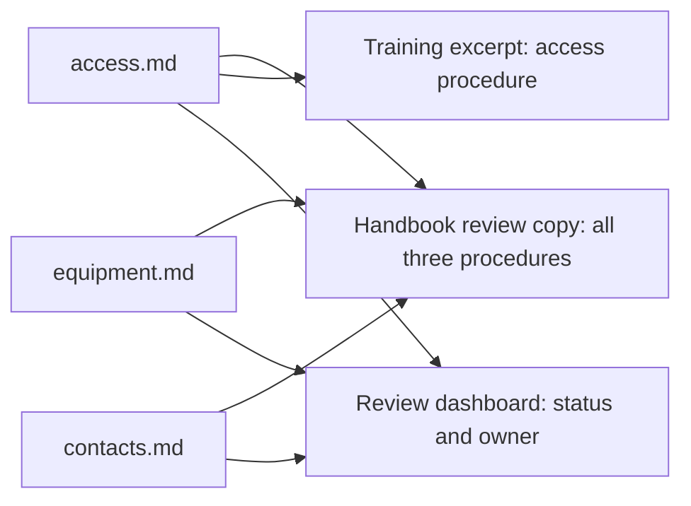
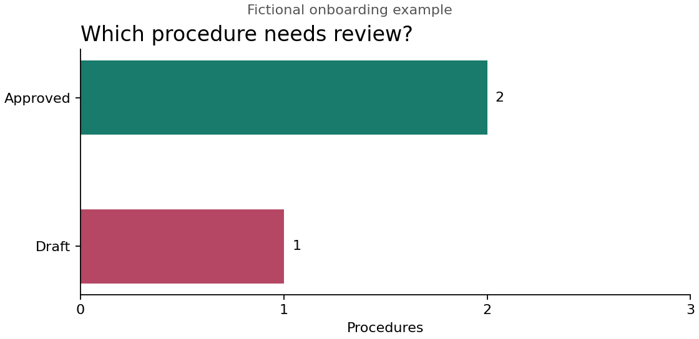

# Document-as-Code: The Living Tutorial

Document-as-Code Lab introduces the principles of document-as-code through practical examples. It is also a showcase for readers who want to explore how maintained information can support charts, diagrams, dashboards, and interactive views.

Document-as-code brings software development practices into information work. We keep editable sources, record changes, review updates, and automate how information is checked and published. This makes information easier to maintain and reuse, and provides useful context for AI-assisted work.

The tutorial itself demonstrates the approach. Its chapters are maintained as Markdown files: readable text with simple formatting. Those same files supply our published website. As the project develops, we also explore how the material can support PDF books and presentations.

## Reading This Tutorial

You can read the tutorial on the [website](https://and-gu.github.io/document-as-code-lab/) or browse its [Markdown files on GitHub](https://github.com/And-Gu/document-as-code-lab/tree/main/docs). Both present the maintained chapter text, while offering different ways to explore it.

GitHub lets you inspect the files, read their formatted previews, and follow their changes. The website adds chapter navigation, visual styling, and interactive components. For example, the expandable *Chapter information* panel presents information about the chapter and its recent changes.

We build the website with Astro, a tool that turns our source material into web pages. The published website reflects the latest successfully deployed version. Changes to the source files appear on the website after the next successful build and deployment. [Chapter 11](11-publishing.md#our-website-uses-astro) explains how this publishing process works.

## Why I Created This Tutorial

My motivation for creating this tutorial comes from using document-as-code in my own work. I have applied it to product development, roadmap work, and planning, as well as budgeting and workforce planning in my role as a line manager. For me, its relevance extends beyond documentation to how we organize information and use it in everyday decisions.

I have also worked in an organization trying to understand and adopt this way of working. It brings challenges: moving to document-as-code can be a substantial change in established practices, often alongside the introduction of AI support in the workplace. Adopting the tools is only part of that transition; people also need to understand how their work and responsibilities change.

After using the approach for a while, my experience is that it has significant potential, but realizing that potential requires education, support, and a shared understanding. That is why I created this tutorial: to make the approach tangible through examples, explain the choices involved, and provide room to learn by doing.

The project is for anyone who wants an introduction to the principles of document-as-code. It also introduces closely related concepts, such as automation, information reuse, visualization, and AI-supported work. Beginners can follow the concepts and exercises without prior experience with software development tools. More experienced readers can examine the examples and the rules behind their visualizations.

This chapter follows one onboarding example from editable instructions to a handbook, training material, and a visual overview of what needs review. At the end, you will identify a similar opportunity in your own work. The [shared vocabulary](../GLOSSARY.md) explains unfamiliar terms.

## From Source Files to Documents

A source file holds information we maintain. A document brings selected information together for a reader. One document can draw on several source files, and one source file can contribute to several documents.

In this tutorial, we mainly organize reusable information as separate files. A file should have a clear purpose, such as explaining one procedure, and contain the context needed to understand it. Choose what belongs together according to who maintains the information and how it will be used. Headings organize the content inside each file; they do not automatically make each section a separately maintained item.

<!-- example:start onboarding -->

## Example: An Onboarding Handbook

Imagine preparing a handbook for new colleagues. They need instructions for requesting system access, collecting equipment, and finding the right people to contact. These topics belong together for the reader, but different teams are responsible for keeping the parts up to date.

In our fictional example, each team maintains its instructions in a separate file. We can then bring those instructions together as a handbook and reuse selected parts in training material. This lets us organize maintenance around the responsible teams and presentation around the reader's needs.

The three source files are listed below. Their `.md` extension identifies them as Markdown files. Open any file to read its instructions; [chapter 4](04-markdown.md) explains how the format works.

| Source file | What it contains | Who maintains it | Status |
| --- | --- | --- | --- |
| [access.md](../examples/onboarding-showcase/access.md) | How to request system access | Onboarding team | Approved |
| [equipment.md](../examples/onboarding-showcase/equipment.md) | How to collect equipment | Workplace team | Approved |
| [contacts.md](../examples/onboarding-showcase/contacts.md) | How to find team contacts | People team | Draft |

The status is recorded at the top of each file. For example, `contacts.md` contains `status: draft`, indicating that its instructions still need review. Fields such as status and owner are called metadata: information describing the content. We will look inside a file shortly and explore metadata further in [chapter 5](05-structured-content.md).

The table above could itself be the starting page of a simple handbook. We store this project on GitHub, a cloud service where people can share files, review changes, and keep a history of their work. GitHub displays our instruction files as readable pages, so a new colleague can follow the three links to find what they need. There is no need to generate a separate document or build a website first. Readers simply need access to the shared project, called a repository. [Chapter 2](02-github-workspace.md) introduces this workspace in more detail.

A handbook link can lead readers to the current instructions, even as those instructions change. The team can review each update before making it available to readers, so they do not need a new link whenever the text is revised. This requires a review process; the link itself does not guarantee that the instructions have been reviewed. For a fixed edition of the handbook, links can instead point to the exact versions reviewed for that edition.

We can also bring the text together when readers need one continuous document. This project includes a small program, called a [script](../scripts/build_onboarding_showcase.py), that reads the three files and creates a handbook review copy, an access-only training excerpt, and a status chart. The chart forms part of the review dashboard shown later in this chapter: a visual overview of which instructions need attention.

Read the diagram from left to right. Each arrow means "provides information for": all three files supply text for the handbook, only the access file supplies text for the training excerpt, and all three supply status and owner information for the dashboard. The arrows show how the same information is reused in different outputs.



*Three files form a handbook review copy; their content and metadata also serve other needs.*

### From a Review Copy to a Published Handbook

The [handbook review copy](../assets/onboarding-showcase/handbook.md) combines the three procedures. The contacts procedure still needs review, so the handbook remains a draft.

Once all three procedures are approved, the person responsible for the handbook checks that they work together: the instructions are consistent, nothing important is missing, and the links and presentation work for readers. The team can then publish the handbook according to its review process.

Readers could receive a fixed edition containing the reviewed versions, or a starting page linking to instructions that are maintained over time.

### Reusing the Access Instructions for Training

The arrow from `access.md` to the training excerpt shows how we can select information for another purpose. The script creates a [training excerpt](../assets/onboarding-showcase/training-excerpt.md) containing the full access procedure, leaving out the equipment and contacts procedures. Here, reuse means selecting a whole procedure file, rather than extracting a section within it. A trainer uses it to prepare explanations, exercises, or slides suited to the audience.

The onboarding team maintains the instructions, a project maintainer looks after the script, and the trainer maintains the teaching material. When the instructions change, the maintainer regenerates the excerpt and the trainer reviews its effect on the session. This example is rebuilt manually; later chapters show how updates can become part of an automated workflow.

### A Dashboard from the Same Files

The third output in the earlier diagram is the review dashboard. You do not need to open another application to find it: it is the chart and table below, presented together in this chapter.

The dashboard helps a team or organization keep track of its information, see what needs attention, and make responsibilities clear. This supports more consistent, up-to-date instructions. Here, it answers a practical question: **which procedure needs review, and who should act?**

Each instruction file records its review status and the team responsible for it. The example script counts how many procedures have each status to create this chart:



*Two procedures are marked approved and one remains draft. These values describe the fictional example, not the tutorial's chapter completion.*

The count shows how much attention is needed; the accompanying table identifies the item and the responsible team.

| Procedure | Status | Owner |
| --- | --- | --- |
| Requesting access | Approved | Onboarding team |
| Collecting equipment | Approved | Workplace team |
| Finding team contacts | Draft | People team |

The useful next action is to ask the people team to review the contacts procedure. A total alone would not tell us that. This is the kind of relationship between data, presentation, and decisions that the showcase explores.

You can inspect the [input data](../assets/onboarding-showcase/data.json) and [generation script](../scripts/build_onboarding_showcase.py). The [example notes](../examples/onboarding-showcase/README.md) explain how to regenerate the outputs later. No tool installation is needed to read them now.

Who keeps this dashboard up to date? In this repository, maintaining the example means maintaining both the script and this chapter. The script generates the saved chart when someone runs it; the table above is written in the chapter and must be updated to match. Neither refreshes itself when a source file changes. In a working team, the procedure owners would maintain their records, while a designated maintainer would look after the dashboard and its generation process. Later chapters explore how to automate more of that work.

Our tutorial website already demonstrates another use of maintained source files. The website view of [chapter 3](03-project-growth.md) adds an interactive view of the project's growth, and [chapter 11](11-publishing.md) explains website publishing and the planned PDF and presentation outputs.

We have now seen all three outputs from the diagram: the handbook, the training excerpt, and the dashboard. Next, we will look inside one instruction file to see how its text and descriptive information support these different uses.

### Inside the Access Procedure

A new colleague needs instructions, a trainer needs material for a session, and the onboarding team needs to know who maintains the procedure. The same file can provide all three with useful information.

Here is the complete access source from the example:

```markdown
---
id: PROC-001
owner: onboarding-team
status: approved
---

# Requesting Access

Submit an access request through the service portal. State which system you need and which team you belong to. Keep the confirmation reference number and include it when asking the service desk about progress.
```

The fields between the `---` lines are metadata: information describing the procedure. The `id` gives it a stable name, the `owner` identifies the team responsible for it, and the `status` records its review state. The rest is the instruction a reader needs.

We chose these fields to suit our example: identifying each procedure, assigning responsibility, and tracking review. They are not required by document-as-code or GitHub. Your team can choose different fields according to what it needs to manage, automate, or present.

Those fields become useful when tools are configured to interpret them. Here is how the text and metadata contribute to different views:

| View | What it uses | What it helps someone do |
| --- | --- | --- |
| Handbook | Full procedure text | Follow the onboarding process |
| Training excerpt | Access instructions | Prepare an explanation for new colleagues |
| Dashboard | Status and owner | Find material that needs attention |
| Background material for an AI assistant | Selected text, version, audience, and task | Draft material suited to a particular purpose |

The example script creates the handbook, training excerpt, and dashboard chart; the dashboard's accompanying table is maintained in this chapter. In [chapter 7](07-ai-native.md), we will assemble background material and instructions for an AI assistant into what we call a context package.

<!-- example:end onboarding -->

## Review the Part That Changed

In a conventional document workflow, reviewers may track individual edits in Word while approving a whole manual as one deliverable.

When each procedure is kept in its own file, for example in a shared project on GitHub, reviewers can focus on the procedure that changed. [Chapter 2](02-github-workspace.md) explains how that shared workspace works. If the access process changes, the onboarding team reviews that procedure and its effect on the handbook and training material.

Recording a change and approving it are separate actions. Saving a version in the project's history records what the files contained at that point, including any drafts. It does not mean that someone has approved them. Approval means someone has reviewed and accepted particular content. If that content changes again, the new wording may need another review.

In our example, `approved` refers to the procedure's review state. The contacts procedure remains draft, so assembling the files does not make the handbook an approved publication. The complete output still needs checks for consistency, completeness, and presentation.

The [collaboration chapter](09-git-review.md) develops review workflows, while [structured content](05-structured-content.md) explains the rules behind fields such as status.

## What This Enables in Everyday Work

When the access process changes, the team updates one source, reviews its consequences, and regenerates the views that use it. Each capability supports a different part of that work:

- **Version control** records what changed and why.
- **Focused review** directs attention to the changed information and its dependencies.
- **Automation** rebuilds outputs and checks repeatable rules.
- **Reuse** keeps shared facts together while supporting different audiences.
- **Visualization** makes patterns, relationships, and outstanding work easier to inspect.

Document-as-code brings the benefits of the software development discipline to information work and is particularly useful when working with large language models (LLMs). Clear sections, defined terms, and recorded decisions help you provide an LLM with relevant context for a specific task.

For example, give an AI assistant the access procedure, the intended audience, and a request for a short training explanation. Compare its draft with the source before using it. This supports AI-native documentation: organizing information so people and AI tools can use it in everyday work. [Chapter 7](07-ai-native.md) develops that approach.

The broader shift is from producing individual documents to also developing the system that maintains them. The team can improve its templates, metadata, scripts, and checks as its needs change. AI agents can help turn those needs into tested changes, not just generate more text.

Making these improvements requires more than tools that can be changed. The people doing the work also need permission and support to change them. For example, a document management system may support custom workflows, but users may depend on another department to implement even a small improvement.

Document-as-code offers a way to bring that control closer to the people doing the work, provided the organization gives them the necessary permissions and responsibility. The benefit is the ability to improve everyday work without handing every change to another team's queue. [Chapter 2](02-github-workspace.md) explores this ownership and its maintenance obligations.

Versioned text, review, and automated publishing predate today's generative AI tools. AI adds another use for those maintained sources. [Write the Docs describes the established docs-as-code practices](https://www.writethedocs.org/guide/docs-as-code/).

## When Your Tools Keep Information Inside

Document-as-code is easier to adopt when information can be read, compared, and processed by other tools. Many teams, however, work with presentations, systems models, illustrations, or animations whose editable content depends on a particular application.

This can make reuse and automation harder. A reviewer may need the application to understand what changed. Another tool may be able to display an exported image without accessing the relationships behind it. An AI assistant may receive the visible result but lack the structure and context needed to help maintain it.

The difficulty is not the visual presentation itself. It is whether the underlying information is accessible. A diagram generated from a readable definition can fit naturally into a document-as-code workflow. A model held in a closed application may require an export, an integration, or a different way of maintaining the information.

Adopting the approach may therefore mean changing part of your workflow or choosing different tools. You might keep a specialist application while exporting selected information for other uses. You might maintain shared facts in structured files and use the application to present them. Where the limitations are too restrictive, replacing the tool may be worthwhile.

Start with one important task. Can you inspect changes, extract the information you need, and regenerate a useful output? Check what is lost during export and where updates must be made. Maintaining an editable original and an exported copy also creates a responsibility to keep them consistent.

This tutorial starts with text and small datasets because they make these connections easier to inspect and automate. [Chapter 8](08-images.md) explores visual sources, [chapter 11](11-publishing.md) covers publishing, and [chapter 12](12-beyond-github.md) considers workflows in other applications.

## Try It: Find a Reusable Part in Your Own Work

Choose a document, presentation, model, or set of instructions that you maintain. You can do this exercise on paper or in your usual note-taking tool.

1. Identify one part that changes independently, such as a procedure, diagram, or data table.
2. Name the person or team best placed to maintain and review it.
3. Describe two documents or views that could use that same information.
4. Choose one field, such as owner or review status, that would help you answer a practical question.
5. Describe how you would check the outputs after changing the shared source.

**Expected result:** a small, concrete opportunity for reuse. For example: "Our equipment checklist is owned by the workplace team, appears in the handbook and training material, and has a review status that identifies pending work."

**If it is difficult to choose a part:** start with something you currently copy between files or update on a different schedule from the surrounding content.

**Keep:** a short note naming the information item, its owner, two uses, and the question its metadata could answer. We will return to these ideas as the tools become more concrete.

Next, [GitHub as a Workspace for Knowledge and Automation](02-github-workspace.md) introduces the environment and your first reviewable change.
