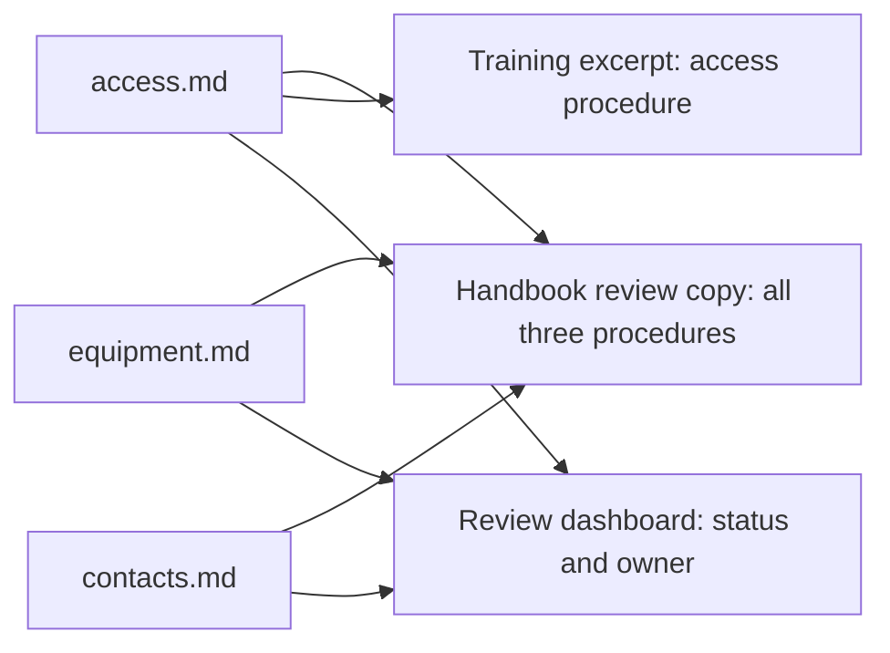

# Document-as-Code: The Living Tutorial

Document-as-Code Lab is both a tutorial for learning document-as-code and a showcase for exploring how information stored in a repository can be visualized. We use the project's content and history to develop charts, diagrams, dashboards, presentations, and PDF documents.

The project is for people who create documents, presentations, models, or instructions and want to make that work easier to maintain and reuse. Beginners can follow the concepts and exercises without prior experience with Markdown or Git. More experienced readers can examine the examples and the rules behind their visualizations.

This chapter follows one onboarding example from source files to useful outputs. At the end, you will identify a similar opportunity in your own work. The [shared vocabulary](../GLOSSARY.md) explains unfamiliar terms.

## From Source Files to Documents

Document-as-code applies software development practices to documentation. You keep editable content in source files, record changes with version control, and use repeatable processes to check and publish it.

A finished document does not have to correspond to one source file. An onboarding handbook can combine separate files for access instructions, equipment, and team contacts. Each part can be maintained by the team that knows it best, while the handbook presents everything in the order a new colleague needs.

Our fictional example has three source files:

| Source file | What it contains | Who maintains it |
| --- | --- | --- |
| [access.md](../examples/onboarding-showcase/access.md) | How to request system access | Onboarding team |
| [equipment.md](../examples/onboarding-showcase/equipment.md) | How to collect equipment | Workplace team |
| [contacts.md](../examples/onboarding-showcase/contacts.md) | How to find team contacts | People team |

A small script combines their text into a [handbook review copy](../assets/onboarding-showcase/handbook.md). It also takes the access procedure into a [training excerpt](../assets/onboarding-showcase/training-excerpt.md) and uses the files' descriptive fields to create a dashboard.



*Three files form a handbook review copy; their content and metadata also serve other needs.*

The handbook contains all three procedures, including a draft that still needs review. The training excerpt supplies material for a trainer to adapt; it is not a finished presentation. These are concrete teaching outputs, while the project's full website, book, and presentation pipelines remain future work.

This lets you choose source boundaries for ownership and maintenance, then assemble documents around readers' needs.

## Inside the Access Procedure

A new colleague needs instructions, a trainer needs material for a session, and the onboarding team needs to know who maintains the procedure. The same file can provide all three with useful information.

Here is the complete access source from the example:

```markdown
---
id: PROC-001
owner: onboarding-team
status: approved
---

# Requesting Access

Submit an access request through the service portal. State which system you need and which team you belong to. Keep the confirmation reference number and include it when asking the service desk about progress.
```

The fields between the `---` lines are metadata: information describing the procedure. The `id` gives it a stable name, the `owner` identifies the team responsible for it, and the `status` records its review state. The rest is the instruction a reader needs.

Those fields become useful when tools are configured to interpret them. Here is how the text and metadata contribute to different views:

| View | What it uses | What it helps someone do |
| --- | --- | --- |
| Handbook | Full procedure text | Follow the onboarding process |
| Training excerpt | Access instructions | Prepare an explanation for new colleagues |
| Dashboard | Status and owner | Find material that needs attention |
| AI context package | Selected text, version, audience, and task | Draft material suited to a particular purpose |

The example script creates the first three views. A later exercise develops the AI context package.

## Review the Part That Changed

In a conventional document workflow, reviewers may track individual edits in Word while approving a whole manual as one deliverable. That approval scope comes from the team's process, rather than an inherent limit of Word.

When each procedure is kept in its own file, for example in a shared project on GitHub, reviewers can focus on the procedure that changed. [Chapter 2](02-github-workspace.md) explains how that shared workspace works. If the access process changes, the onboarding team reviews that procedure and its effect on the handbook and training material.

Recording a change and approving it are separate actions. A Git commit saves a version of the source, which may still contain drafts. Approval means someone has reviewed and accepted particular content. If that content changes again, the new wording may need another review.

In our example, `approved` refers to the procedure's review state. The contacts procedure remains draft, so assembling the files does not make the handbook an approved publication. The complete output still needs checks for consistency, completeness, and presentation.

The [collaboration chapter](08-git-review.md) develops review workflows, while [structured content](05-structured-content.md) explains the rules behind fields such as status.

## A Dashboard from the Same Files

The team has a practical question: **which procedure needs review, and who should act?**

The example script reads the status and owner fields from the three files. It counts the statuses to create this chart:


*Two procedures are marked approved and one remains draft. These values describe the fictional example, not the tutorial's chapter completion.*

The count shows how much attention is needed; the accompanying table identifies the item and its owner.

| Procedure | Status | Owner |
| --- | --- | --- |
| Requesting access | Approved | Onboarding team |
| Collecting equipment | Approved | Workplace team |
| Finding team contacts | Draft | People team |

The useful next action is to ask the people team to review the contacts procedure. A total alone would not tell us that. This is the kind of relationship between data, presentation, and decisions that the showcase explores.

You can inspect the [input data](../assets/onboarding-showcase/data.json) and [generation script](../scripts/build_onboarding_showcase.py). The [example notes](../examples/onboarding-showcase/README.md) explain how to regenerate the outputs later. No tool installation is needed to read them now.

## What This Enables in Everyday Work

When the access process changes, the team updates one source, reviews its consequences, and regenerates the views that use it. Each capability supports a different part of that work:

- **Version control** records what changed and why.
- **Focused review** directs attention to the changed information and its dependencies.
- **Automation** rebuilds outputs and checks repeatable rules.
- **Reuse** keeps shared facts together while supporting different audiences.
- **Visualization** makes patterns, relationships, and outstanding work easier to inspect.

Document-as-code brings the benefits of the software development discipline to information work and is particularly useful when working with large language models (LLMs). Clear sections, defined terms, and recorded decisions help you provide an LLM with relevant context for a specific task.

For example, give an AI assistant the access procedure, the intended audience, and a request for a short training explanation. Compare its draft with the source before using it. This supports AI-native documentation: organizing information so people and AI tools can use it in everyday work. [Chapter 6](06-ai-native.md) develops that approach.

Versioned text, review, and automated publishing predate today's generative AI tools. AI adds another use for those maintained sources. [Write the Docs describes the established docs-as-code practices](https://www.writethedocs.org/guide/docs-as-code/).

## When Your Main Medium Is Not Text

Your source might be a systems model, an illustration, an animation, or a dataset. We use "information-as-code" as a broader description of applying versioning, review, and repeatable processing to those sources.

The same question applies: **what do you maintain, and what views do people need from it?**

| Main medium | Source to maintain | Possible output |
| --- | --- | --- |
| Systems model | Model elements and relationships | Diagrams and selected explanations |
| Illustration | Editable design file | Images for manuals and presentations |
| Animation | Editable project, script, and assets | A rendered sequence |
| Dataset | Records and transformation rules | Charts, tables, and dashboards |

Preserve the editable source as well as useful exports. Some formats require specialist tools to compare changes or reproduce an output, so the review method needs to fit the medium.

This tutorial begins with text and small datasets, then expands into visual assets. [Chapter 7](07-images.md) covers those assets, and [chapter 10](10-publishing.md) covers publishing choices. [Beyond GitHub](11-beyond-github.md) explores how lighter workflows can use familiar applications.

## Try It: Find a Reusable Part in Your Own Work

Choose a document, presentation, model, or set of instructions that you maintain. You can do this exercise on paper or in your usual note-taking tool.

1. Identify one part that changes independently, such as a procedure, diagram, or data table.
2. Name the person or team best placed to maintain and review it.
3. Describe two documents or views that could use that same information.
4. Choose one field, such as owner or review status, that would help you answer a practical question.
5. Describe how you would check the outputs after changing the shared source.

**Expected result:** a small, concrete opportunity for reuse. For example: "Our equipment checklist is owned by the workplace team, appears in the handbook and training material, and has a review status that identifies pending work."

**If it is difficult to choose a part:** start with something you currently copy between files or update on a different schedule from the surrounding content.

**Keep:** a short note naming the information item, its owner, two uses, and the question its metadata could answer. We will return to these ideas as the tools become more concrete.

Next, [GitHub as a Workspace for Knowledge and Automation](02-github-workspace.md) introduces the environment and your first reviewable change.
