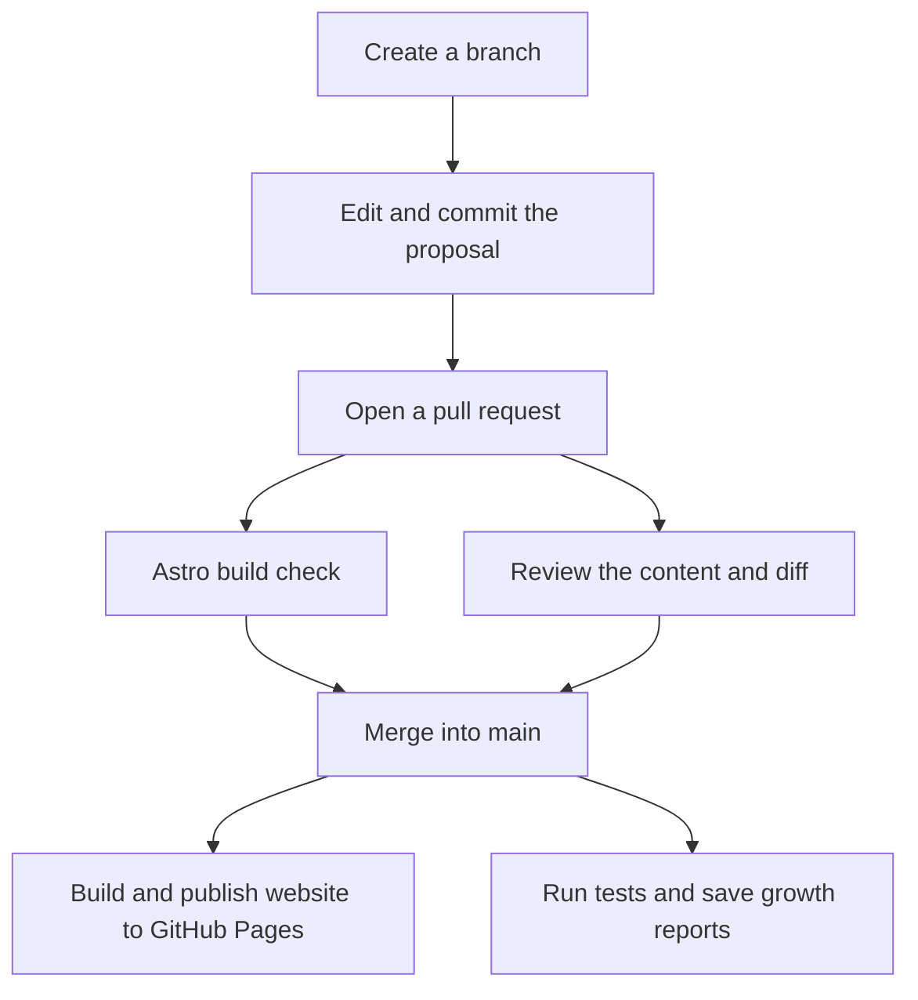

# GitHub as a Workspace for Knowledge and Automation

GitHub is an online platform where people store files, track changes, and collaborate on shared work. It is built around Git, a version-control system that records how files change over time.

GitHub is best known for software development, but its capabilities are also useful for documentation, diagrams, structured data, and other information. Work is organized in repositories. A repository is a project's shared collection of files, together with a recorded history of their changes.

On GitHub, that repository also provides a place to discuss proposed changes, review contributions, and run automated checks or publishing tasks. Our tutorial uses it to keep the chapters, examples, and instructions for building the website together.

AI-assisted tools make this approach more accessible to people without a software background. You can describe a desired change in everyday language and ask an agent to help edit files or prepare automation. You still decide what the information should mean and review the result.

What does this mean in everyday work? Consider the onboarding team from chapter 1, which needs to clarify its access instructions. A colleague should be able to propose the wording, show exactly what changed, and ask the right person to review it. Once accepted, that change should be available to the processes that build documents and reports.

GitHub can connect those activities in one shared workspace. In chapter 1, we followed information from separate source files into several outputs. Here, we follow the work around those files: finding them, proposing a change, reviewing it, and inspecting an automated result.

By the end, you will know where to find the source, a recorded change, and evidence of what the automation did. The core exercise requires only read access. Editing and proposing a change are optional extensions in your own repository.

## More Than a Place to Store Files

Our repository contains tutorial chapters, examples, metadata, diagrams, and instructions for processing them.

Git records revisions. GitHub hosts repositories and provides browser tools for reading, editing, review, work tracking, and automation. A local working copy lets you use editors and AI tools on your own computer.

The useful connection is that the content and the instructions for processing it can be reviewed together. If a chart changes unexpectedly, you can inspect both its input data and the script that produced it.

The website and the repository serve different purposes. GitHub is where we maintain the source material and collaborate on changes. Astro builds the reading website from those sources, and GitHub Pages hosts it. The website adds navigation and interactive views; the repository lets you inspect the files and the work behind them. [Chapter 10](10-publishing.md#our-website-uses-astro) explains the publishing process.

## Find Your Way Around GitHub

To understand this workspace, we will follow the information behind the tutorial you are reading. Where is the chapter text maintained? How can you see what changed? Where do you check whether an automated task succeeded?

If you are reading the tutorial on its website, open the [project repository on GitHub](https://github.com/And-Gu/document-as-code-lab) alongside it. Start with the [README](https://github.com/And-Gu/document-as-code-lab/blob/main/README.md), the project's introduction and guide to its contents. Use the questions in the table below to explore the files and the work around them.

| Your question | Where to look | Example in this project |
| --- | --- | --- |
| Where is the maintained information? | Repository files | [The access procedure](https://github.com/And-Gu/document-as-code-lab/blob/main/examples/onboarding-showcase/access.md) |
| How is it turned into another view? | Processing scripts | [The onboarding builder](https://github.com/And-Gu/document-as-code-lab/blob/main/scripts/build_onboarding_showcase.py) |
| What does the result look like? | Saved examples or build outputs | [The handbook review copy](https://github.com/And-Gu/document-as-code-lab/blob/main/assets/onboarding-showcase/handbook.md) |
| What changed, and why? | [File history](https://github.com/And-Gu/document-as-code-lab/commits/main/docs/01-introduction.md) and [pull requests](https://github.com/And-Gu/document-as-code-lab/pulls?q=is%3Apr) | A wording change and its review discussion |
| What work remains? | [Issues](https://github.com/And-Gu/document-as-code-lab/issues) or a project board, when used | A task to clarify an instruction |
| Did the automated process run? | [Actions and its run logs](https://github.com/And-Gu/document-as-code-lab/actions) | The growth report's tests and generated files |

These links open the GitHub workspace, even when you are reading this chapter on the website. The file links lead to existing material; the wording change and task illustrate what to look for in history, pull requests, and issues. An issue list or project board only shows work that someone has recorded there.

## Follow One Proposed Change

<!-- example:start proposed-change -->

### Example: Clarifying the Access Instructions

Suppose the onboarding team wants to clarify its access instructions. They need somewhere to prepare and review the change while readers continue using the current version.

A branch provides that working space within the repository. It starts from an existing version and records proposed changes separately. The team can edit and discuss those changes before bringing them into the shared main version, conventionally called `main`.

In our example, a contributor creates a branch and updates the access procedure there. The current instructions on `main` remain unchanged during review.

A commit records the proposed revision. A pull request then brings its changes and discussion together. Reviewers inspect a diff, which shows the difference between the old and new source, and consider the handbook and training excerpt that reuse it. Merging brings the accepted changes into the main branch.

The diagram uses Mermaid, a text-based diagram notation, to connect this example with our configured automation. The Astro build check runs on the pull request. After merging, separate workflows publish the website and generate growth reports. [Chapter 4](04-markdown.md) introduces the syntax; [Mermaid's introduction](https://mermaid.js.org/intro/) provides background.

*A branch holds the proposal; build checks and review precede merging, followed by website publication and growth reporting.*

These workflows publish the website and measure repository growth. The example's assembled handbook and training excerpt still need to be regenerated separately.

<!-- example:end proposed-change -->

Recording a commit does not approve its contents. A pull request makes review possible, but required reviewers and checks depend on the team's rules and repository settings. Approval of a procedure also does not automatically approve an assembled handbook. [Chapter 8](08-git-review.md) follows this workflow in more detail, including how to review related changes and decide what an approval covers.

The diagram shows our intended review sequence. The build check is configured, but requiring it and a review before merging depends on branch rules. The growth workflow runs after a push to `main`, or when started manually.

## Start in the Browser

Open the repository and begin with its README. It describes the project and links to the chapters. Browse a Markdown file in its rendered preview, then use the Code view to inspect the source.

You can edit files in GitHub's browser editor without setting up a local development environment. Permissions and branch rules determine whether you can edit directly or need to propose a change. [GitHub's editing guide describes the options](https://docs.github.com/en/repositories/working-with-files/managing-files/editing-files).

GitHub also offers a browser-based editor at github.dev. Browser editing is an accessible starting point, while local tools become useful when you need to run scripts or inspect several files together.

A proposed edit should still be reviewed. Compare the source and preview, inspect the diff, and explain the purpose of the change. [Chapter 4](04-markdown.md) covers Markdown's source and rendered views in more detail.

## A Few Terms You Will Encounter

| Term | Meaning in this tutorial |
| --- | --- |
| Commit | A recorded revision with an identifier and an explanation |
| Branch | A separate line of work where changes can be prepared |
| Diff | A comparison showing what changed |
| Pull request | A proposal to review and merge changes from a branch |
| Issue | A place to describe a question, problem, or planned task |
| Workflow | Instructions for an automated process |
| Runner | The machine that executes a workflow job |
| Artifact | Files saved from a workflow run for later inspection |

Later, [Git, Review, and Collaboration](08-git-review.md) develops the review process. For now, use these terms to follow an existing change.

## How It Compares with Familiar Tools

A word processor, a content management system, and a repository platform have overlapping capabilities. Their usual starting points differ.

| Environment | Typical focus | How processing is organized |
| --- | --- | --- |
| Word processor | Writing, formatting, and reviewing documents | Document features, templates, macros, or integrations |
| Content management system | Managing content and editorial workflows for delivery channels | Content models, templates, plugins, APIs, or configured services |
| Repository platform | Versioning source files and processing instructions together | Reviewable configuration and scripts, executed by automation services |

A repository brings the content and the rules for processing it into the same workspace. With the right permissions, a team can improve both as its needs change. AI agents can help prepare those changes, and version control makes them available for review.

## Ownership Close to the Work

In many organizations, changes to document tools depend on IT, marketing, or another central function. Even a small improvement can require a ticket and a wait for another team's capacity.

A software-oriented environment lets the team maintain both its information and the templates, metadata, scripts, and checks around it. For example, the onboarding team could work with an AI agent to build and test a view of procedures awaiting review, grouped by owner. Improving the tools becomes part of everyday work.

This autonomy requires organizational support: permission to make changes, agreed boundaries, and responsibility for maintenance. Start with small improvements that remove repeated work, and keep them documented and tested.

## Automation as Part of the Workspace

GitHub Actions runs repeatable tasks when a specified event occurs, such as a proposed change or an update to `main`. A workflow defines the tasks, and a runner is the machine that executes them. GitHub can provide the runner; the workflow instructions live alongside our content in `.github/workflows/`.

This project checks the Astro website build on pull requests. After changes reach `main`, separate workflows generate growth reports and publish the website, including fresh data for chapter 3's interactive chart. The onboarding handbook and training excerpt still require someone to run their script; their updates have not been automated.

Each workflow automates the steps configured for it. A successful run confirms those steps completed; content approval remains a review decision. [Chapter 3](03-project-growth.md) explains the growth report, and [chapter 12](12-automation.md) develops the automation approach. [GitHub's workflow guide](https://docs.github.com/en/actions/concepts/workflows-and-actions/workflows) provides technical detail.

## AI Can Help You Build the Process

Agentic AI tools can inspect files, edit sources, run checks, and refine their work using the results. [Codex](https://learn.chatgpt.com/docs/codex/cli) and [Claude Code](https://code.claude.com/docs/en/overview) are examples; their available actions depend on the environment and permissions.

A repository gives an agent access to more than the passage being edited. It can inspect related chapters, shared terminology, examples, metadata, and the scripts that process them. This helps it understand how a change fits into the wider project and identify other files that need updating.

For example, changing a procedure may also affect a training excerpt, a diagram, and a validation rule. An agent working with the repository can help update and check those connections. Compared with writing assistance focused on the current document, this supports a broader task: maintaining the information and the processes around it.

That context still needs to be organized. Clear structure and project instructions help the agent find relevant sources; access to the repository alone does not ensure that it reads or understands everything.

Review the changed files, their diff, and the results of checks. [Chapter 4](04-markdown.md) provides a bounded editing prompt; [chapter 6](06-ai-native.md) explains context and coordinated maintenance.

The same approach can help develop a script or workflow from a stated need. You define the inputs, expected result, and acceptance criteria; the agent helps implement and test them. You normally create workflows and scripts, then choose a runner, rather than build the runner itself. Keep permissions limited to the task and follow organizational rules for sharing information.

## Try It: Follow a Change Through the Workspace

Follow the actual change that introduced chapter 1's approved edition and the interactive growth view:

1. Open [this chapter on GitHub](https://github.com/And-Gu/document-as-code-lab/blob/main/docs/02-github-workspace.md) and compare its source and preview.
2. Open [pull request #1](https://github.com/And-Gu/document-as-code-lab/pull/1). In its changed files, inspect `docs/01-introduction.md` and identify the status change and one wording improvement. The pull request also contains site changes; its merge alone does not establish that every chapter is approved.
3. Locate its merge revision, `3c5ab277f3073d8fe0ba69d823e494491d12db78`. Open the [growth run for that revision](https://github.com/And-Gu/document-as-code-lab/actions/runs/37230719162), confirm the source commit matches, and inspect the job steps. The [Pages deployment for the same revision](https://github.com/And-Gu/document-as-code-lab/actions/runs/37230719137) shows how it reached readers.
4. If the `project-growth` artifact is still available, inspect its report and charts. Compare the report's source commit with the run's revision. Chapter 3 explains the measurements.

This inspects existing work in a public repository. Downloading artifacts requires signing into GitHub with read access, and artifacts can expire; [GitHub explains artifact downloads](https://docs.github.com/en/actions/how-tos/manage-workflow-runs/download-workflow-artifacts). If the report is unavailable, use chapter 3's [saved historical report](../assets/figures/growth-first-update/history.json) to inspect its structure. That fallback describes a different revision, `9c91191`, so do not present it as the result of this merge; note which checks you could not complete.

**Expected result:** you can connect a source file, a recorded change, and a processing result, without assuming that recording or building them constitutes approval.

**If a result is unavailable:** distinguish missing repository access, an expired artifact, and a failed run. [GitHub's workflow-history guide](https://docs.github.com/en/actions/how-tos/monitor-workflows/view-workflow-run-history) explains where to inspect runs and logs.

**Keep:** a short note with the source path, commit reference, run link when accessible, and one observation about the output.

Return to the reusable information item you identified in chapter 1. Note where its source would live, who should review changes, and what output you would want to regenerate. Use fictional material for practice if your real example contains confidential information.

### Optional: Propose Your Own Change

For account and Git preparation, use [GitHub's setup guide](https://docs.github.com/en/get-started/git-basics/set-up-git). For later local exercises, follow [its cloning guide](https://docs.github.com/en/repositories/creating-and-managing-repositories/cloning-a-repository), which includes command-line and GitHub Desktop options. A downloaded ZIP does not provide the Git history needed by chapter 3.

In an editable exercise repository, improve one sentence on your own branch, inspect the diff, and record an explanatory commit. You can propose it through a pull request and follow the review process developed in chapter 8. Merging is not required to complete this chapter.

If the change is later accepted into `main`, inspect its growth run. Actions must be enabled and the workflow installed; a local commit or a push to another branch does not trigger this workflow. Keep the source revision and any run evidence together.

### Other Environments

The practices also apply to platforms such as [GitLab](https://docs.gitlab.com/ci/pipelines/) and [Bitbucket](https://support.atlassian.com/bitbucket-cloud/docs/get-started-with-bitbucket-pipelines/), although their workflow configurations differ. [Beyond GitHub](11-beyond-github.md) explores lighter approaches using familiar document applications.

The important connection is between the source revision, the review, and the processing result. Next, [Project Growth: History as Data](03-project-growth.md) explains how we calculate and interpret that result.
