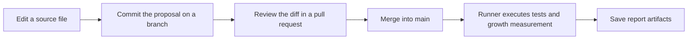

# GitHub as a Workspace for Knowledge and Automation

GitHub is an online platform where people store files, track changes, and collaborate on shared work. It is built around Git, a version-control system that records how files change over time.

GitHub is best known for software development, but the same capabilities are useful for documentation, diagrams, structured data, and other information. A repository can bring together the source material, discussions about proposed changes, and instructions for checking or publishing the results.

AI-assisted tools make this approach more accessible to people without a software background. You can describe a desired change in everyday language and ask an agent to help edit files or prepare automation. You still decide what the information should mean and review the result.

What does this mean in everyday work? Consider the onboarding team from chapter 1, which needs to clarify its access instructions. A colleague should be able to propose the wording, show exactly what changed, and ask the right person to review it. Once accepted, that change should be available to the processes that build documents and reports.

GitHub can connect those activities in one shared workspace. In chapter 1, we followed information from separate source files into several outputs. Here, we follow the work around those files: finding them, proposing a change, reviewing it, and inspecting an automated result.

By the end, you will know where to find the source, a recorded change, and evidence of what the automation did. The core exercise requires only read access. Editing and proposing a change are optional extensions in your own repository.

## More Than a Place to Store Files

A repository is a collection of files with a recorded history. In this project, it contains tutorial chapters, examples, metadata, diagrams, and instructions for processing them.

Git records revisions. GitHub hosts repositories and provides browser tools for reading, editing, review, work tracking, and automation. A local working copy lets you use editors and AI tools on your own computer.

The useful connection is that the content and the instructions for processing it can be reviewed together. If a chart changes unexpectedly, you can inspect both its input data and the script that produced it.

## Find Your Way Around

Start with the [README](../README.md), then follow a question rather than trying to learn every GitHub feature at once:

| Your question | Where to look | Example in this project |
| --- | --- | --- |
| Where is the maintained information? | Repository files | [The access procedure](../examples/onboarding-showcase/access.md) |
| How is it turned into another view? | Processing scripts | [The onboarding builder](../scripts/build_onboarding_showcase.py) |
| What does the result look like? | Saved examples or build outputs | [The handbook review copy](../assets/onboarding-showcase/handbook.md) |
| What changed, and why? | File history and pull requests | A wording change and its review discussion |
| What work remains? | Issues or a project board, when used | A task to clarify an instruction |
| Did the automated process run? | Actions and its run logs | The growth report's tests and generated files |

The file links above open existing material. The change discussion and task are examples of how a team could organize its work, not claims that those issues or pull requests already exist.

## Follow One Proposed Change

Suppose the team wants the access procedure to explain when to use the confirmation reference number. A contributor prepares the wording on a branch: a separate line of work that leaves the shared main version unchanged while the proposal is being prepared.

A commit records the proposed revision. A pull request then brings its changes and discussion together. Reviewers inspect a diff, which shows the difference between the old and new source, and consider the handbook and training excerpt that reuse it. Merging brings the accepted changes into the main branch.

The diagram below uses Mermaid, a text-based diagram notation, to show a proposed review sequence followed by our configured growth workflow. [Chapter 4](04-markdown.md) introduces the syntax; [Mermaid's introduction](https://mermaid.js.org/intro/) provides background.

*A proposed change is recorded, reviewed, and merged; the configured growth workflow then produces a report.*

Recording a commit does not approve its contents. A pull request makes review possible, but required reviewers and checks depend on the team's rules and repository settings. Approval of a procedure also does not automatically approve an assembled handbook. [Chapter 8](08-git-review.md) develops those distinctions.

The diagram shows our chosen sequence, not a universal GitHub rule. Workflows can also be configured to check proposals before merging. Our current growth workflow runs after a push to `main`, or when started manually; it is not a pre-merge approval check.

## Start in the Browser

Open the repository and begin with its README. It describes the project and links to the chapters. Browse a Markdown file in its rendered preview, then use the Code view to inspect the source.

You can edit files in GitHub's browser editor without setting up a local development environment. Permissions and branch rules determine whether you can edit directly or need to propose a change. [GitHub's editing guide describes the options](https://docs.github.com/en/repositories/working-with-files/managing-files/editing-files).

GitHub also offers a browser-based editor at github.dev. Browser editing is an accessible starting point, while local tools become useful when you need to run scripts or inspect several files together.

A proposed edit should still be reviewed. Compare the source and preview, inspect the diff, and explain the purpose of the change. [Chapter 4](04-markdown.md) covers Markdown's source and rendered views in more detail.

## A Few Terms You Will Encounter

| Term | Meaning in this tutorial |
| --- | --- |
| Commit | A recorded revision with an identifier and an explanation |
| Branch | A separate line of work where changes can be prepared |
| Diff | A comparison showing what changed |
| Pull request | A proposal to review and merge changes from a branch |
| Issue | A place to describe a question, problem, or planned task |
| Workflow | Instructions for an automated process |
| Runner | The machine that executes a workflow job |
| Artifact | Files saved from a workflow run for later inspection |

Later, [Git, Review, and Collaboration](08-git-review.md) develops the review process. For now, use these terms to follow an existing change.

## How It Compares with Familiar Tools

A word processor, a content management system, and a repository platform have overlapping capabilities. Their usual starting points differ.

| Environment | Typical focus | How processing is organized |
| --- | --- | --- |
| Word processor | Writing, formatting, and reviewing documents | Document features, templates, macros, or integrations |
| Content management system | Managing content and editorial workflows for delivery channels | Content models, templates, plugins, APIs, or configured services |
| Repository platform | Versioning source files and processing instructions together | Reviewable configuration and scripts, executed by automation services |

Many content management systems have powerful automation and APIs. Word processors can also support structured content and automated tasks. But technical extensibility is not the same as giving users the authority and practical ability to make changes. The repository approach makes the files and processing rules explicit so a team can inspect and develop them together, when it has that authority.

The tradeoff is setup and maintenance, but the same structure also supports AI-assisted work. An agent can use the source material and project instructions to help generate processing code, update related information, or prepare excerpts for different audiences. Version control makes those changes visible and reviewable.

AI assistance can reduce the effort involved, but people still need to check meaning, consistency, and the generated results. A repository preview also offers less layout control than a presentation tool. The choice is therefore not necessarily one environment or another: maintain shared information in the repository, then use publishing and visual tools to shape how people experience it.

## Ownership Close to the Work

In many organizations, authors can use a document application but cannot change its templates, integrations, or publishing rules. Those decisions belong to IT, marketing, or another central function. Even a small improvement can require a ticket, a handover, and a wait for another team's priorities and capacity.

A software-oriented working environment offers a different possibility. The team maintaining the information can also maintain the templates, metadata, scripts, and checks around it. Improvements become part of its ongoing work rather than requests for another group to implement. Here, ownership means practical control and responsibility for that work, not ownership of every underlying platform component.

For example, the onboarding team might need a view of procedures awaiting review, grouped by owner. With access to its records and processing code, it can define the question, develop the view with an agent, test it, and improve it after use. The same approach can support a new excerpt format or a check for missing metadata. The team builds reusable capabilities around its actual needs.

This autonomy is an organizational choice, not something GitHub grants automatically. A repository can be centrally controlled too. Teams need permission to change their tools, suitable infrastructure, and clear responsibility for maintaining the result. Shared security, access, and platform standards should establish boundaries within which teams can act; changes outside those boundaries still need coordination.

More control also means more responsibility. Custom fields, scripts, and integrations need documentation, tests, and maintainers. Prefer small improvements that remove repeated work or improve quality, and extend existing capabilities before adding another tool. The aim is an evolving working environment the team can sustain, not a custom platform for its own sake.

## Automation as Part of the Workspace

Suppose an onboarding procedure changes. A configured workflow could check links, rebuild a handbook, and generate an updated work report from that revision.

In GitHub Actions, a workflow defines when to run and what jobs to perform. Jobs contain steps that run commands or reusable actions. The configuration is stored as YAML in `.github/workflows/`. [GitHub explains the workflow model](https://docs.github.com/en/actions/concepts/workflows-and-actions/workflows).

A runner executes the job. GitHub provides hosted runners, so you can begin without installing and operating your own automation server. [GitHub documents hosted runners](https://docs.github.com/en/actions/how-tos/manage-runners/github-hosted-runners/use-github-hosted-runners).

Our [growth workflow](../.github/workflows/growth.yml) already contains a concrete sequence: retrieve the repository history, install dependencies, run the tests, measure growth, and save the report and charts. Its configuration uses read-only repository content permissions and does not commit generated files back into the source. Its first hosted run succeeded for commit `9c91191`; [chapter 3](03-project-growth.md) links to the run and explains the results.

There are two different examples to keep distinct:

| Process | Available now | Not yet connected |
| --- | --- | --- |
| Onboarding showcase | A script assembles the handbook, training excerpt, and status chart | Automatic regeneration on GitHub |
| Growth report | A script and Actions workflow measure repository history and save charts | Website publication and interactive dashboards |

Changing a procedure therefore does not currently rebuild the handbook automatically. It can trigger the growth workflow after reaching `main`, but the chapter word count will remain unchanged because supporting examples are excluded. [Chapter 3](03-project-growth.md) explains those measurement rules.

Availability depends on repository settings and permissions, and hosted automation has usage limits. Check the relevant account settings when planning repeated or heavier jobs.

## AI Can Help You Build the Process

Agentic AI tools can inspect files, edit sources, run checks, and refine their work using the results. [Codex](https://learn.chatgpt.com/docs/codex/cli) and [Claude Code](https://code.claude.com/docs/en/overview) are examples; their available actions depend on the environment and permissions.

A chat response supplies suggested text. A repository-connected agent may also save the edit and check it. Ask for the actual changed files, a diff, and evidence of checks. [Chapter 4](04-markdown.md) provides a bounded editing prompt; [chapter 6](06-ai-native.md) explains context and coordinated maintenance.

The same approach can help develop a script or workflow from a stated need. You define the inputs, expected result, and acceptance criteria; the agent helps implement and test them. You normally create workflows and scripts, then choose a runner, rather than build the runner itself. Keep permissions limited to the task and follow organizational rules for sharing information.

## Try It: Follow a Change Through the Workspace

1. Open the access source and handbook linked above. Identify which is maintained directly and which is generated.
2. Open this chapter in source and preview. Find the file history and inspect one recorded change. Explain its purpose from the diff and commit message.
3. Open an existing growth run in Actions, such as the [first successful run](https://github.com/And-Gu/document-as-code-lab/actions/runs/37135502115). Identify its source commit and inspect the job steps.
4. If the `project-growth` artifact is still available, inspect its report and charts. Compare the report's source commit with the run's revision. Chapter 3 explains the measurements.

This inspects existing work; it does not require creating a branch, merging a proposal, or configuring automation. The example run is private and its artifacts have retention limits. Without access, use chapter 3's [saved report](../assets/figures/growth-first-update/history.json) and mark the hosted-run inspection incomplete.

**Expected result:** you can connect a source file, a recorded change, and a processing result, without assuming that recording or building them constitutes approval.

**If a result is unavailable:** distinguish missing repository access, an expired artifact, and a failed run. [GitHub's workflow-history guide](https://docs.github.com/en/actions/how-tos/monitor-workflows/view-workflow-run-history) explains where to inspect runs and logs.

**Keep:** a short note with the source path, commit reference, run link when accessible, and one observation about the output.

Return to the reusable information item you identified in chapter 1. Note where its source would live, who should review changes, and what output you would want to regenerate. Use fictional material for practice if your real example contains confidential information.

### Optional: Propose Your Own Change

For account and Git preparation, use [GitHub's setup guide](https://docs.github.com/en/get-started/git-basics/set-up-git). For later local exercises, follow [its cloning guide](https://docs.github.com/en/repositories/creating-and-managing-repositories/cloning-a-repository), which includes command-line and GitHub Desktop options. A downloaded ZIP does not provide the Git history needed by chapter 3.

In an editable exercise repository, improve one sentence on your own branch, inspect the diff, and record an explanatory commit. You can propose it through a pull request and follow the review process developed in chapter 8. Merging is not required to complete this chapter.

If the change is later accepted into `main`, inspect its growth run. Actions must be enabled and the workflow installed; a local commit or a push to another branch does not trigger this workflow. Keep the source revision and any run evidence together.

### Other Environments

The practices also apply to platforms such as [GitLab](https://docs.gitlab.com/ci/pipelines/) and [Bitbucket](https://support.atlassian.com/bitbucket-cloud/docs/get-started-with-bitbucket-pipelines/), although their workflow configurations differ. [Beyond GitHub](11-beyond-github.md) explores lighter approaches using familiar document applications.

The important connection is between the source revision, the review, and the processing result. Next, [Project Growth: History as Data](03-project-growth.md) explains how we calculate and interpret that result.
