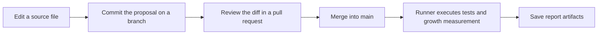

# GitHub as a Workspace for Knowledge and Automation

GitHub is an online platform where people store files, track changes, and collaborate on shared work. It is built around Git, a version-control system that records how files change over time.

GitHub is best known for software development, but the same capabilities are useful for documentation, diagrams, structured data, and other information. A repository can bring together the source material, discussions about proposed changes, and instructions for checking or publishing the results.

AI-assisted tools make this approach more accessible to people without a software background. You can describe a desired change in everyday language and ask an agent to help edit files or prepare automation. You still decide what the information should mean and review the result.

What does this mean in everyday work? Consider the onboarding team from chapter 1, which needs to clarify its access instructions. A colleague should be able to propose the wording, show exactly what changed, and ask the right person to review it. Once accepted, that change should be available to the processes that build documents and reports.

GitHub can connect those activities in one shared workspace. In chapter 1, we followed information from separate source files into several outputs. Here, we follow the work around those files: finding them, proposing a change, reviewing it, and inspecting an automated result.

You do not need a software background to explore the example. By the end, you will know where to find the source, the discussion about a change, and evidence of what the automation did. The editing exercise requires a GitHub account and an editable repository; the first exploration only requires read access.

## More Than a Place to Store Files

A repository is a collection of files with a recorded history. In this project, it contains tutorial chapters, examples, metadata, diagrams, and instructions for processing them.

Git records revisions. GitHub hosts repositories and provides browser tools for reading, editing, review, work tracking, and automation. A local working copy lets you use editors and AI tools on your own computer.

The useful connection is that the content and the instructions for processing it can be reviewed together. If a chart changes unexpectedly, you can inspect both its input data and the script that produced it.

Think of the workspace as more than a shared folder. It also holds the history of changes, discussions about proposed work, and repeatable instructions for producing results. These connections are useful whether the source is a procedure, a diagram, or a dataset.

## Find Your Way Around

Start with the [README](../README.md), then follow a question rather than trying to learn every GitHub feature at once:

| Your question | Where to look | Example in this project |
| --- | --- | --- |
| Where is the maintained information? | Repository files | [The access procedure](../examples/onboarding-showcase/access.md) |
| How is it turned into another view? | Processing scripts | [The onboarding builder](../scripts/build_onboarding_showcase.py) |
| What does the result look like? | Saved examples or build outputs | [The handbook review copy](../assets/onboarding-showcase/handbook.md) |
| What changed, and why? | File history and pull requests | A wording change and its review discussion |
| What work remains? | Issues or a project board, when used | A task to clarify an instruction |
| Did the automated process run? | Actions and its run logs | The growth report's tests and generated files |

The file links above open existing material. The change discussion and task are examples of how a team could organize its work, not claims that those issues or pull requests already exist.

## Follow One Proposed Change

Suppose the team wants the access procedure to explain when to use the confirmation reference number. A contributor prepares the wording on a branch: a separate line of work that leaves the shared main version unchanged while the proposal is being prepared.

A commit records the proposed revision. A pull request then brings its changes and discussion together. Reviewers inspect a diff, which shows the difference between the old and new source, and consider the handbook and training excerpt that reuse it. Merging brings the accepted changes into the main branch.

For this tutorial's configured growth workflow, the sequence is:

We describe the diagram below in Mermaid, a text-based notation for diagrams. A renderer turns its descriptions of items and connections into shapes and arrows, so we can review the diagram source alongside the prose. [Mermaid's introduction](https://mermaid.js.org/intro/) explains the approach. Chapter 4 introduces the syntax used here; [chapter 7](07-images.md) will cover authoring and export in more detail.



*A proposed change is recorded, reviewed, and merged; the configured growth workflow then produces a report.*

Recording a commit does not approve its contents. A pull request makes review possible, but required reviewers and checks depend on the team's rules and repository settings. Approval of a procedure also does not automatically approve an assembled handbook. [Chapter 8](08-git-review.md) develops those distinctions.

The diagram shows our chosen sequence, not a universal GitHub rule. Workflows can also be configured to check proposals before merging. Our current growth workflow runs after a push to `main`, or when started manually; it is not a pre-merge approval check.

## Start in the Browser

Open the repository and begin with its README. It describes the project and links to the chapters. Browse a Markdown file in its rendered preview, then use the Code view to inspect the source.

You can edit files in GitHub's browser editor without setting up a local development environment. Permissions and branch rules determine whether you can edit directly or need to propose a change. [GitHub's editing guide describes the options](https://docs.github.com/en/repositories/working-with-files/managing-files/editing-files).

GitHub also offers a browser-based editor at github.dev. Browser editing is an accessible starting point, while local tools become useful when you need to run scripts or inspect several files together.

A proposed edit should still be reviewed. Compare the source and preview, inspect the diff, and explain the purpose of the change. [Chapter 4](04-markdown.md) covers Markdown's source and rendered views in more detail.

## A Few Terms You Will Encounter

| Term | Meaning in this tutorial |
| --- | --- |
| Commit | A recorded revision with an identifier and an explanation |
| Branch | A separate line of work where changes can be prepared |
| Diff | A comparison showing what changed |
| Pull request | A proposal to review and merge changes from a branch |
| Issue | A place to describe a question, problem, or planned task |
| Workflow | Instructions for an automated process |
| Runner | The machine that executes a workflow job |
| Artifact | Files saved from a workflow run for later inspection |

For our onboarding guide, a branch can hold a proposed procedure update. A pull request gives colleagues a place to discuss that update before it joins the main version.

You can learn these concepts through document changes. Later, [Git, Review, and Collaboration](08-git-review.md) develops the collaboration workflow.

## How It Compares with Familiar Tools

A word processor, a content management system, and a repository platform have overlapping capabilities. Their usual starting points differ.

| Environment | Typical focus | How processing is organized |
| --- | --- | --- |
| Word processor | Writing, formatting, and reviewing documents | Document features, templates, macros, or integrations |
| Content management system | Managing content and editorial workflows for delivery channels | Content models, templates, plugins, APIs, or configured services |
| Repository platform | Versioning source files and processing instructions together | Reviewable configuration and scripts, executed by automation services |

Many content management systems have powerful automation and APIs. Word processors can also support structured content and automated tasks. The repository approach makes the files and processing rules explicit so we can inspect their changes together.

The tradeoff is setup and maintenance, but the same structure also supports AI-assisted work. An agent can use the source material and project instructions to help generate processing code, update related information, or prepare excerpts for different audiences. Version control makes those changes visible and reviewable.

AI assistance can reduce the effort involved, but people still need to check meaning, consistency, and the generated results. A repository preview also offers less layout control than a presentation tool. The choice is therefore not necessarily one environment or another: maintain shared information in the repository, then use publishing and visual tools to shape how people experience it.

## Automation as Part of the Workspace

Suppose an onboarding procedure changes. A configured workflow could check links, rebuild a handbook, and generate an updated work report from that revision.

In GitHub Actions, a workflow defines when to run and what jobs to perform. Jobs contain steps that run commands or reusable actions. The configuration is stored as YAML in `.github/workflows/`. [GitHub explains the workflow model](https://docs.github.com/en/actions/concepts/workflows-and-actions/workflows).

A runner executes the job. GitHub provides hosted runners, so you can begin without installing and operating your own automation server. [GitHub documents hosted runners](https://docs.github.com/en/actions/how-tos/manage-runners/github-hosted-runners/use-github-hosted-runners).

Our [growth workflow](../.github/workflows/growth.yml) already contains a concrete sequence: retrieve the repository history, install dependencies, run the tests, measure growth, and save the report and charts. Its configuration uses read-only repository content permissions and does not commit generated files back into the source. Hosted execution still needs verification after these files are pushed.

There are two different examples to keep distinct:

| Process | Available now | Not yet connected |
| --- | --- | --- |
| Onboarding showcase | A script assembles the handbook, training excerpt, and status chart | Automatic regeneration on GitHub |
| Growth report | A script and Actions workflow measure repository history and save charts | Website publication and interactive dashboards |

Changing a procedure therefore does not currently rebuild the handbook automatically. It can trigger the growth workflow after reaching `main`, but the chapter word count will remain unchanged because supporting examples are excluded. [Chapter 3](03-project-growth.md) explains those measurement rules.

Availability depends on repository settings and permissions, and hosted automation has usage limits. Check the relevant account settings when planning repeated or heavier jobs.

## AI Can Help You Build the Process

Agentic AI tools can carry out a sequence of actions: inspect files, propose a change, edit the source, run checks, and use the results to refine their work. Their capabilities depend on the tools and permissions available in the chosen environment.

Codex is OpenAI's coding agent. For example, Codex CLI can work in a selected repository, edit files, and run local tools. Those capabilities also apply to this tutorial's Markdown, diagrams, and processing scripts. [Official Codex documentation](https://learn.chatgpt.com/docs/codex/cli).

Claude Code is another agentic tool that can read project files, edit them, and run commands. Different products provide different interfaces and integrations; our exercises focus on the transferable workflow. [Claude Code overview](https://code.claude.com/docs/en/overview).

A chat that returns a suggested paragraph provides material for an edit. A repository-connected agent may make the edit and run checks itself. In both cases, inspect the actual saved files and review the result. Ask for a concrete deliverable and evidence of verification, such as an updated chapter, a diff, and a successful link check.

For a first task, give the agent a small, bounded change in the [draft exercise copy](../examples/onboarding/requesting-access.md), which is separate from chapter 1's fixed showcase:

```text
Read examples/onboarding/requesting-access.md.
Clarify the wording about keeping the confirmation reference number.
Do not invent a service promise or change the procedure's meaning.
Keep its status as draft and leave the fixed showcase unchanged.
Show the diff and explain what you checked.
Do not commit, push, or publish the change.
```

The file supplies context; the request supplies the purpose and boundaries. Review the resulting wording for accuracy, not just fluency. Follow your organization's rules before giving an AI service access to internal content, and keep passwords and credentials out of prompts and source files.

You can describe an outcome and ask an AI tool to propose the script and workflow needed to achieve it. For example:

```text
Use this repository's chapter files to report its growth.
Explain what you will count and how you will handle outlines.
Create a workflow that runs on updates to main.
Save a JSON report and charts as downloadable artifacts.
Use a GitHub-hosted runner.
Do not commit generated files back to the source.
Show me how to test the script and inspect a workflow failure.
```

This can lower the barrier for people without a software background. You still need to understand the inputs, the intended outputs, and how to check the result. Review what the workflow executes and which permissions it requests before running it.

You usually create a workflow and scripts, then choose a runner. You do not need to build a runner for this tutorial.

Ask the AI tool to explain unfamiliar commands and errors. A successful run means the configured steps completed; it does not establish that the report measures the right things. [Chapter 3](03-project-growth.md) defines and tests those measurement rules.

## Similar Platforms, Shared Practices

GitHub is our example environment. Other repository platforms can combine source history, collaboration, and automation.

GitLab uses CI/CD pipelines, while Bitbucket Cloud offers Pipelines. Their configuration and interfaces differ, so workflow files are not automatically interchangeable. [GitLab's pipeline guide](https://docs.gitlab.com/ci/pipelines/) and [Bitbucket's introduction](https://support.atlassian.com/bitbucket-cloud/docs/get-started-with-bitbucket-pipelines/) describe their models.

The transferable practices are clear sources, explicit processing rules, reviewable changes, and inspectable results. [Beyond GitHub](11-beyond-github.md) also explores lighter approaches using shared folders and familiar document applications.

## Try It: Follow a Change Through the Workspace

Begin without editing anything. Open the access source and handbook linked above, then find the builder and growth workflow. Explain which process assembles the handbook and which measures the tutorial. This is a useful first result even if you cannot yet edit files or run Actions.

Return to the reusable information item you identified in chapter 1. Note where its source would live, who should review changes, and what output you would want to regenerate. Use fictional material for practice if your real example contains confidential information.

### Make a Small Change

For account and Git preparation, use [GitHub's setup guide](https://docs.github.com/en/get-started/git-basics/set-up-git). For later local exercises, follow [its cloning guide](https://docs.github.com/en/repositories/creating-and-managing-repositories/cloning-a-repository), which includes command-line and GitHub Desktop options. A downloaded ZIP does not provide the Git history needed by chapter 3.

A fork is a separate repository under your account; a clone is a working copy with history. Committing locally records a revision, while pushing sends commits to GitHub. See the [shared vocabulary](../GLOSSARY.md) when these terms are unfamiliar.

Use a repository where you can edit files and inspect Actions runs. The growth workflow must already be available on its default branch, and Actions must be enabled. If these tutorial files are only local or have not been pushed, publish the working copy first or use an example repository where the workflow is installed.

1. Open this chapter on GitHub and compare its preview with the Code view.
2. On your own branch, improve one sentence. Inspect the diff and record the change with an explanatory commit message.
3. Propose the change through a pull request. Review and merge it when appropriate in your own exercise repository.
4. Open the Actions tab and find the growth workflow run for the resulting `main` commit. If your default branch has another name, adapt the workflow's branch trigger first.
5. Inspect the job steps and their logs. After a successful run, download the `project-growth` artifact and inspect its report and charts.

GitHub exposes workflow history and individual run details. [Its workflow-history guide explains where to look](https://docs.github.com/en/actions/how-tos/monitor-workflows/view-workflow-run-history).

If the run fails, identify the failed step before changing anything. Use the error message, workflow configuration, and source revision to investigate it. Keep automated results tied to the version that produced them.

**Expected result:** a reviewed chapter edit and a workflow run associated with the resulting commit, with downloadable artifacts after success. The report should include that commit; it does not establish that your edit improved the writing. If Actions is unavailable, retain the proposed change and mark the automation part as not yet verified.

**If no run appears:** check that Actions is enabled, the workflow is on the default branch, and the update reached `main`. A commit on your computer or another branch does not trigger this workflow. A missing artifact may mean the job failed before upload.

**Keep:** the accepted source change, its commit reference, and the workflow run link when available. Also retain your note about the source, reviewer, and desired output for your own example. Generated artifacts can be downloaded for inspection; they do not need to be committed into the source.

The important connection is between the source revision, the review, and the processing result. Next, [Project Growth: History as Data](03-project-growth.md) explains how we calculate and interpret that result.
