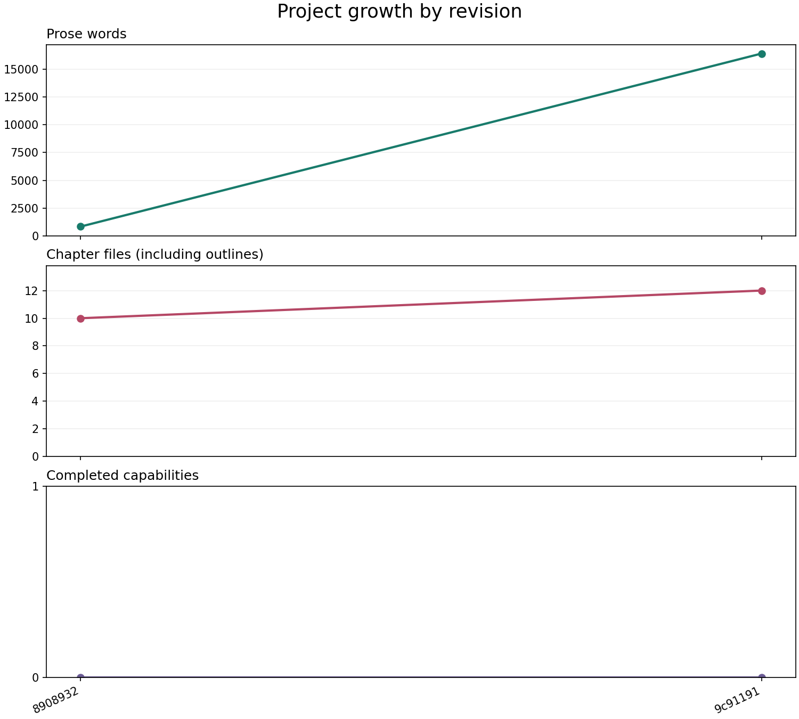
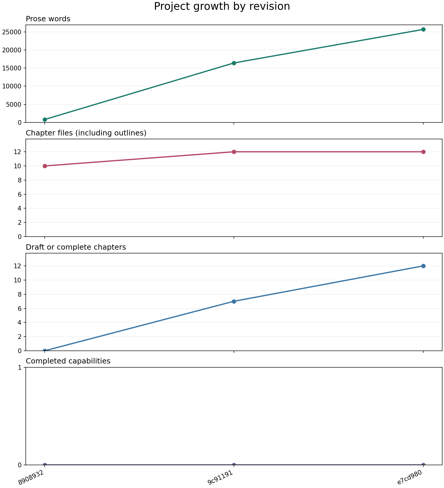
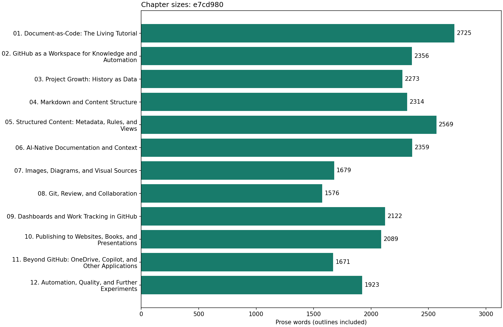

# Project Growth: History as Data

Project growth is more than a rising word count. We want to know how much of the tutorial has been developed, where its content is concentrated, and which publishing or visualization capabilities actually work. Those questions help us decide what to write, review, or build next.

In a document-as-code project, the source files and their recorded history can supply much of this information. A script can read earlier revisions, apply the same measurement rules to each, and produce data for charts. We do not need to maintain a separate progress spreadsheet by hand.

Chapter 1 demonstrated different views of the same information. Chapter 2 introduced the workspace and its automation. Here, the tutorial itself becomes our dataset: you will inspect a real historical result, learn how it was calculated, and generate a report of your own. Reading the example requires no installation. The local exercise uses Git and Python 3.9 or later.

## What Does Growth Mean?

Our project grows in several ways. We add content, develop chapters, and introduce capabilities such as PDF publishing. These changes need different measures.

| Measure | What it describes | What it does not establish |
| --- | --- | --- |
| Chapter files | Scope of the tutorial, including outlines | How many chapters are ready to use |
| Draft or complete chapters | Material that has progressed beyond an outline | Independent verification of its quality |
| Prose words | Approximate volume of readable content | Clarity, correctness, or usefulness |
| Completed capabilities | Features explicitly marked complete | The amount of code or effort invested |

A shorter explanation may be an improvement. A chapter can become more useful without gaining words, and a new publishing capability may add no prose at all. We will look at these measures together and inspect the changes behind them.

Chapter 1's dashboard summarizes fictional procedure review states. This report measures the tutorial repository. A chapter marked `draft`, a procedure marked `approved`, and a capability marked `complete` describe different things; they should not be combined into one completion percentage.

## Current Data and Historical Examples

The charts below are saved historical measurements, labelled with the revisions they describe. They remain readable in GitHub's Markdown preview and do not refresh when the project changes.

The [website version of this chapter](https://and-gu.github.io/document-as-code-lab/chapters/03-project-growth/) adds an interactive growth view here, immediately before the first historical chart. It uses the same measurement script and rules, following the first-parent history through the revision used for that website build. After a merge, this measures the merged result rather than every separate branch commit. You can select a measure and compare revisions without replacing the historical examples.

"Latest" means the latest built revision, not a live GitHub feed. The website refreshes after a successful deployment. Uncommitted edits are excluded from the widget, even in a local preview. Metadata, commit history, and generated data can therefore add another reading experience without changing the source of the tutorial's facts.

<!-- interactive: project-growth -->

## Our First Committed Comparison

The first commit, `8908932`, contains ten chapter outlines. The next, `9c91191`, records the first seven drafts, supporting examples, and processing scripts. Compare these actual revisions using the same measurement rules:



*Two committed observations, ending at `9c91191`, measured with rules version 2. This is a fixed historical comparison, not a live report.*

| Measure | Initial outline: 8908932 | First drafts: 9c91191 | Change |
| --- | --- | --- | --- |
| Chapter files | 10 | 12 | +2 |
| Draft or complete chapters | 0 | 7 | +7 |
| Prose words | 829 | 16,416 | +15,587 |
| Recorded completed capabilities | 0 | 0 | No change |

The additional chapters cover the GitHub workspace and structured content. Existing chapters were expanded and reordered; their stable IDs preserve their identity across that reorganization. Seven chapters are drafts, not seven approved or completed publications.

The flat capability line needs explanation. The commit includes working scripts and tests, but the feature register still records every capability as planned. This metric reports explicit milestone decisions, not an automatic assessment of available functionality. The appropriate next action is to review the completion criteria and evidence, then update the register where justified, rather than interpret zero as "nothing works."

The large word-count increase represents work accumulated before one commit. Git does not record each uncommitted editing step. These two points establish a before-and-after comparison, not a reliable trend, productivity rate, or forecast.

The [chapter-size chart](../assets/figures/growth-first-update/chapter-sizes.png) shows another useful detail: structured content is the largest chapter at this revision, with 3,063 measured words. That suggests a readability review, not an automatic decision to shorten it. Its examples may justify the space.

The [saved report](../assets/figures/growth-first-update/history.json) contains both observations and their chapter-level values. This chapter update is not included in the totals above: the report is pinned to the earlier committed source. Recreate the snapshot from the repository root with:

```bash
python scripts/measure_growth.py --ref 9c91191bcf0bf77a337870a17f43523d16f7407b --output build/first-update-check
```

With the same script and measurement rules, the JSON values should match the saved report. Keep future live reports separate from this teaching snapshot. The original one-observation [baseline chart](../assets/figures/growth-baseline.png) and [data](../assets/figures/growth-baseline.json) remain available as historical assets.

## A Complete First Draft

Commit `e7cd980` records a first draft of all twelve chapters, including the remaining material on dashboards, publishing, portable workflows, and automation. It also contains the editorial improvements made while reviewing earlier chapters.



*Fixed historical comparison ending at `e7cd980`, using measurement rules version 2. The additional panel makes chapter development visible even when the file count stays unchanged.*

| Measure | First drafts: 9c91191 | Complete first draft: e7cd980 | Change |
| --- | --- | --- | --- |
| Chapter files | 12 | 12 | No change |
| Draft or complete chapters | 7 | 12 | +5 |
| Prose words | 16,416 | 25,656 | +9,240 |
| Recorded completed capabilities | 0 | 0 | No change |

The scope stayed at twelve chapter files, but five outlines became drafts. The separate measures reveal progress that the file count alone would hide. At this historical checkpoint, all chapters were still drafts; the count did not mean that every exercise had been verified in its target environment.



*Chapter sizes at the same checkpoint. Longer does not mean better, and equal lengths are not the goal.*

The introduction is now the longest chapter at 2,725 measured words. The review chapter is the shortest at 1,576. Structured content has fallen from 3,063 to 2,569 words following editorial work. These differences help select material for reader review; they do not establish that any chapter needs a prescribed length.

The capability count still reflects the unchanged feature register. Completing the tutorial draft does not automatically complete website, book, or presentation delivery. Review the register against the evidence before updating those milestones.

Inspect the [saved data](../assets/figures/growth-complete-draft/history.json), or reproduce it with:

```bash
python scripts/measure_growth.py --ref e7cd98089498c392db3f914fd74eb4f2bc97545f --output build/complete-draft-check
```

This report deliberately stops at the completed-draft commit. The explanation you are reading and later script changes are recorded afterwards, so they are not included in its totals. The charts now use four panels and reader-facing chapter titles; the underlying counting rules remain version 2. Older saved charts retain their original presentation.

## From Drafts to Working Capabilities

Commit `62eacec` adds a local Astro reading site. It reads the original chapter files rather than maintaining another copy of the text. Readers can browse all twelve chapters, follow links to supporting examples, and see images and Mermaid diagrams. The site builds successfully, passes its TypeScript checks, and has been checked for broken local links.

This is a working capability, not just more tutorial content. You can try it by following the [site instructions](../site/README.md). Editing a chapter updates the local reading site from the same source. [Chapter 10](10-publishing.md#our-website-uses-astro) explains Astro's role in publishing.

Commit `815d650` adds the GitHub Pages deployment. The [tutorial website](https://and-gu.github.io/document-as-code-lab/) is now public, and its build and deployment have succeeded. We checked navigation, an image, and a Mermaid diagram on the hosted site. This completes the original website milestone: it builds from the maintained sources and is available to readers.

Commit `d1b4f17` adds an expandable **Chapter information** panel to all twelve chapter pages. It shows the chapter's status, audience, learning goal, stable ID, and recent commit messages. CSS colors the panel according to the source's `status` field. Git history is collected during the build, so the displayed changes refer to the source revision used for publication rather than a live GitHub feed.

This small widget demonstrates another use of the information we already maintain. Readers can inspect the state and history of the chapter without opening its source file. Its status label is not an approval decision, and its commit list is not a measure of writing effort. The widget is a chapter-level view, not the complete work-tracking dashboard planned in chapter 9.

Later changes add two different kinds of progress. Chapters 1 and 2 now have their first approved editions. The website view of this chapter also adds the interactive growth chart described earlier. Chapter approval changes a review state; the chart adds a way to explore measured history. Neither creates another chapter file.

Merge commit `f11393b` adds a published [HTML introduction deck](https://and-gu.github.io/document-as-code-lab/presentations/document-as-code/). Its eight slides select messages from chapters 1, 2, 8, and 10. YAML defines the teaching sequence, Astro renders reusable slide components, and Reveal.js provides presentation controls. The deck uses the same website build and GitHub Pages deployment. [Chapter 10](10-publishing.md#our-html-presentations-use-astro-and-revealjs) explains the arrangement and links to its authoring instructions.

This is useful progress even though the presentation milestone is not complete. Its criterion requires both an introduction and a workshop deck to be generated and visually verified. The introduction has been checked locally and on GitHub Pages; the workshop remains to be developed. The register therefore marks presentations as `in-progress`, rather than treating one working deck as completion of the whole milestone.

We have now reviewed the [feature register](../data/features.json) against the available evidence:

| Capability | Current status | Evidence or remaining work |
| --- | --- | --- |
| Historical growth metrics | Complete | Historical reports are reproducible; counting tests pass, and local and hosted results have been compared |
| Local Astro reading site | Complete | All twelve chapters render; build, type checks, local links, and Mermaid rendering have been verified |
| Tutorial website | Complete | Production build and GitHub Pages deployment succeeded; the hosted reading experience was checked |
| Chapter metadata and history widget | Complete | All twelve hosted chapters contain the panel; expansion and chapter-specific commit history were checked |
| Presentation decks | In progress | The HTML introduction deck is published and verified; the workshop deck is still missing |
| PDF book | Planned | The book still needs generation and visual verification |
| GitHub dashboard | Planned | The combined chart and work-tracking view still needs implementation |
| Workflow beyond GitHub | Planned | The exercise still needs verification in its stated environment |

Why separate the local site from the broader website milestone? They record different outcomes: a site we can run ourselves, and a publication readers can reach online. The widget adds another outcome: making each chapter's metadata and history visible. These milestones overlap and are not independent units of effort, so their count should not be interpreted as a percentage of the project finished.

The register still records four completed capabilities. Adding the introduction deck does not raise that count because the presentation entry remains in progress. The historical charts above still correctly show zero: the register had not recorded completion at those revisions. Commit `3522333` records the first two completed capabilities, and `0b5b449` records four after recognizing the published website and chapter information widget.

The entries are assessments supported by implementation and verification evidence. Their recording dates may be later than their implementation dates. This distinction matters: the capability chart shows when completion was recorded, not necessarily when the first working code appeared. Each completed entry includes evidence explaining the decision. Regenerating the report does not rewrite the earlier teaching snapshots.

## Choose a View for the Question

The report separates measures with different units rather than combining them into a single score. Each view should help a reader ask a specific question:

| Question | Useful view | What to inspect before acting |
| --- | --- | --- |
| How has the content changed? | Word count by revision | The edits behind a rise or fall |
| Has the scope expanded? | Chapter count by revision | Whether files are outlines, drafts, or completed chapters |
| Where is the material concentrated? | Horizontal bars of chapter sizes | Whether longer chapters need their detail or should be split |
| What can the project deliver? | Completed capabilities by revision | Each capability's completion criterion and supporting evidence |

For example, splitting one chapter into two can increase the chapter count without adding much information. Editing for clarity can reduce the word count. Neither change is automatically progress or a setback. Use the chart to find a change worth inspecting, then read the source and its review context.

The generated history chart uses separate panels for words, chapter files, drafted or completed chapters, and capabilities. The chapter-size chart uses horizontal bars so chapter titles remain readable. The website widget applies the same measurement rules to the revision being built, presented as a selectable measure. A future slide could reuse that growth data; our current introduction deck instead reuses chapter 1's onboarding status chart.

## Git History Is Our First Dataset

Git records revisions of the source files. Each commit has an identifier, a date, and a snapshot of the repository. We can read those snapshots to reconstruct earlier chapter counts and word counts, even if the measurement script was added later.

The script uses the first-parent history of the selected revision. This follows the main sequence of revisions and, after a merge, measures the merged result rather than every separate branch commit. The charts use revision order; they do not imply equal time between commits. Dates remain available in the report.

A commit is a recorded observation, not a unit of effort. Several days of work may appear in one commit, while a small correction may have its own. Do not use the slope of this revision-based chart as a measure of productivity per day or as a comparison between authors.

Git and GitHub contribute different information. This exercise reads Git history from a local clone. In GitHub Actions, that clone is fetched from GitHub. Issues, pull requests, and project fields require additional GitHub data; collecting those is a later dashboard exercise.

## Define the Rules Before Counting

The script counts chapter files directly inside `docs/`, including outlines. It measures their prose while excluding metadata and fenced examples, and leaves supporting files and generated outputs outside the totals. Presentation YAML, Astro components, and generated HTML therefore do not add to the chapter word count. This measures tutorial prose, not all the information or software in the repository.

The current report records `measurement_version: 3`. Its draft-or-complete count also includes chapters in review or approved, so approving chapters 1 and 2 does not reduce that count. Individual review states remain available in the data. The saved teaching charts use version 2; their numeric values are unchanged because those revisions contain no chapters with the newly included statuses. Use the same rules across revisions; otherwise a change in measurement can look like a change in content. The optional [measurement reference](../reference/growth-measurement.md) lists exact inclusions, exclusions, and regeneration commands.

## Track Capabilities Explicitly

The [feature register](../data/features.json) lists capabilities and their completion criteria. Supported statuses are `planned`, `in-progress`, and `complete`.

Only `complete` contributes to the completed-capability count. A person must check the criterion before changing that status. Adding a file or setting a field does not prove the capability works.

For example, the PDF book capability requires the book to be generated from source and visually verified. Writing a publishing script alone does not meet that criterion. The register records a checked milestone rather than guessing functionality from the number of scripts in the repository.

The report reads the register at each revision. If no register exists, the capability count is unknown rather than zero. It cannot reconstruct milestones that were never recorded. You can document an earlier milestone explicitly, but should distinguish that retrospective entry from what Git recorded at the time.

## Generate Your First Report

Use a local clone with Git history. If you need help obtaining it, follow [GitHub's setup guide](https://docs.github.com/en/get-started/git-basics/set-up-git) and [cloning guide](https://docs.github.com/en/repositories/creating-and-managing-repositories/cloning-a-repository). The repository root is the top-level folder containing `README.md`, `requirements.txt`, and `scripts/`.

The commands below use a macOS/Linux shell. For Windows commands and environment activation, follow [Python's virtual environment guide](https://docs.python.org/3/library/venv.html). Once the environment is active, the `python` commands for the exercises are the same. An agentic tool working in the clone can also run the exercise; ask it to report the source revision, outputs, and any failures.

From the repository root, create an isolated Python environment and install the measurement dependencies:

```bash
python3 -m venv .venv
source .venv/bin/activate
python -m pip install -r requirements.txt
python scripts/measure_growth.py
```

The script creates three files in `build/growth/`:

| File | Contents |
| --- | --- |
| `history.json` | Source commit, date, chapter records, and capability data for each revision |
| `growth.png` | Separate historical panels for words, chapter files, drafted or completed chapters, and completed capabilities |
| `chapter-sizes.png` | Word counts for individual chapters in the latest snapshot |

These are generated outputs and are excluded from version control. You can regenerate them from the source. Astro runs the same script with `--json-only` before starting the local site or building it for publication. Its separate report in `build/site-growth/` supplies the interactive widget without rendering new chart images.

The default report ends at `HEAD`, your current committed revision. Uncommitted edits are excluded. To inspect local edits without presenting them as history, run:

```bash
python scripts/measure_growth.py --include-working-tree
```

This adds a separately labelled working-tree snapshot. Its `source_commit` identifies the base revision, not an exact version of the local edits. Keep the committed report for reproducible comparisons.

Open both generated charts and compare them with `history.json`. The history chart includes a panel counting chapters marked draft or complete; individual statuses remain available in the data. The chapter-size chart shows the latest measured snapshot, including the working-tree preview when requested. It uses reading-order numbers from filenames and chapter titles. Stable IDs remain in the report for comparison across reorganizations.

### Optional: Ask AI to Interpret the Report

The structured report is also useful context for an LLM. An agent can help explain a change, suggest a visualization, or adapt the measurement script. Give it the rules and source revisions as well as the numbers, so it can distinguish observations from interpretations.

After generating a report, try a bounded request:

```text
Read build/growth/history.json and the measurement rules in
docs/03-project-growth.md. Compare the last two committed observations.
If fewer than two exist, say that a trend cannot yet be established.
Report the source commit IDs and changes in words, chapters, and
completed capabilities. Keep any working-tree preview separate.
Distinguish measured facts from possible explanations.
Suggest one source change to inspect before drawing a conclusion.
Do not edit files or change completion statuses.
```

Check its figures against the JSON report. A plausible explanation is not evidence of why something changed. If you ask an agent to modify the counting rules, review the code and tests, update the measurement version, and regenerate comparable history. [Chapter 6](06-ai-native.md) develops this approach to context and verification.

## Try It: Compare Two Revisions

Use your own working copy so you can make an experimental commit.

Before editing, predict the result: adding a paragraph to an existing chapter should change its word count, but not the number of chapters or completed capabilities. If you completed chapter 2's optional editing extension and its change was accepted, you can skip steps 2 and 3 and investigate that edit instead.

1. Run the script and note the latest totals in `build/growth/history.json`.
2. Add a useful paragraph to a chapter. Generate a working-tree preview and inspect the change in its word count.
3. Commit the paragraph with a message explaining its purpose.
4. Run the default script again. Compare the final two entries in `history.json` and inspect both charts.
5. Explain whether the change affected words, chapter count, or capabilities, and whether it improved the tutorial.

For an optional reproducibility check, regenerate the same revision using the commands in the [measurement reference](../reference/growth-measurement.md). A shallow clone lacks the history this exercise needs; the script stops rather than silently reporting incomplete totals.

**Expected result:** the new committed observation reflects your paragraph, with chapter and capability counts unchanged. Its exact word change depends on the text you wrote.

**If totals do not change:** check whether the edit is committed or whether you requested the working-tree preview. Edits under `examples/` are intentionally excluded. For a missing dependency, check that the Python environment is active and the requirements installation succeeded.

**Keep:** the intended chapter edit, its explanatory commit, and a short interpretation stating what changed, what the measures cannot establish, and what you would inspect next. Keep generated reports under the ignored `build/` directory; the shared-source revision is what lets you recreate them.

For the information item you identified in chapter 1, choose one question a report could answer. Name the source field or history needed, the view you would use, and a decision it would support. A procedure collection might need a count of items awaiting review rather than a word-count chart.

## Update the Report on GitHub

The [growth workflow](../.github/workflows/growth.yml) is configured to run on pushes to `main` and manual dispatch. It checks out the full history, installs dependencies, runs focused tests, and uploads the JSON report and charts as an artifact named `project-growth`.

Full history is requested with `fetch-depth: 0`. [The checkout documentation explains this setting](https://github.com/actions/checkout). The uploaded files can be downloaded from the workflow run; artifacts have retention limits and do not replace the source history. [GitHub documents workflow artifacts](https://docs.github.com/en/enterprise-cloud%40latest/actions/tutorials/store-and-share-data).

The growth workflow does not commit generated reports back into the repository, so its output cannot trigger a cycle of new commits and builds. It produces downloadable artifacts, not refreshed chapter or README images. A separate [Pages deployment workflow](../.github/workflows/deploy-pages.yml) publishes the Astro website. That build generates its own JSON report with the same measurement script for the interactive widget; it does not download the growth workflow's artifact. The saved chart images in this chapter remain historical examples.

Local measurement and a successful GitHub workflow run are separate checks. The [first hosted run for 9c91191](https://github.com/And-Gu/document-as-code-lab/actions/runs/37135502115) completed successfully after the push to `main`, running the tests and uploading the `project-growth` artifact. The repository was private at that time and is now public; artifact availability is subject to retention limits. The fixed comparison above remains available with the tutorial's source files.

The downloaded artifact's JSON report matches the locally regenerated report for that revision. This verifies agreement for these inputs, not the correctness of every future measurement or an automatic completion decision for the feature register.

The [hosted run for the complete first draft](https://github.com/And-Gu/document-as-code-lab/actions/runs/37187718618) also succeeded for `e7cd980`. Its report provides the third committed observation used in the new comparison. That run used the earlier three-panel chart renderer; the refreshed fixed charts add the fourth panel without changing the measured values.

Next, [Markdown and Content Structure](04-markdown.md) explores the source conventions that make these chapters easier to maintain and process.
