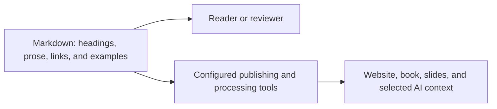
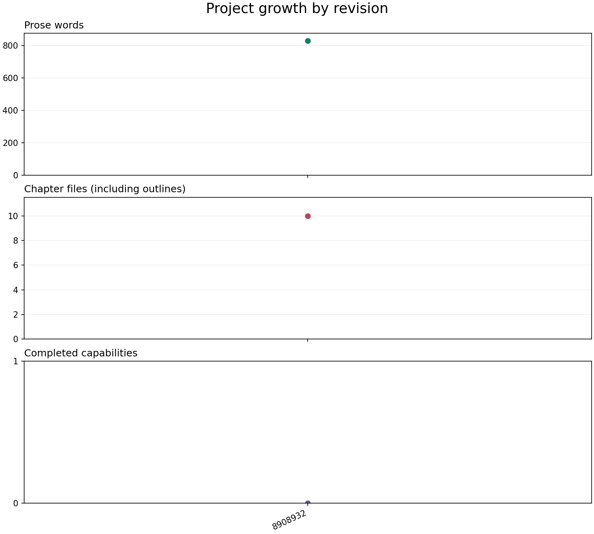

# Markdown and Content Structure

Markdown is a way to express document structure in ordinary text. Small markers identify headings, lists, links, and examples, while publishing tools decide how those elements appear. This makes the information easy to inspect, revise, and process without tying it to one page layout.

By the end, you will be able to write a short Markdown section with headings, steps, a link, and basic metadata. You will also know which parts are portable and which depend on the publishing tool.

You can write Markdown directly or describe changes to an AI agent. Memorizing syntax is not the goal: understanding the resulting structure helps you review edits and provide useful context. We will follow the onboarding procedure from earlier chapters through source, preview, and a small improvement.

You need an editable copy of the repository and a text editor or an AI tool that can edit its files for the exercise. You can inspect the examples without changing anything.

## Structure Before Appearance

You can read Markdown source in a text editor. A renderer interprets its markers and displays formatted content; a preview is one such view.

In Word, you might apply a heading style. In Markdown, you write a heading marker. Both express structure; the publishing environment decides how that structure looks.

A clear heading helps a reader navigate and gives a processing tool a section boundary. It can also help you select useful context for an AI task. Those benefits still depend on meaningful writing and appropriate tool configuration.



*Markdown supplies readable structure; configured tools create audience-specific views.*

The source can be read directly or processed into different views. It does not define every detail of a page layout or automatically create a good presentation.

## One Procedure, Source and Preview

Return to our onboarding example. A new colleague wants to know how to request access and how to follow up.

Chapter 1 uses a fixed showcase with an access procedure marked `approved`. Here we use a separate [exercise copy](../examples/onboarding/requesting-access.md), marked `draft`, so you can practice editing it. Both use the illustrative ID `PROC-001`, but they are separate teaching examples, not a shared approval history. Changes to the exercise copy do not update the showcase.

Here is its reader-facing text, reproduced exactly; we will inspect its metadata later:

```markdown
# Requesting Access

This fictional example explains how to submit an access request and follow its progress. Replace its assumptions with verified instructions before using it at work.

## Before You Start

Have your team name and the system name ready. This example assumes your organization provides a service portal.

## Submit the Request

1. Open your organization's service portal.
2. Select the system you need and enter your team name.
3. Submit the request.
4. Keep the confirmation reference number.

## Follow Up

Use the reference number when asking the service desk about progress. A submitted request does not mean access has been approved.
```

The headings describe the reader's tasks. The introduction sets expectations, and the numbered list expresses an ordered procedure.

GitHub offers a formatted preview and a Code view of the source. They show the same file, not separate versions to maintain. A diff is different: it compares revisions or proposed changes. [GitHub documents its file views](https://docs.github.com/en/repositories/working-with-files/using-files/working-with-non-code-files).

For example, the `## Follow Up` marker becomes a heading, while its paragraph remains ordinary prose. Open the linked exercise file to compare the full source and preview. A focused rendered comparison appears below.

## Write Directly or Ask an Agent

The editing method does not change what we maintain: a source file that people can inspect and tools can process. You can write the wording yourself or ask a repository-connected agent to make a bounded edit. A useful prompt names the source, audience, purpose, and constraints:

```text
Edit examples/onboarding/requesting-access.md for a new colleague.
Add a section on what to do if the reference number is missing.
Use clear, natural English and the existing heading structure.
Keep the metadata status as draft and leave the fixed showcase unchanged.
Do not invent a portal address, recovery process, or response-time guarantee.
Put unresolved questions in a separate maintainer note, not in reader steps.
Show the diff and identify details that need confirmation.
Do not commit or publish the change.
```

If the tool only returns text in chat, the repository source still needs updating. If it edits files, inspect the saved result and its diff. The agentic workflow introduced in [chapter 2](02-github-workspace.md) can support both editing and checks, but a fluent answer is not evidence that an instruction is correct.

Meaningful headings, consistent terms, and explicit assumptions help both human reviewers and LLMs interpret an excerpt. Supply the relevant source and conventions, then review facts, links, metadata, and the rendered result. [Chapter 6](06-ai-native.md) develops context selection and verification.

## Make a Section Useful on Its Own

Imagine replacing the follow-up instruction with "Use it when asking about progress." Inside the full procedure, a reader might infer what "it" means. Extracted into a training note or an AI context package, the sentence loses that connection.

The current section names the reference number, but a standalone excerpt can be more explicit. Here is a proposed revision, not a change already made to the exercise file:

```markdown
## Follow Up on an Access Request

Use the confirmation reference number from your access request when asking
the service desk about that request's progress. Submitting the request
does not mean access has been approved.
```

Rendered as a section, the same text reads:

## Follow Up on an Access Request

Use the confirmation reference number from your access request when asking
the service desk about that request's progress. Submitting the request
does not mean access has been approved.

The example ends here. Its appearance depends on the renderer in which you read this chapter. The improvement is not just formatting: it identifies the task, names the reference, and preserves the distinction between submission and approval without inventing a new service policy.

A heading alone does not make content reusable. Include the context and qualifications needed to interpret the instruction, and check whether the excerpt depends on another section or asset.

For this project, use one level-one heading (`#`) for the document title, level-two headings (`##`) for sections, and level-three headings (`###`) for subsections. Keep the hierarchy consistent rather than choosing a heading level for its font size.

Write paragraphs with one main idea and leave a blank line between them. Use complete sentences with enough context to stand on their own. A useful section should still make sense when selected for a handbook excerpt or an AI task.

Reusing a section also requires an inclusion or transformation mechanism. Copying it manually creates another copy to maintain. Chapter 1's [showcase script](../scripts/build_onboarding_showcase.py) demonstrates simple assembly from source files; [chapter 10](10-publishing.md) develops publishing workflows for websites, PDFs, and presentations.

## A Small Set of Useful Elements

You can do most introductory writing with a few elements:

| Element | Source notation | Use |
| --- | --- | --- |
| Heading | `## Follow Up` | Name a section |
| Emphasis | `**Keep the reference number.**` | Highlight a meaningful point |
| Inline code | `` `status` `` | Identify a field, command, or filename |
| Link | `[Chapter 3](03-project-growth.md)` | Connect related material |
| Bullet | `- Team name` | List parallel items |
| Ordered step | `1. Open the portal.` | Express a sequence |

Use tables when readers need to compare items. Use prose when the explanation needs to develop an idea. Blank lines around lists, tables, and code blocks make the source easier to scan.

A fenced code block preserves an example without interpreting it as ordinary document formatting. Place three backticks before and after the example, and add a language name such as `markdown`, `yaml`, or `bash` after the opening fence.

```bash
python scripts/measure_growth.py --include-working-tree
```

The [CommonMark specification](https://spec.commonmark.org/spec) defines core Markdown elements. GitHub Flavored Markdown extends it with features such as tables and task lists. [Its specification describes those extensions](https://github.github.com/gfm/).

## Images Need Text Too

An image reference has an exclamation mark, alternative text in brackets, and the asset path in parentheses:

```markdown

```

Alternative text communicates the image's purpose and key information when the image cannot be seen. A caption explains why it belongs in the surrounding discussion. For a complex chart, also provide its values or a longer explanation in the text, as chapter 3 does.

Use meaningful headings, descriptive links, and table headers as part of the same practice. Accessibility begins in the source and needs checking again in each published format. [The images chapter](07-images.md) will develop this further.

## Links That Survive Everyday Changes

Use descriptive link text so readers know what they will find. For example, link to [the growth measurement exercise](03-project-growth.md) instead of writing "click here."

For files in this repository, use relative paths. A link from this chapter to another chapter starts in `docs/`; a link to [contribution guidance](../CONTRIBUTING.md) goes up one directory. GitHub resolves relative links against the current branch. [GitHub's formatting guide explains relative links](https://docs.github.com/en/get-started/writing-on-github/getting-started-with-writing-and-formatting-on-github/basic-writing-and-formatting-syntax).

Heading links can be useful, but a heading rename may change its generated anchor. Stable chapter IDs identify the content independently of its title; they do not automatically redirect a renamed file or repair a link. Update references when moving source files.

Use the same name for a concept throughout the tutorial. If "source revision" means a committed snapshot, avoid using it elsewhere to mean an uncommitted draft.

## Metadata Beside the Prose

The exercise file starts with YAML front matter, a metadata block between two `---` lines. Here is its current block:

```yaml
---
id: PROC-001
status: draft
owner: onboarding-team
learning_goal: Submit an access request and follow its progress.
---
```

The ID identifies the procedure, the status records its draft state, and the owner names the team responsible for it. The learning goal describes what the reader should be able to do. These fields describe the information; they are not steps for requesting access.

Chapters use related fields, including `chapter_number`. This chapter retains the stable ID `03-markdown` even though it is now chapter 4. Our measurement script uses chapter IDs and statuses, but excludes the supporting procedure under `examples/` from chapter totals.

Front matter is a convention used by many tools, rather than a core Markdown requirement. Our field names have project-specific meanings. A publishing tool must be configured to interpret them, and another application may display or ignore them.

Optional visual specifications use a `visuals` list, described in [CONTRIBUTING.md](../CONTRIBUTING.md). You do not need to add one for this chapter's text-editing exercise.

Keep metadata small and useful. The next chapter, [Structured Content: Metadata, Rules, and Views](05-structured-content.md), introduces templates as starting points, then schemas as rules for checking the resulting records, followed by relationships and validation.

## Check the Source, Preview, and Target Format

Review in three passes. First inspect the source and diff for meaning, metadata, and unintended edits. Then inspect the preview for readable headings, ordered steps, working links, and understandable diagrams. Finally, check each published format when its pipeline exists: a successful GitHub preview does not prove that a PDF or slide is usable.

### Essential Preview Checks

GitHub's repository preview provides a particular rendering environment. It does not run our publishing scripts, resolve custom include instructions, or turn our `visuals` metadata into images. A separately built website can have different capabilities.

Use formatting that the renderer recognizes:

- Put a space after heading markers, as in `## Follow Up`.
- Separate paragraphs and surround lists and tables with blank lines for predictable layout.
- Give a table its header and separator row, such as `| --- | --- |`.
- Keep opening and closing code fences balanced. A `markdown` fence displays an example as code; it does not render the example's headings.
- Use a fenced block labelled `mermaid` for a diagram that GitHub should render.

The checks above are enough for the core exercise. The following diagram example is optional background for readers inspecting Mermaid sources.

### Optional: Diagram Fences and Rendering

A four-backtick outer fence lets us display the three-backtick inner fence as an example:

````markdown

````

We keep editable Mermaid sources in `.mmd` files, but use embedded `mermaid` blocks for diagrams in the chapter preview. A Markdown link to a source file provides access to its text; it is not an instruction to include or render that file as a diagram.

The `mermaid` fence identifies the diagram language. `flowchart LR` requests a left-to-right flowchart; `request` identifies a node, brackets contain its label, and `-->` draws an arrow. See [Mermaid's flowchart guide](https://mermaid.js.org/syntax/flowchart.html) for more syntax.

Rendering turns the diagram text into a visual. It does not check that the diagram agrees with a procedure or dataset. [Chapter 5](05-structured-content.md) shows why that distinction matters when diagrams describe record relationships.

Mermaid support varies between renderers. Check the actual preview; [GitHub's diagram documentation](https://docs.github.com/en/get-started/writing-on-github/working-with-advanced-formatting/creating-diagrams) explains supported use and how to inspect its Mermaid version.

GitHub also sanitizes rendered HTML. You cannot assume that custom scripts, embedded content, or layout styling will work in a repository preview. [The GitHub Flavored Markdown specification describes this additional processing](https://github.github.com/gfm/).

A wide table or diagram may need different treatment in print. [Chapter 7](07-images.md) develops visual sources and exports, and [chapter 10](10-publishing.md) covers publication choices. This chapter's diagram source is not a verified cross-format asset.

## Try It: Improve an Onboarding Section

Open the [example onboarding source](../examples/onboarding/requesting-access.md) in your own working copy. It describes a fictional service, so adapt it to a real workflow you understand before using it at work.

1. Read the source and its Markdown preview, if your editor provides one. Identify its metadata, title, sections, and ordered steps.
2. Draft a short section about a missing reference number, directly or with the prompt above. The source does not specify a recovery process. Do not fill that gap with an invented instruction; record the question for the owner in a separate maintainer note and leave the section explicitly incomplete until confirmed.
3. Add a `## Maintainer Notes` section for unresolved questions and a link labelled `Contribution guidance for maintainers`. From the example directory, the link path is `../../CONTRIBUTING.md`. This is editorial material, not a step for the requester; it needs separate handling when publishing reader-only instructions.
4. Compare the source and preview. Check the heading hierarchy, list order, link destination, and readability. If you used AI, review its assumptions as well. Keep the metadata status as `draft`.
5. Read the new section without the surrounding procedure. Can you identify the task, the kind of reference number, and any unresolved information? Check that no instruction depends on an unexplained "it" or "as above."
6. Inspect the diff and commit the intended change with a message explaining its purpose and any remaining review question.

**Expected result:** a clearly scoped draft section, a separate maintainer note with a working link, and a reviewable revision. The missing recovery policy is visible rather than disguised as a finished instruction.

**If formatting looks wrong:** compare the heading markers, blank lines, and code fences with the examples above. If a link fails, resolve its path from the file containing it rather than from the repository root.

**Keep:** the improved example and its explanatory commit. Remove any unverified organizational assumptions before using the procedure outside this fictional exercise.

Apply the same standalone-reading check to the information item you selected in chapter 1. Note what context must travel with it when it becomes an excerpt or AI input.

If you run chapter 3's measurement script, this example does not increase the chapter count or chapter word total. That is intentional: a measurement should reflect its stated scope.

Next, we will give records more explicit rules in [Structured Content: Metadata, Rules, and Views](05-structured-content.md).
