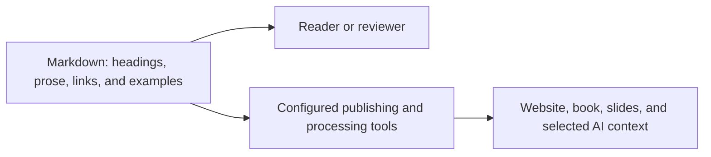
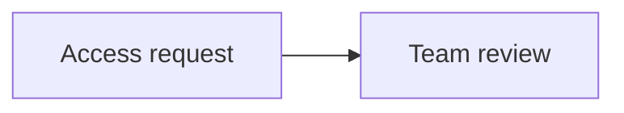

# Markdown and Content Structure

Markdown lets you write and organize a document in a plain text file. Simple symbols mark headings, lists, links, and examples. You can read and edit the file directly, while a publishing tool turns those markers into formatted pages. The same source can therefore support different layouts and publications.

By the end of this chapter, you will be able to write a short Markdown section with headings, steps, a link, and basic metadata. You will also understand which features work across common tools and which need support from a particular publishing tool.

You can write Markdown directly or describe changes to an AI agent. An AI agent is an AI assistant that can use tools to carry out a task, such as reading related files, editing a document, and checking the result. You explain the change you want in everyday language, and the agent helps turn it into an edit you can review.

Learning a few Markdown conventions will help you give clearer instructions and check that the result is well structured. We will use the onboarding procedure from earlier chapters to compare its source text with the formatted preview, then make and review a small change.

To do the exercise, you need a copy of the repository that you can edit, together with a text editor or an AI tool that can change its files. You can read and compare all the examples without setting up an editing environment.

## Structure Before Appearance

When you write a document, you decide both what it says and how its parts fit together. A heading introduces a section, a numbered list gives steps in order, and a link directs the reader to related information. Markdown records these choices in the text itself.

In Word, you might select a line and apply a heading style. In Markdown, you put a marker such as `##` before that line. A tool called a renderer reads the marker and displays the line as a heading. GitHub's formatted preview and our Astro website both render Markdown, although their headings can look different.

A descriptive heading does more than change the text's appearance. It helps readers find the right instruction and helps tools identify where a section begins. For example, a section called "Follow Up on an Access Request" is easier to find and select for a training excerpt or an AI task than one called "Other Information."

The diagram below shows the two ways we use the source: people can read it directly, and tools can process it into other views.



*The same Markdown source can be read directly or used to prepare different publications.*

Each output still needs decisions about content and presentation. A website may display a complete procedure, while a slide deck selects a few points for a particular session. Markdown gives those tools structured source material to work with.

## One Procedure, Source and Preview

Let us apply this to the onboarding example. A new colleague needs to request access to a system and know how to ask about progress afterwards.

Chapter 1 demonstrated an access procedure marked `approved`. For this exercise, we use a separate [draft procedure](../examples/onboarding/requesting-access.md) that you can edit. Both examples use the ID `PROC-001`, but the draft has its own content and review status. Editing it leaves chapter 1's demonstration unchanged.

Here is the procedure's text as it appears in the Markdown file. We will look at the metadata above it later in the chapter.

```markdown
# Requesting Access

This fictional example explains how to submit an access request and follow its progress. Replace its assumptions with verified instructions before using it at work.

## Before You Start

Have your team name and the system name ready. This example assumes your organization provides a service portal.

## Submit the Request

1. Open your organization's service portal.
2. Select the system you need and enter your team name.
3. Submit the request.
4. Keep the confirmation reference number.

## Follow Up

Use the reference number when asking the service desk about progress. A submitted request does not mean access has been approved.
```

The headings help the colleague find each task, and the numbered list shows the order of the steps. Even before the file is formatted, you can see how the instructions are organized.

Open the exercise file on GitHub and switch between its Code view and formatted preview. The Code view shows the Markdown markers; the preview shows the headings and lists they produce. Both views come from the same file. [GitHub's guide explains these file views](https://docs.github.com/en/repositories/working-with-files/using-files/working-with-non-code-files).

For example, `## Follow Up` appears as a heading in the preview, followed by the instruction as a paragraph. When you later edit that section, a diff will show which lines changed between the earlier and revised versions.

## Write Directly or Ask an Agent

You can make an edit yourself or ask an AI agent with access to the repository to help. Give it the filename, explain who will read the text, and describe the improvement you want. Include any limits it should respect. For example:

```text
Edit examples/onboarding/requesting-access.md for a new colleague.
Add a section on what to do if the reference number is missing.
Use clear, natural English and the existing heading structure.
Keep the metadata status as draft and leave the fixed showcase unchanged.
Do not invent a portal address, recovery process, or response-time guarantee.
Put unresolved questions in a separate maintainer note, not in reader steps.
Show the diff and identify details that need confirmation.
Do not commit or publish the change.
```

Some AI tools suggest wording in chat; others can edit the file directly. Check where the result has been saved, then read the revised file and inspect its diff. The workflow introduced in [chapter 2](02-github-workspace.md) lets an agent help with both editing and checks. You still need to confirm that the instructions describe the actual process.

Clear headings and consistent terms help the agent understand the material. Relevant sources and an explanation of what is known help it avoid filling gaps with guesses. Review the facts, links, metadata, and preview before accepting the edit. [Chapter 7](07-ai-native.md) explains how to prepare this context for AI-assisted work.

## Use Clear Headings and References

Headings help readers find the information they need. Choose names that describe the task or topic, and make it clear what the instructions refer to. For example, "Use the access request reference number" is easier to follow than "Use it" when the preceding text mentions several things.

Our procedure already names the reference number. We can make the heading more specific and clarify where that number comes from. This is a suggested revision for comparison; the exercise file still contains the original wording.

```markdown
## Follow Up on an Access Request

Use the confirmation reference number from your access request when asking
the service desk about that request's progress. Submitting the request
does not mean access has been approved.
```

The same text appears below as a formatted example:

<!-- example:start follow-up -->

## Follow Up on an Access Request

Use the confirmation reference number from your access request when asking
the service desk about that request's progress. Submitting the request
does not mean access has been approved.

<!-- example:end follow-up -->

If you are reading the source, you will also see `<!-- example:start follow-up -->` and `<!-- example:end follow-up -->` around this example. They are HTML comments, which GitHub hides in its formatted preview. Our Astro website reads these markers and gives the enclosed example a distinct visual style. The marker names and their meaning are conventions we chose for this project, not built-in Markdown features.

The heading names the task, and the paragraph identifies the reference number. Where readers need background information, explain it briefly or link to it. These choices also help when a file is included in another publication or supplied as context to an AI agent.

In this project, use one level-one heading (`#`) for the document title, level-two headings (`##`) for sections, and level-three headings (`###`) for subsections. Choose the level according to where the heading belongs in the document. The publishing tool determines its size and appearance.

Give each paragraph one main idea and leave a blank line between paragraphs. This makes both the source and the formatted text easier to follow.

Chapter 1 explains how we organize information into reusable files. [Chapter 11](11-publishing.md#select-files-or-extract-sections) discusses how publishing tools assemble files and, when needed, select individual sections.

## A Small Set of Useful Elements

The following elements cover most of what you need for a short procedure:

| Element | Source notation | Use |
| --- | --- | --- |
| Heading | `## Follow Up` | Name a section |
| Emphasis | `**Keep the reference number.**` | Highlight a meaningful point |
| Inline code | `` `status` `` | Identify a field, command, or filename |
| Link | `[Chapter 3](03-project-growth.md)` | Connect related material |
| Bullet | `- Team name` | List parallel items |
| Ordered step | `1. Open the portal.` | Express a sequence |

A table works well when readers need to compare items, as in the list of elements above. Paragraphs are better for developing an explanation. Leave blank lines around lists, tables, and code blocks so their boundaries are easy to see in the source.

A fenced code block displays source text or commands exactly as written. That is how we show Markdown examples without turning their markers into headings and lists. To create one, place three backticks before and after the text. Add a language name such as `markdown`, `yaml`, or `bash` immediately after the opening backticks. This command, for example, is displayed in a `bash` block:

```bash
python scripts/measure_growth.py --include-working-tree
```

Most of these elements are defined in the [CommonMark specification](https://spec.commonmark.org/spec). GitHub uses an extended version called [GitHub Flavored Markdown](https://github.github.com/gfm/), which also supports tables and task lists. This is one reason to check how a file appears in the tool your readers will use.

## Images Need Text Too

To include an image, write an exclamation mark followed by a description in square brackets and the image's path in parentheses. The description is called alternative text, or alt text:

```markdown

```

Alternative text helps readers understand an image when they cannot see it, including when they use a screen reader. A visible caption connects the image to the surrounding discussion. For a complex chart, provide its values in a table or explain the main findings in the text, as chapter 3 does.

Clear headings, descriptive links, and table headers also make a document easier to navigate and understand. Check these features in the published result as well as the source. [Chapter 8](08-images.md) explains how to maintain and use different kinds of images.

## Links That Survive Everyday Changes

Use descriptive link text so readers know what they will find. For example, link to [the growth measurement exercise](03-project-growth.md) instead of writing "click here."

For files in this repository, use relative paths: directions from the file containing the link to the file you want to open. From this chapter, `03-project-growth.md` points to another file in the same folder. The path `../CONTRIBUTING.md` goes up one folder to the [contribution guidance](../CONTRIBUTING.md). GitHub follows these links within the branch you are viewing. [Its formatting guide gives more examples](https://docs.github.com/en/get-started/writing-on-github/getting-started-with-writing-and-formatting-on-github/basic-writing-and-formatting-syntax).

You can also link to a heading within a document. The destination is usually generated from the heading's text, so renaming the heading can break the link. Check incoming links when changing headings or moving files. A chapter's stable ID helps our tools recognize its identity, but does not repair those links automatically.

Consistent terminology helps readers follow links between sections. For example, use "source revision" consistently for a recorded version, and make it clear when you mean local edits that have not yet been committed.

## Metadata Beside the Prose

Chapter 1 introduced metadata such as an instruction's owner and review status. Here, we look at how that information is written alongside the reader-facing text. At the start of our Markdown files, a block called YAML front matter holds fields between two `---` lines:

```yaml
---
id: PROC-001
status: draft
owner: onboarding-team
learning_goal: Submit an access request and follow its progress.
---
```

The `id` gives the procedure an identifier, `status` records that it is a draft, and `owner` names the responsible team. The `learning_goal` describes what readers should be able to do after following the instructions. These fields help us maintain and organize the procedure.

Front matter describes the file as a whole. The example markers introduced earlier identify a particular passage for styling on our website. Both become useful when tools are configured to interpret them. The markers do not give that passage its own review status or change history.

Our chapters have similar metadata, including a `chapter_number` for their reading order. This chapter's ID is still `03-markdown`, although it moved to position 4 as the tutorial developed. Keeping the ID lets the measurement script recognize it across that change. The script counts chapters in `docs/`; this practice procedure lives in `examples/` and is outside those totals.

Many publishing tools support front matter, but it is an addition to core Markdown. We choose the fields to suit our project and configure our tools to use them. Another application may display the fields differently or ignore them.

Some chapters also have a `visuals` list describing planned or existing illustrations. The [contribution guidance](../CONTRIBUTING.md) explains those fields. The exercise here only needs the procedure's existing metadata.

Choose metadata that supports a useful task, such as finding drafts or identifying their owners. [Chapter 5](05-structured-content.md) explains YAML in more detail, then shows how templates and validation rules help us create consistent records.

## Check the Source, Preview, and Target Format

After editing, check both what the file says and how readers will see it:

1. Read the source and its diff. Check the meaning, metadata, and any changes outside the intended section.
2. Open the formatted preview. Check headings, step order, links, and diagrams.
3. Inspect the outputs you publish. Our Astro website and HTML slides have their own layouts; a future PDF will need its own review too.

Each check answers a different question. Correct Markdown can still contain an unclear instruction, and text that looks good in GitHub can be too long for a slide.

### Essential Preview Checks

GitHub's preview formats the file using the features GitHub supports. It does not run our publishing scripts or create images from our `visuals` metadata. Our Astro site can add features because we control its build process.

Use formatting that the renderer recognizes:

- Put a space after heading markers, as in `## Follow Up`.
- Separate paragraphs and surround lists and tables with blank lines for predictable layout.
- Give a table its header and separator row, such as `| --- | --- |`.
- Keep opening and closing code fences balanced. A `markdown` fence displays an example as code; it does not render the example's headings.
- Use a fenced block labelled `mermaid` for a diagram that GitHub should render.

These checks cover the formatting needed for the exercise. The next section explains how we include diagrams, for readers who want to understand the Mermaid blocks used throughout the tutorial.

### Optional: Diagram Fences and Rendering

Mermaid describes diagrams in text. To display one in a GitHub Markdown preview, put its instructions inside a code block labelled `mermaid`, as shown below. We use four backticks around this teaching example so that its three-backtick fences remain visible:

````markdown

````

We also keep editable diagram sources in `.mmd` files. Linking to one lets readers inspect the source, while including the `mermaid` block in the chapter lets GitHub display the diagram there.

In this example, `flowchart LR` asks for a flowchart running from left to right. The names `request` and `review` identify its two nodes, the bracketed text supplies their labels, and `-->` connects them with an arrow. [Mermaid's flowchart guide](https://mermaid.js.org/syntax/flowchart.html) explains the notation in more detail.

Check the meaning of a diagram as carefully as its appearance. A renderer can draw a valid arrow even when the relationship it describes is wrong. [Chapter 6](06-processing.md) explores this when connecting requirements, tasks, and tests.

Different tools can support different Mermaid features or versions. Check the result in the tool you will publish with. [GitHub's diagram guide](https://docs.github.com/en/get-started/writing-on-github/working-with-advanced-formatting/creating-diagrams) explains its support and how to find the Mermaid version it uses.

GitHub also filters the HTML it displays for security. Custom scripts and styling that work on your own website may therefore be removed or ignored in its preview. [The GitHub Flavored Markdown specification describes this processing](https://github.github.com/gfm/).

A wide table or diagram may need a different layout on a printed page or a slide. [Chapter 8](08-images.md) explains visual sources and exports, and [chapter 11](11-publishing.md) discusses how to prepare each publication. The diagram in this chapter has not yet been verified in every output format.

## Try It: Improve an Onboarding Section

Open the [example onboarding source](../examples/onboarding/requesting-access.md) in your own working copy. It describes a fictional service, so adapt it to a real workflow you understand before using it at work.

1. Read the source and its Markdown preview, if your editor provides one. Identify its metadata, title, sections, and ordered steps.
2. Draft a short section about a missing reference number, yourself or with the AI prompt above. The source does not explain how to recover it. Mark this part of the draft as incomplete and ask the owner what the requester should do. Keep that question in the maintainer notes described in the next step.
3. Add a `## Maintainer Notes` section containing the question and a link labelled `Contribution guidance for maintainers`. From the example directory, the link path is `../../CONTRIBUTING.md`. These notes are for the people maintaining the procedure. Decide how to keep them separate from the instructions delivered to new colleagues.
4. Compare the source and preview. Check the heading hierarchy, list order, link destination, and readability. If you used AI, review its assumptions as well. Keep the metadata status as `draft`.
5. Read the revised procedure as a new colleague would. Do the headings help you find each task? Is it clear which reference number the instructions mean and which information still needs confirmation? Replace unclear references such as an unexplained "it" with specific wording.
6. Inspect the diff and commit the intended change with a message explaining its purpose and any remaining review question.

**Expected result:** a draft section that identifies the task, a maintainer note asking for the missing recovery instructions, and a working link to the contribution guidance. Your commit records the change so another person can review it.

**If formatting looks wrong:** compare the heading markers, blank lines, and code fences with the examples above. If a link fails, resolve its path from the file containing it rather than from the repository root.

**Keep:** the revised example and its explanatory commit. Confirm the procedure against your organization's actual process before using it at work.

Now read the information item you selected in chapter 1 on its own. What would someone need to know if they encountered it in a training excerpt? Include that context when preparing the text for another reader or an AI task.

If you run chapter 3's measurement script, edits to this example will leave the chapter count and chapter word total unchanged. The script measures files in `docs/`, while your exercise file is in `examples/`.

Next, [Templates and Metadata](05-structured-content.md) shows how to organize readable records with consistent fields. Chapter 6 then processes those records into useful views.
