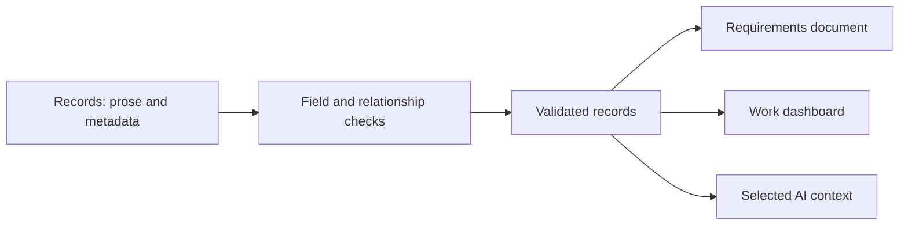
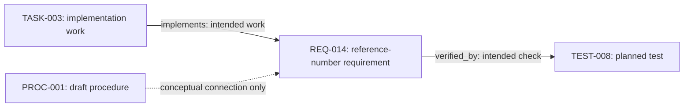

# Structured Content: Metadata, Rules, and Views

A procedure explains what someone should do. A team also needs to know which requirements have been agreed, who owns the implementation, and what still needs verification. Structured content makes that information explicit, so tools can select it, connect it, and present it for different purposes.

We will follow the onboarding example from chapter 4, using a template to organize a requirement and processing its text and metadata into useful views. You can inspect the examples without installing anything. The exercise uses the Python environment from chapter 3 to validate records and generate a requirements document, a work dashboard, and an AI context package.

## From Prose to Records

An onboarding guide might explain that every access request needs a reference number. A requirements record makes that expectation identifiable, gives it a status and owner, and connects it to an intended test.

A record combines prose with metadata. The prose explains the meaning; the fields let tools select, connect, and present it. Planning items and customer tickets can use the same approach, with fields suited to their own workflows.

We can keep readable text in Markdown and metadata in its front matter. For larger datasets, separate JSON or YAML files may be more convenient. The important choice is where information is maintained and how the tools interpret it.



*Validate the records before selecting information for each view.*

Validation checks the structure. People still need to review whether the content and resulting views are useful and correct.

## One Dataset, Several Questions

Our [example dataset](../examples/structured-content/records/REQ-014.md) describes a fictional onboarding service:

| ID | Type | Status | Meaning |
| --- | --- | --- | --- |
| REQ-014 | Requirement | approved | Request confirmations must include a reference number |
| REQ-015 | Requirement | proposed | Requesters should be able to look up progress |
| TASK-003 | Task | in-progress | Implement reference numbers |
| TEST-008 | Test | planned | Check the confirmation |

These records let us ask which requirements are approved, who owns the work, and what verification is intended. An approved requirement states an agreed expectation; it does not establish that the service already meets it.

## Connect the Procedure to the Work

The [procedure from chapter 4](../examples/onboarding/requesting-access.md) tells a requester to keep a reference number. The records here describe the expectation and work behind that instruction:

We continue with chapter 4's draft exercise copy of `PROC-001`, not the approved demonstration in chapter 1's fixed showcase. The matching ID connects the teaching scenario; it does not transfer approval between the separate examples.

| Item | Perspective | Connection |
| --- | --- | --- |
| PROC-001 | Reader-facing instruction | Explains what the requester should do |
| REQ-014 | Service requirement | Requires the confirmation to supply a reference number |
| TASK-003 | Implementation work | Records work intended to implement REQ-014 |
| TEST-008 | Verification plan | Describes how REQ-014 is intended to be checked |

These are related views of the same fictional scenario. The procedure is a draft illustration, while the records do not yet establish that the service is implemented and tested. Before publishing an operational instruction, reconcile it with evidence of the service's actual behavior.

The procedure uses its own small metadata convention and is not processed by this chapter's requirement/task/test schema. Its connection to REQ-014 is explained here rather than stored as a machine-validated link. We could introduce such a relationship when a real query requires it.

See the [shared vocabulary](../GLOSSARY.md) for the distinction between a record, a template, and a schema.

Keep three kinds of information distinct:

| Kind | Example | How it is maintained |
| --- | --- | --- |
| Authored content | Requirement and rationale | Written and reviewed |
| Authored metadata | ID, owner, status, relationships | Maintained according to agreed rules |
| Derived data | Counts by status or owner | Calculated from the records |

A current status cannot tell us when an item entered that status. Measures such as time in progress need historical events or revisions. A completion percentage also needs an explicit denominator: completed tasks divided by all tasks is different from approved requirements divided by all requirements.

## Start with a Template

A template gives an author a familiar starting point. It provides the fields to fill in and the sections to write, much like a Word template for a report or a PowerPoint template for a presentation.

Our [requirement template](../examples/structured-content/templates/requirement.md) supplies metadata, a requirement statement, and a rationale. Here is its starting structure:

```markdown
---
id: REPLACE-WITH-UNIQUE-ID
type: requirement
status: proposed
owner: REPLACE-WITH-OWNER
title: REPLACE-WITH-TITLE
verified_by: []
---

Describe one observable requirement.

## Rationale

Explain why the requirement matters.
```

Copy it into the `records/` directory, replace the placeholders, and write the content. Keep the new requirement proposed until it has been reviewed. Add test references only when the corresponding records exist.

Here is the complete existing [REQ-014 record](../examples/structured-content/records/REQ-014.md). It illustrates a filled-in template after a fictional review decision; a newly authored record should still start as `proposed`.

```markdown
---
id: REQ-014
type: requirement
status: approved
owner: onboarding-team
title: Access Confirmation
verified_by: [TEST-008]
---

The access service must confirm a submitted request with a reference number.

## Rationale

The requester needs a reference when asking about progress.
```

The statement expresses the expectation and the rationale explains why it matters. The title and ID identify it in a document, the status controls selection, the owner supports work summaries, and the test reference connects it to intended verification. The ID remains stable if the title changes. Its `approved` status is example data, not an approval action performed by the processor.

Templates can also guide AI-assisted authoring. Provide the template, the relevant source information, and instructions about assumptions. Ask the tool to create a proposed record and flag missing information rather than invent it. Review the result before accepting it.

We keep templates in a separate directory so the processor does not count unfinished starting files as records. The placeholders are writing prompts; our current validator does not detect every unfilled placeholder or judge the quality of the prose.

There are two useful kinds of template:

| Kind | Purpose | Example |
| --- | --- | --- |
| Authoring template | Help a person or AI tool create consistent records | Requirement metadata, statement, and rationale |
| Output template | Arrange selected records for an audience | A requirements document or AI context package |

The authoring template provides a starting structure. An output template controls how information is presented after selection. In our small processor, output layouts are defined in Python; separate template files can be introduced when those layouts become more complex.

## Check the Record with a Schema

A template helps you create a record. A schema defines the rules that let a tool check its structure. It specifies required fields, their types, and allowed values.

Our [schema file](../examples/structured-content/schema.yaml) requires a nonempty string for the ID, type, status, owner, and title. You can write a valid record without copying the template, and you can fill in a template incorrectly. The processor checks the resulting record against the rules.

Each record type has its own statuses. Requirements can be proposed, approved, or retired. Tasks can be planned, in progress, or complete. Tests can be planned or complete; this example does not model test outcomes.

The processor rejects unknown fields rather than silently ignoring a misspelled status or owner. It also rejects duplicate IDs and empty record bodies.

The distinction matters when checking a result:

| Example | Processor result | What still needs review |
| --- | --- | --- |
| `verified_by: [TEST-999]` with no such test | Rejected: missing reference | Which real test should be linked |
| A requirement marked `complete` | Rejected: unsupported requirement status | Whether its intended state is proposed, approved, or retired |
| A valid record containing an incorrect requirement | May pass | Whether its meaning agrees with the source and stakeholders |
| An unfilled template with nonempty placeholder strings | May pass | Whether all placeholders have been replaced |

Passing validation means the implemented structural checks succeeded. It does not certify the facts, the review decision, or readiness for publication.

Start with fields that support a real question. Additional fields create additional maintenance work. When the schema changes, record its version and decide how older records should be handled.

## Give Relationships a Direction

Our example uses two relationships:

| Field | Source | Target | Meaning |
| --- | --- | --- | --- |
| verified_by | Requirement | Test | This test is intended to check the requirement |
| implements | Task | Requirement | This task is intended to implement the requirement |

The processor checks that each referenced ID exists and has the expected type. A requirement cannot use `verified_by` to point to a task.

This diagram uses Mermaid, a text-based notation for diagrams. Instead of positioning shapes manually, we describe the items and their connections, and a renderer draws them. Its source can be versioned and reviewed alongside the records. [Chapter 4](04-markdown.md) introduces the basic syntax.



*Record links express intended implementation and verification, not completed work.*

The labelled solid arrows correspond to fields the processor checks. The dashed arrow explains the shared scenario; it is not stored or validated as a record relationship. These meanings are choices we made for this diagram, not rules imposed by Mermaid. Neither arrow style is evidence that the service works.

### Text-Based Is Not Automatically Data-Driven

This diagram is authored rather than generated from the records. Its Mermaid source repeats record IDs and relationships that also exist in the metadata. If REQ-014 changes to reference another test, updating the diagram should be part of the same maintenance task. Otherwise, it can render correctly while describing outdated information.

Text-based describes how a diagram is stored and edited. Data-driven describes how its content is derived from maintained information. Rendering and data generation are separate steps:

| Approach | Where the connections come from | What happens after a record changes |
| --- | --- | --- |
| Authored Mermaid diagram, as above | A person or AI agent writes the nodes and arrows | Review and update affected connections as part of the source change |
| Data-driven Mermaid diagram, introduced in chapter 7 | A generator reads record IDs and relationship fields | Rerunning the generator updates the diagram source |

A data-driven pipeline reads and validates the records, generates Mermaid text from their relationships, then renders that text as a diagram. Chapter 7 implements the generation step and explains separate rendering options. Its generator uses explicit selection rules and omits our conceptual procedure connection, which is not stored in those fields.

Data-driven does not mean continuously updated: someone or an automated workflow must run the generator again. Chapter 2's automation provides the mechanism for that later step. Tests would check that the generated connections match the selected records, while people would still review meaning and readability.

### Make Related Updates Part of the Task

AI-assisted maintenance should treat a source change and its affected views as one task. When an agent updates a requirement, it should identify related diagrams, explanations, and excerpts, update them where needed, and check that they remain consistent. An authored diagram may communicate an interpretation that cannot be derived from metadata alone; agent-assisted editing is useful for maintaining that explanation.

This coordination needs explicit support: project instructions, reusable skills, recorded dependencies, or an execution harness. A skill supplies reusable task guidance; a harness is the surrounding system that supplies context, runs tools, and checks results. The agent should report which related outputs it updated, which it checked and left unchanged, and which it could not verify. An unverified dependency should remain visible as unfinished work.

Where relationships can be generated reliably from structured records, prefer a repeatable generator. Where a diagram requires editorial judgment, use agent-assisted updates with review. In both cases, completing the task means checking the affected views, not merely changing the original file. These checks support human review; they do not automatically approve the content.

In this chapter, the three output views below are generated from records; the relationship diagram is an authored explanation. We have not yet implemented a harness that discovers and checks all affected views. [Chapter 7](07-images.md) will develop coordinated diagram maintenance, and [chapter 12](12-automation.md) will cover automation and checks.

A valid relationship does not prove implementation or successful verification. Evidence would need additional records, such as a test result tied to a product version. Keep that distinction visible in dashboards and AI context.

Preserve IDs when records change. If an item is retired, retaining it with an explicit status can preserve the explanation behind older references. Deleting it requires a decision about its links and history.

## Build Three Views

The [record processor](../scripts/process_records.py) reads the files, validates metadata and relationships, then creates:

| Output | Selection | Purpose |
| --- | --- | --- |
| requirements.md | All requirements, with their statuses | Read expectations and distinguish proposals |
| dashboard.md | All records, grouped by type, status, and owner | Inspect the distribution of work |
| ai-context.md | Approved requirements only | Supply a bounded source for a training draft |

The dashboard is a Markdown summary, not an interactive application. GitHub can render it as tables. Later chapters will develop richer visual views.

### Inspect the Results Before Running

These excerpts show the supplied four-record dataset. They omit the generated provenance headers and some content for readability; they are not live reports and will change when you edit the records.

The requirements view answers **what has been requested or agreed?** Its REQ-014 entry includes this text:

```markdown
## REQ-014: Access Confirmation

Status: approved. Owner: onboarding-team.

The access service must confirm a submitted request with a reference number.
```

The full entry also includes the rationale and intended verification. REQ-015 appears separately with its proposed status, so inclusion in this document does not imply approval.

The dashboard answers **how is the recorded work distributed?** Its type-and-status table is:

| Type | Status | Count |
| --- | --- | --- |
| requirement | approved | 1 |
| requirement | proposed | 1 |
| task | in-progress | 1 |
| test | planned | 1 |

This suggests checking implementation and verification before treating the approved requirement as operational behavior. It does not tell us how long the task has been in progress.

The AI package answers **what selected information should guide this task?** It begins its task context with:

```text
Audience: onboarding trainer.

Task: draft a brief explanation of the approved requirements for new colleagues.
```

It then states its selection and limitations and includes REQ-014's requirement and rationale. REQ-015 is excluded because it is proposed. A context package is therefore an intentional selection, not just the entire document pasted into a prompt.

The AI package includes an audience, a task, selection rules, and limits. It excludes the proposed requirement and the bodies of related tasks and tests. The processor prepares a file; it does not send data to an AI service or generate a model response.

Every output records the base Git commit and a digest of the input files. The manifest also lists hashes for the schema, records, and processor. The commit identifies the working tree's base; the digest distinguishes the exact local inputs. Reproducing a result still requires preserving those inputs.

## Draft a Record with AI Support

A template gives an agent a starting structure, the schema supplies checkable rules, and the source provides meaning. None replaces the others. Try this bounded authoring request in your exercise copy:

```text
Read examples/structured-content/templates/requirement.md and schema.yaml
in the same structured-content directory. Inspect the existing records.
Using only this fictional expectation, draft a new requirement:
"The requester must be able to identify which system an access request concerns."
Use the unused ID REQ-016; stop if it already exists.
Set owner to onboarding-team and status to proposed.
Keep verified_by empty; do not invent a test, service promise, or approval.
Save it as examples/structured-content/records/REQ-016.md.
Flag assumptions in your response and show the source diff.
Run the record processor if the environment is ready; otherwise say so.
Do not commit, push, or send records to another service.
```

Review whether the requirement expresses the supplied expectation, then inspect validation and generated views. A structurally valid invented promise remains wrong. Any rationale drafted by the agent also needs review.

The example processor selects AI context by type and approval status only. `approved` does not establish permission to share a record with an AI service. Check confidentiality, intended audience, and organizational policy before using a package externally; this processor does not enforce those access boundaries.

## Try It: Change a Record, Inspect the Views

Activate the Python environment from [chapter 3](03-project-growth.md), which links to Git and Python preparation guides. The activation command below uses a macOS/Linux shell; Windows readers can use the platform-specific activation in the linked Python guide. From the repository root, run:

```bash
source .venv/bin/activate
python scripts/process_records.py
```

The processor writes its three Markdown views and `manifest.json` to `build/records/`. These generated files are excluded from Git.

### 1. Inspect the Starting Views

Before opening them, predict where REQ-015 should appear from its type and status. Confirm that it is in the requirements document and dashboard but absent from the AI package. If you already changed the exercise records, use their actual starting values rather than expecting the fixed table above.

### 2. Author a Proposed Record

Copy the requirement template into a new file in `records/`, or use the bounded AI prompt above. Use a unique ID, replace every placeholder, and leave the record proposed. Predict which outputs will change, then run the processor.

The requirement should appear in the requirements document and dashboard, but not the approved-only AI package. Confirm that the input digest changed too. If you already created REQ-016 with the prompt, inspect that record rather than creating it twice.

### 3. Simulate a Review Decision

In your exercise copy, change REQ-015 from `proposed` to `approved`. This simulates a decision; it does not approve a real requirement. Predict the effect, then rebuild: the total requirement count should stay the same, one count should move from proposed to approved, and REQ-015 should enter the AI package. The new requirement from stage 2 remains proposed and excluded.

If REQ-015 was already approved from an earlier exercise, choose a proposed requirement instead and record which ID you changed.

### 4. Break and Repair a Relationship

Temporarily change REQ-014's test reference to a nonexistent ID, such as `TEST-999`. Predict whether processing will succeed. Run the processor, inspect the missing-reference error, then restore `TEST-008` and run it successfully.

When validation fails, the processor stops before writing outputs. Files from an earlier successful run may remain in `build/records/`; treat them as old results, not a successful rendering of the invalid inputs.

Review the final source diff and commit only the intended exercise changes. Record your predictions and what the outputs actually showed.

**Expected result:** changing a requirement's status changes the document, summary counts, and AI selection. A broken relationship stops processing with an error.

**If processing fails:** check field spelling, allowed statuses, and referenced IDs against the schema. After correcting the source, run the processor again and inspect the new manifest rather than relying on an older output.

**Keep:** the intended changes to exercise records and their commit. Restore deliberate errors before committing. Tests use independent record fixtures so that completing this exercise does not invalidate their starting assumptions. Generated views remain in `build/records/`.

Return to your information item from chapter 1. Sketch a small authoring template, identify one field that answers a real question, and name one useful output. Explain what a structural check could verify and what still needs human judgment. Add a relationship only if it supports a question you need to answer.

## Connect Existing Applications

A requirements tool, planning application, or ticket system may already own the original records. Decide which system maintains each field before introducing an export or connection.

Preserve external IDs and record retrieval times and source versions when available. A downloaded snapshot can become stale; a write-back integration needs explicit rules for conflicts and review. Our example is local and has no external synchronization.

Choose information suitable for the audience and destination. An internal ticket may contain details that do not belong in a public manual or an AI context package. Selection rules should account for those boundaries as well as status.

[Dashboards and Work Tracking in GitHub](09-dashboards.md) develops work views. [Beyond GitHub](11-beyond-github.md) explores how lighter workflows can apply the same principles.

Next, [AI-Native Documentation and Context](06-ai-native.md) examines how to select and use source material for language-model tasks.
