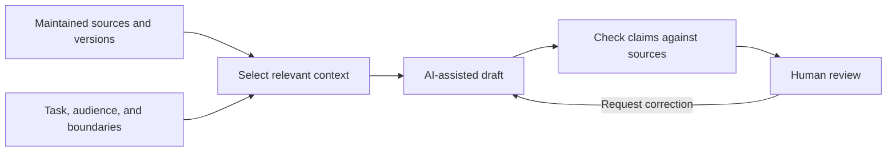

# AI-Native Documentation and Context


AI-native documentation is information maintained so that people and AI tools can work with it as part of everyday tasks. In this tutorial, that means clear source material, explicit context, traceable changes, and reviewable results. It does not mean that every document is written by AI.

We have already prepared the foundations for this in our onboarding example. In chapter 5, we organized requirements into records and selected approved requirements for an AI context package. That package had a specific purpose: help a trainer explain the agreed requirements to new colleagues. We will now follow it from maintained source material into an AI-assisted drafting task.

For the trainer, a fluent explanation is only part of a useful result. The draft must preserve the distinctions we established in the records: an agreed requirement is not a proposed feature, and neither is evidence that a capability has been implemented. The question is how to give an AI tool enough context to preserve those distinctions, then check that its draft does so.

You will inspect the context package, compare an unsupported task with a source-grounded draft, and define checks for related updates. Reading requires no AI account; the comparison requires a tool permitted for the material you supply. An optional extension adds the full chapter as a third context condition.

## Start with the Task, Not the Whole Repository

Context is the information available to an AI tool for a particular task. A repository may contain the answer, but that does not establish that the tool has read the right files or distinguished current sources from old examples.

For our trainer, the task is to explain agreed requirements, not to write operational instructions. The difference determines what information is needed:

| Context element | Example | Why it matters |
| --- | --- | --- |
| Purpose and audience | A brief explanation for new colleagues | Sets the scope and level of detail |
| Maintained source | Approved requirement records | Grounds the explanation in identifiable material |
| Definitions | Approval does not prove implementation | Prevents a requirement becoming an unsupported service claim |
| Selection rule | Include approved requirements only | Separates agreements from proposals |
| Missing evidence | No implementation or test results in the package | Identifies what the draft cannot establish |
| Source identity | Record IDs, base commit, and input digest | Connects the draft to inspectable inputs |
| Output boundary | Draft explanation, not publication | Keeps review and release separate |

More context is not automatically better context. A whole chapter may mix instructions, historical examples, proposed changes, and qualifications. A selected package should retain what the task needs, including limitations, rather than merely make the input shorter.

## From Maintained Sources to Task Context

The [record processor](../scripts/process_records.py) from chapter 5 selects approved requirements and packages their text with an audience, task, and limitations. It also records the source identity. It creates a file; it does not contact an AI service.



*Selected context supports drafting; source checks and human review determine what can be used.*

This Mermaid diagram is an authored explanation, not a running agent workflow. As discussed in chapter 5, its related sources and wording should be checked together when the process changes.

Selection can begin with file paths and metadata filters. For larger collections, retrieval finds relevant items through search or links. Check scope, version, and missing dependencies rather than treating every matching result as suitable context.

## Adapt a General Model to Local Needs

A general-purpose LLM does not automatically know your team's terminology, decisions, or current procedures. Maintained documentation can supply that local context. In our example, the requirements explain what has been agreed, the glossary defines terms, and task instructions set the audience and limits. Together, they help adapt the model's response to this project.

This is adaptation through context, not retraining or fine-tuning. The supplied text does not change the model's underlying parameters or guarantee that it will remember the information in a later session. The application or agent must make relevant, current sources available when needed. [Microsoft's RAG guide](https://learn.microsoft.com/en-us/dotnet/ai/conceptual/rag) explains how external information can support generation without first training the model on it.

### Optional Depth: Can a Repository Replace RAG?

Retrieval-augmented generation (RAG) means retrieving relevant external information and supplying it to a model when generating a response. It is a pattern, not a synonym for a vector database. A repository stores maintained information; RAG describes a way to find and use that information.

A well-organized repository can sometimes replace a separate indexed retrieval system. An agent can follow file paths, search text, inspect metadata, and read selected records directly. This still performs retrieval; it changes the mechanism rather than eliminating the need for context selection. Anthropic describes this just-in-time file retrieval and its combination with other retrieval methods in its [context-engineering guidance](https://www.anthropic.com/engineering/effective-context-engineering-for-ai-agents).

For this tutorial's small, clearly identified dataset, direct selection is a reasonable starting point: our processor filters records into a context package without a search index. It does not implement question-dependent search across a large knowledge base. If we later add that capability, the repository can remain the maintained source feeding it.

Choose the mechanism according to the work. Direct file access is worth testing when sources are easy to locate and the permitted scope is clear. A dedicated retrieval service may be useful across large collections or many systems, especially when relevance ranking, response speed, and per-user access filtering become important. Neither approach enforces permissions merely by existing; access controls must be implemented and tested.

Our practical conclusion is to start with the simplest approach that finds sufficient, authorized evidence for representative tasks. Check missed sources, outdated content, unsupported answers, and retrieval time before deciding that repository access replaces a more elaborate system. Documentation provides the local knowledge; the surrounding tools must still select it, respect its boundaries, and verify the results.

## Inspect Our Context Package

After running chapter 5's processor, open `build/records/ai-context.md`. With the supplied starting dataset, REQ-014 is included and REQ-015 is excluded. If you changed statuses during the previous exercise, your package may legitimately include different records. Inspect it rather than assuming the starting selection still applies.

The generated package supplies these task instructions:

```text
Audience: onboarding trainer.

Task: draft a brief explanation of the approved requirements for new colleagues.
```

It then explains that task and test contents are excluded, approval is not evidence of implementation, and the draft must not invent operational instructions. The selected REQ-014 text states:

> The access service must confirm a submitted request with a reference number.

The word "must" expresses a requirement. It does not establish that the current service issues numbers. A suitable explanation would preserve that distinction:

> The agreed requirement is that an access request receives a confirmation reference number. The supplied material does not establish whether this behavior is implemented or tested.

This is an authored illustration of the intended distinction, not an observed model response. Actual responses must be assessed against the sources supplied in that run.

The package is also intentionally incomplete. It does not provide a service portal address, a missing-reference recovery process, or implementation evidence. If the requested output needs those details, ask for verified sources or narrow the task. Do not fill the gaps with plausible instructions.

## Keep Sources and Instructions Distinct

A task instruction tells the agent what to do. A source supplies information to interpret. A customer ticket, retrieved page, or quoted document may contain commands, but those commands should not become authorization to change files, publish content, or disclose information.

Keep the task boundaries explicit: which files may be edited, which material may be supplied to an external service, and which actions require review. The fictional records here are practice material. For real records, check confidentiality and sharing permissions before preparing context; an `approved` content status is not a data-sharing permission.

Our processor filters by record type and status. It does not enforce confidentiality rules, detect malicious instructions, or verify that the recorded approval is supported by review evidence. Those remain separate responsibilities.

## Develop the Working Environment with an Agent

AI-native work is not limited to generating content. It can also help the people responsible for information develop the tools around it. A documentation specialist can describe a recurring need, work with an agent to implement a small change, and inspect the result against concrete examples.

Suppose the onboarding team needs to identify procedures awaiting review by owner. The specialist defines what counts as awaiting review and which records belong in the view. The agent can inspect the existing metadata, adapt a processor, add tests, and generate a sample result. The specialist checks that the view answers the actual question before accepting it into the team's workflow.

As [chapter 2](02-github-workspace.md) explains, this requires practical authority to improve the team's tools. An agent can help implement changes within that scope; it does not bypass access controls or replace platform support.

Treat the improvement as maintained work: state the expected behavior, test normal and missing-input cases, review the code and sample output, and record how to run it. Keep ownership with the team rather than leaving essential knowledge in one conversation. Project instructions and reusable skills can preserve the procedure for later work; people still need to understand its purpose, limits, and maintenance needs.

Our processors illustrate this direction, not a complete autonomous platform. Start with a recurring problem and extend the environment where the benefit justifies the complexity.

## Make Updates a Coordinated Task

An AI agent can help maintain authored explanations as well as generate new text. When the source changes, the desired task is to update and check affected material, not simply finish the first file.

For example, changing REQ-014's intended test may affect its record, the relationship diagram in chapter 5, and the chapter's embedded source example. The generated requirements view must be rebuilt. The AI package excludes test relationships, so its requirement body may remain unchanged while its input digest changes. Each outcome deserves an explicit check.

Project instructions can identify the relevant sources and dependencies. A reusable skill can describe how to perform the update. A harness, the system surrounding the agent, can supply context, run generators and tests, and collect results. These mechanisms support coordination; they do not make every dependency discoverable automatically.

For this example, a maintenance task should produce a short report:

| Result | What to record |
| --- | --- |
| Updated | Which source, diagram, excerpt, or generated view changed, and why |
| Checked, unchanged | Which related items were inspected and why no edit was needed |
| Not verified | Missing evidence, unavailable rendering, or another unfinished check |

Prefer generators for relationships and counts that can be derived reliably. Use agent-assisted editing and review where a diagram or explanation requires judgment. A successful test run does not establish that all related prose is correct.

This repository has record generation and focused tests, but no complete harness for discovering dependencies and verifying every affected view. The checklist above describes the practice to build toward, not an existing automated guarantee.

## Preserve Enough Evidence to Review the Draft

Keep the task prompt, selected inputs, source identity, and resulting draft together in your working materials. Record the AI tool, model label if available, and date. These details help explain what was attempted; they do not guarantee identical responses on a later run.

The generated package identifies a base Git commit and an input digest. The digest helps distinguish local inputs but cannot recover them. Preserve the actual package and relevant source files, especially when they contain uncommitted changes. Rebuilding later from changed files creates a different context package.

Ask for record IDs beside factual claims, then inspect whether those records actually support the wording. A citation is a route to evidence, not proof by itself. Review the audience fit, omitted qualifications, and unsupported claims before accepting the draft. Publishing it is a separate decision.

## Try It: Compare a Task with and without Sources

Use the fictional dataset in your own working copy. With the Python environment from chapter 3 active, regenerate the package:

```bash
python scripts/process_records.py
```

Inspect the selected records and preserve the resulting package. Reuse this task in two fresh conversations or otherwise isolated sessions, keeping the tool and settings the same where possible:

```text
Draft a short explanation of the agreed access-request requirements
for new colleagues. Use only the material supplied in this conversation.
Distinguish requirements from implemented behavior.
Identify missing evidence and cite source record IDs where available.
Do not invent operational instructions. Keep the result under 150 words.
```

1. Supply the task alone, without source files. Look for whether the response acknowledges that it has no evidence of agreed requirements.
2. Supply the task with the generated `ai-context.md` package. Check each claim against the selected records and note what remains unknown.

Use a tool configuration without automatic repository retrieval for this comparison where possible. If other context remains available, record that limitation: the first condition is no longer an instruction-only comparison. Do not reset or overwrite your exercise records just to match the chapter's starting dataset.

For each response, note supported claims, unsupported claims, missing qualifications, and useful acknowledgements of uncertainty. Compare source support rather than fluency alone. The task-only response may correctly decline to supply specifics; that is preferable to invented requirements.

**Expected result:** two responses and a short evidence-based comparison. The package makes source support easier to inspect, but does not guarantee a correct answer. This is a learning exercise, not a benchmark of model quality.

**If results are misleading:** check for context carried over from another conversation, changed record statuses, missing source text, or a package generated before your latest edits. Correct the input or narrow the task before trying again.

**Keep:** the prompt, exact package used, source references, responses, and review notes. Store practice results under an ignored directory such as `build/ai-context-review/`; keep any reusable, reviewed source improvements separately. No AI-generated response is automatically an approved publication.

### Optional: Compare the Whole Chapter

In a third fresh session, supply the same task with chapter 5's full text. Check whether the response distinguishes examples, proposals, and authoring instructions from requirements. Compare its source support with the curated-package response. This tests selection, not the assumption that shorter input is always better.

You can also complete a no-model version: inspect the input conditions and write what each establishes and leaves unknown. Label this as a context review, not an AI-output experiment.

Finally, return to the information item you chose in chapter 1. Define one AI-assisted task, its permitted sources, and a claim the available material cannot support. Identify one related view an agent should check if that source changes.

Next, [Images, Diagrams, and Visual Sources](07-images.md) explores how these maintenance and review practices apply to visuals.
