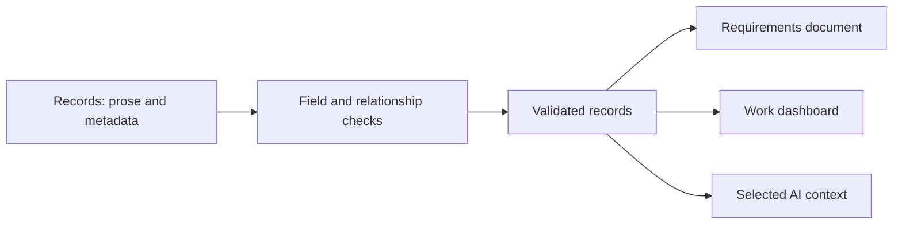
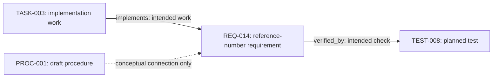

# Processing Information into Views

Chapter 5 gave us readable records with consistent metadata. Those fields become more useful when a program checks them and prepares views for different readers.

Here, we follow one change from a record to a requirements document, a work dashboard, and an AI context package. First, we explain where the program runs. You can read the examples without installing anything; the hands-on exercise uses the Python environment introduced in chapter 3.

By the end of this chapter, you will be able to distinguish editing from processing, explain what a runner does, and rebuild the views after changing a record.

## Where Does the Work Happen?

You can edit the same kind of file in a browser or on your computer. The location matters because saving a file, recording a version, and running a program are separate actions.

### On Your Computer

A local working copy contains editable project files. A text editor changes those files. Git records selected changes as commits, and a Git application provides controls for reviewing and sharing them. Python runs our processing program. An editor or agent may bring these controls together, but each still does a different job.

Saving a record locally does not send it to GitHub or regenerate a report. Committing records a version locally; pushing sends commits to GitHub. If you edit through GitHub's browser interface, bring those changes into your local copy before processing them there. [The review chapter](09-git-review.md) explains the collaboration workflow, and chapter 3 links to setup guides.

### In GitHub's File Editor

Suppose you edit `schema.yaml` in GitHub's browser editor and remove `proposed` from the allowed requirement statuses. When you commit the edit, the changed rule is stored on the branch you chose. It does not update existing records to a new status.

Records that still say `status: proposed` would now fail our processor's check. That failure appears when someone runs the processor using the changed schema and those records. The browser editor itself does not apply our project's validation rules. See [GitHub's file-editing guide](https://docs.github.com/en/repositories/working-with-files/managing-files/editing-files) for the editing and commit steps.

Propose changes to rules on a branch and review the affected records together. If a field or rule changes, the template and processing code may need updates too. A schema change is a change to the team's working agreement, not just a formatting edit.

### On a GitHub Actions Runner

A workflow describes an automated process, with jobs containing steps. A runner is the machine that executes a job. It can be provided by GitHub or managed by your organization. [GitHub's Actions introduction](https://docs.github.com/en/actions/get-started/understand-github-actions) explains these terms.

For a record check, a workflow could respond to a pull request and ask a runner to:

1. Check out the repository files for that run.
2. Prepare Python and install the required libraries.
3. Run `python scripts/process_records.py`.
4. Report success or failure.

The workflow chooses when to run; the processor chooses which records to check. A required pull request check can prevent merging on failure, but only when the repository's branch rules require it.

Our [Astro pull request workflow](../.github/workflows/astro-pr-check.yml) currently checks and builds the website. It does not invoke the record processor. The [growth workflow](../.github/workflows/growth.yml) runs Python tests and creates growth reports, but does not generate the three record views. A successful website build therefore does not establish that these records passed validation. We run that check locally in this chapter.

Processing also does not publish its outputs automatically. A workflow must explicitly retain or publish generated files if others should receive them. [The automation chapter](13-automation.md) develops workflow design, permissions, and maintenance.

## Meet the Record Processor

So far, we have described files and the information they contain. Something must read those files to check the information and create the views. In this project, that job belongs to a small Python program called the [record processor](../scripts/process_records.py).

We wrote this program for the tutorial. It is included in the repository as `scripts/process_records.py`; it is not a built-in GitHub feature or a service that runs in the background.

Run the processor explicitly, either from your terminal or through a configured workflow. Activating a Python environment only makes the required libraries available; it does not start this program. The exercise below gives the command and walks through a complete run.

### Which Files Does It Read?

Our program is written to use these locations by default:

| Location | What the processor does |
| --- | --- |
| `examples/structured-content/schema.yaml` | Reads the rules for the records |
| `examples/structured-content/records/*.md` | Reads the Markdown records directly inside this folder |
| `build/records/` | Writes the generated views and information about their inputs |

The code makes this connection explicit. It does not search the repository and guess which rules belong to which files. The chapters in `docs/` and the onboarding procedure from chapter 4 are outside this check.

### What Happens If a Check Fails?

If a record breaks a rule, the processor reports an error in the terminal and stops before writing new outputs. For example, a reference to a missing test must be corrected before the views can be rebuilt. Files from an earlier successful run may still be present; they are old results until a new run succeeds.

The team maintaining the records agrees on the rules. The processor's maintainer tests that valid records pass and invalid records fail. This repository includes such tests in `tests/test_records.py`; they use separate test data, so passing them does not validate every exercise record. Review rule changes along with the code and records they affect.

Next, we look at how the schema expresses those rules and how the processor applies them.

## Check the Record with a Schema

A template helps you create a record. A schema defines the rules that let a tool check its structure. It specifies required fields, their types, and allowed values.

Our schema uses a small format designed for this processor. Naming a file `schema.yaml` does not give it special behavior: the Python code must understand its fields and implement the checks.

Our [schema file](../examples/structured-content/schema.yaml) lists the required fields and allowed statuses and relationships. The processor also checks that `id`, `type`, `status`, `owner`, and `title` contain text rather than an empty value or a number. It checks the saved record regardless of whether you used the template.

Each record type has its own statuses. Requirements can be proposed, approved, or retired. Tasks can be planned, in progress, or complete. Tests can be planned or complete; this example does not model test outcomes.

The processor rejects unknown field names, such as `owenr` instead of `owner`, duplicate IDs, and empty record bodies. It does not check owner names against a team directory, so a misspelled team name can still pass.

The distinction matters when checking a result:

| Example | Processor result | What still needs review |
| --- | --- | --- |
| `verified_by: [TEST-999]` with no such test | Rejected: missing reference | Which real test should be linked |
| A requirement marked `complete` | Rejected: unsupported requirement status | Whether its intended state is proposed, approved, or retired |
| A valid record containing an incorrect requirement | May pass | Whether its meaning agrees with the source and stakeholders |
| An unfilled template with nonempty placeholder strings | May pass | Whether all placeholders have been replaced |

Passing validation means the record meets the rules the program checks. People still review the meaning and decide whether to approve or publish the content. The [shared vocabulary](../GLOSSARY.md) summarizes the distinction between a record, a template, and a schema.

Start with fields that support a real question. Additional fields create additional maintenance work. When the schema changes, record its version and decide how older records should be handled.

## One Dataset, Several Questions

The completed requirement shown in chapter 5 belongs to a set of four supplied records describing the fictional onboarding service:

| ID | Type | Status | Meaning |
| --- | --- | --- | --- |
| REQ-014 | Requirement | approved | Request confirmations must include a reference number |
| REQ-015 | Requirement | proposed | Requesters should be able to look up progress |
| TASK-003 | Task | in-progress | Implement reference numbers |
| TEST-008 | Test | planned | Check the confirmation |

These records let us ask which requirements are approved, who owns the work, and what verification is intended. An approved requirement states an agreed expectation; it does not establish that the service already meets it.

The [draft access procedure from chapter 4](../examples/onboarding/requesting-access.md) belongs to the same fictional scenario. It is outside this dataset and is not checked by the processor. Its connection to the requirement is explained for the reader, rather than stored as a validated link.

## From Records to Views

The processing sequence is the same whether you start the program locally or a workflow runs it. The program validates the records before selecting information for each output.



*Validate the records before selecting information for each view.*

## Give Relationships a Direction

Our example uses two relationships:

| Field | Source | Target | Meaning |
| --- | --- | --- | --- |
| verified_by | Requirement | Test | This test is intended to check the requirement |
| implements | Task | Requirement | This task is intended to implement the requirement |

The processor checks that each referenced ID exists and has the expected type. A requirement cannot use `verified_by` to point to a task.

This Mermaid diagram makes the relationships visible. [Chapter 4](04-markdown.md) introduces its text-based notation.



*Record links express intended implementation and verification, not completed work.*

The solid arrows show relationships stored in the records and checked by the processor. The dashed arrow connects the procedure to the scenario for the reader; it is not a stored relationship. We chose these arrow styles to distinguish the two meanings.

This diagram is written in Mermaid but is not generated from the records. Changing a record therefore does not update the diagram automatically. Include related diagrams and explanations in the review of a change: regenerate outputs built from data, and edit maintained illustrations where needed. Keep a historical example unchanged only when it is clearly labelled as such.

An AI agent can help find and update this related material as part of the same task. [Chapter 7](07-ai-native.md) explains how project instructions and checks support that work; [chapter 8](08-images.md) develops diagram generation and rendering.

Preserve IDs when records change. If an item is retired, retaining it with an explicit status can preserve the explanation behind older references. Deleting it requires a decision about its links and history.

## Build Three Views

The [record processor](../scripts/process_records.py) reads the files, validates metadata and relationships, then creates:

| Output | Selection | Purpose |
| --- | --- | --- |
| requirements.md | All requirements, with their statuses | Read expectations and distinguish proposals |
| dashboard.md | All records, grouped by type, status, and owner | Inspect the distribution of work |
| ai-context.md | Approved requirements only | Provide selected background for an AI-assisted training draft |

The dashboard is a Markdown summary, not an interactive application. GitHub can render it as tables. Later chapters will develop richer visual views.

### Inspect the Results Before Running

These are fixed examples based on the supplied four records. We have shortened the outputs for readability. Editing a record and rerunning the processor changes the generated files on your computer; it does not update the examples printed in this chapter.

The requirements view answers **what has been requested or agreed?** Its REQ-014 entry includes this text:

```markdown
## REQ-014: Access Confirmation

Status: approved. Owner: onboarding-team.

The access service must confirm a submitted request with a reference number.
```

The full entry also includes the rationale and intended verification. REQ-015 appears separately with its proposed status, so inclusion in this document does not imply approval.

The dashboard answers **how is the recorded work distributed?** Its type-and-status table is:

| Type | Status | Count |
| --- | --- | --- |
| requirement | approved | 1 |
| requirement | proposed | 1 |
| task | in-progress | 1 |
| test | planned | 1 |

The table draws attention to the task still in progress and the test still planned. It can help a team decide what to follow up next.

The AI package answers **what selected information should guide this task?** It begins its task context with:

```text
Audience: onboarding trainer.

Task: draft a brief explanation of the approved requirements for new colleagues.
```

It then states its selection and limitations and includes REQ-014's requirement and rationale. REQ-015 is excluded because it is proposed. A context package is therefore an intentional selection, not just the entire document pasted into a prompt.

The package excludes the text of related tasks and tests. The processor prepares a file; it does not contact an AI service. Before sharing the file externally, check confidentiality and organizational policy: approval of a requirement does not establish permission to share it. Chapter 7 explores how to use and review this context.

## Try It: Change a Record, Inspect the Views

Activate the Python environment from [chapter 3](03-project-growth.md), which links to Git and Python preparation guides. The activation command below uses a macOS/Linux shell; Windows readers can use the platform-specific activation in the linked Python guide. From the repository root, run:

```bash
source .venv/bin/activate
python scripts/process_records.py
```

The processor writes its three Markdown views and `manifest.json` to `build/records/`. These generated files are excluded from Git.

Each output includes an input digest, a fingerprint calculated from the input files. The manifest records those fingerprints and the starting Git revision, helping you distinguish results from different runs.

### 1. Inspect the Starting Views

Read `examples/structured-content/records/REQ-015.md`. From its type and status, predict which outputs should include it. Then open these generated files in your editor:

- `build/records/requirements.md`: find REQ-015 and its proposed status.
- `build/records/dashboard.md`: find the count of proposed requirements.
- `build/records/ai-context.md`: confirm that REQ-015 is absent.

Also note the input digest near the top of an output file. If you previously edited the records, compare the outputs with those actual values rather than the fixed examples above.

### 2. Change a Status and Predict the Result

In your exercise copy, change `status: proposed` to `status: approved` in `examples/structured-content/records/REQ-015.md`. This simulates a review decision for the exercise. Before running the program, predict which outputs will change.

If REQ-015 was already approved in your copy, select another proposed requirement and record the ID. If none exists, create one using chapter 5's exercise first.

### 3. Rebuild and Compare

From the repository root, run the processor again:

```bash
python scripts/process_records.py
```

Reopen the three output files. REQ-015 now appears as approved in the requirements document. The dashboard still counts two requirements, but both are approved. The AI context now includes REQ-015, and the input digest has changed. If you used a different starting dataset, compare against your own prediction.

**Expected result:** changing one status and rerunning the processor updates the requirements document, dashboard counts, and selected AI context.

**If processing fails:** check spelling, allowed statuses, and referenced IDs. Old generated files can survive a failed run; inspect the new manifest after a successful rerun.

**Keep:** review the source diff and commit the intended exercise change with a message explaining its purpose. Leave the generated files under `build/records/` out of the commit. For the information item you chose in chapter 1, identify one metadata field that would support a useful view.

## Further Experiments

For optional AI-assisted authoring, a deliberate validation failure, and an explanation of input fingerprints, see [Record Processing: Experiments and Traceability](../reference/record-processing.md). These extend the main exercise without changing its processing rules.

## Connect Existing Applications

A requirements tool, planning application, or ticket system may already own the original records. Decide which system maintains each field before introducing an export or connection.

Keep the original IDs and, where available, the source version and the time you retrieved the data. A downloaded copy can become outdated. If your tools also send changes back, agree how to handle conflicting edits and who reviews them. This chapter's processor works with local files only.

Choose information suitable for the audience and destination. An internal ticket may contain details that do not belong in a public manual or an AI context package. Selection rules should account for those boundaries as well as status.

[Dashboards and Work Tracking in GitHub](10-dashboards.md) develops work views. [Beyond GitHub](12-beyond-github.md) explores how lighter workflows can apply the same principles.

Next, [AI-Native Documentation and Context](07-ai-native.md) examines how to select and use source material for language-model tasks.
