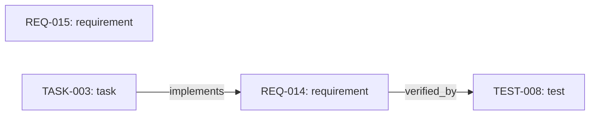

# Images, Diagrams, and Visual Sources


A visual is part of the information we maintain, not just decoration added when publishing. A diagram can explain how a requirement connects to work and verification. A chart can reveal a change in the project. A screenshot can show a detail that prose would struggle to describe.

Document-as-code does not require replacing visual tools with text. It asks us to identify the editable source, record what the visual means, and keep it aligned with related information. The source might be Mermaid, an SVG drawing, a dataset, or a model in a specialist application.

We will extend chapter 5's onboarding example into a generated diagram, then consider visual delivery and maintenance. The main exercise uses the existing Python environment. Rendering and the optional Napkin comparison use separate tools; generating source text and checking the visible result are separate tasks.

## Choose the Visual for the Question

Start with what a reader needs to understand:

| Reader's question | Useful representation | Maintained source |
| --- | --- | --- |
| What connects this requirement to a test? | Relationship diagram | Record fields or an authored diagram |
| How has the project changed? | Chart with labelled units and revisions | Measurement data and plotting code |
| Where should I act in an interface? | Annotated screenshot | Capture, annotations, and application version |
| What does the object look like? | Photograph or illustration | Original image and editing project |
| How does a process behave over time? | Sequence diagram or animation | Process description, model, or animation project |

Mermaid and SVG serve different roles. Mermaid describes diagrams; SVG is a vector image format that can carry a rendered diagram or a directly authored drawing. An exported image and its editable source may therefore use different formats.

## Describe Relationships with Mermaid

Mermaid turns text descriptions into diagrams. You name items and connections, while a renderer arranges and draws them. Its source can be reviewed alongside prose in a diff. [The Mermaid introduction](https://mermaid.js.org/intro/) describes this approach.

Chapter 5's [authored diagram](../assets/diagrams/onboarding-record-relationships.mmd) includes a conceptual connection to the procedure. That is useful explanatory judgment, but the connection is not present in record metadata.

For a diagram answering only "what relationships are recorded?", we can generate the source instead. This avoids maintaining those same connections twice. It does not remove the need to review selection rules or the resulting layout.

## Let Records Supply the Connections

The [diagram generator](../scripts/build_record_diagram.py) reuses chapter 5's validation. It includes every validated record, including unconnected records, and draws only explicit relationships defined in the schema. It does not infer links from prose or include the separate procedure file.

With the supplied starting records, it produces this Mermaid source and view:



*The starting dataset contains four records and two explicit relationships. This fixed teaching example is not a live view of your exercise files.*

REQ-015 has no arrow because no relationship is recorded for it. That does not prove it is unrelated to the service. Likewise, `verified_by` identifies an intended test, not a passing result. The diagram omits status and owner; use chapter 5's dashboard for those questions.

`flowchart LR` requests a left-to-right arrangement. Names such as `n0` are generated drawing identifiers, not record IDs; the labels retain the record IDs. Text between vertical bars names an arrow's relationship. [Mermaid's flowchart reference](https://mermaid.js.org/syntax/flowchart.html) explains the notation.

## Separate Generation, Rendering, and Refresh

| Operation | Input and result | Our implementation |
| --- | --- | --- |
| Generate | Read records and produce Mermaid text | Python diagram generator |
| Render | Turn Mermaid into a visible diagram or image | Compatible preview or Mermaid renderer |
| Refresh | Run the required steps after a change | Manual exercise now; automated integration later |

From the repository root, with the chapter 3 environment active, run:

```bash
python scripts/build_record_diagram.py
```

The result under `build/record-diagram/` contains `relationships.mmd`, a Markdown wrapper named `relationships.md`, and `manifest.json`. The manifest hashes the schema, records, generator, and shared validator. Preserve inputs as well as hashes to reproduce a result.

The script generates text, not SVG or PNG. Open the wrapper in a Mermaid-capable preview. A plain text editor shows the instructions instead. GitHub does not run this generator merely because you open a file, and generated files under `build/` are ignored by Git.

For local image export, follow the [official Mermaid CLI instructions](https://github.com/mermaid-js/mermaid-cli). Once its `mmdc` command is installed, request an SVG export with:

```bash
mmdc -i build/record-diagram/relationships.mmd -o build/record-diagram/relationships.svg
```

Record the renderer version and inspect the export. The renderer is not included in this project's Python dependencies, and this draft does not claim verified rendering across GitHub, PDF, and PowerPoint. [Chapter 4](04-markdown.md) explains preview compatibility; chapter 12 will develop repeatable build checks.

## SVG, Raster Images, and Native Sources

SVG describes vector shapes and text rather than only a fixed grid of pixels. It is useful for scalable diagrams and illustrations, and can be produced by code or edited with visual tools. [MDN's SVG overview](https://developer.mozilla.org/en-US/docs/Web/SVG) explains the XML-based format.

An SVG export does not necessarily preserve a diagram's editable meaning. Moving an exported arrow in a graphics editor will not update the Mermaid source or record relationship. Decide whether the edit belongs in the original source, a deliberate presentation variant, or a separately maintained drawing.

Raster images store pixels. Use them for photographs and screenshots, or when a destination requires a bitmap. Choose dimensions for the intended display or print size. Check that compression does not obscure labels or details the reader needs.

For a SysML model, animation, or complex illustration, preserve the native source and its tool/version information. A screenshot or video export may communicate the result without preserving the model's constraints or editing capabilities. Do not force a rich model into Markdown merely to call it document-as-code.

## Charts Need Data, Not Invented Shapes

Chapter 3's charts are generated from measured history. Keep the data, selection rules, units, and revision identity alongside a chart. A plausible curve is not a substitute for observations.

An AI agent can help write plotting code or explain a chart. Review the input selection and calculations as well as the image. Do not add observations to make a sparse history look convincing. When data changes, regeneration and review of captions and conclusions belong to the same update.

## Napkin and AI-Assisted Visual Exploration

Napkin starts from text, generates candidate visuals, and lets you edit a chosen result. Its site lists image and document export options, with some formats dependent on the plan. Check account entitlements before relying on a particular export. [Napkin's product overview](https://www.napkin.ai/) describes the workflow.

Use it to explore a teaching illustration or presentation composition. Keep the supplied text and editable project, not just the final export. Review whether the visual invents a sequence, hierarchy, quantity, or causal relationship that the source does not support.

For an optional comparison, use this fictional brief in Napkin or another permitted visual tool:

```text
Show three related items: TASK-003 is intended to implement REQ-014.
TEST-008 is intended to verify REQ-014. Do not imply completed work or
a passed test. REQ-015 has no recorded relationship in this dataset.
Keep the record IDs visible. Do not add a timeline or quantities.
```

Compare the result with Mermaid: which preserves the meaning more clearly, and which is easier to update? This account-dependent exercise is optional. No Napkin project or integration has been created for the tutorial.

## Make Visual Updates Part of the Change

Use generators for connections and counts that follow explicit rules. Use people and agents for authored explanations that require judgment. Both belong in a coordinated update process.

For this example, check the records, generated diagram, chapter 5's authored diagram and explanations, embedded teaching examples, and affected captions. Fixed snapshots may deliberately remain unchanged, but must remain labelled rather than becoming stale current-state claims.

Ask an agent to report updated items, checked-but-unchanged items, and unverified items. Supply dependencies and generation commands through project instructions or skills. A harness can run checks and record results; this repository does not yet discover every affected visual automatically.

## Make Visuals Understandable and Traceable

Provide a caption explaining the point, alternative text describing essential information, and a longer explanation or data table when needed. Do not encode important distinctions through color alone. [W3C's complex-image guidance](https://www.w3.org/WAI/tutorials/images/complex/) explains descriptions for charts and diagrams.

Check labels, arrow direction, contrast, clipping, and reading order at the intended size. A desktop diagram may need another arrangement in print or on a slide. For animations, provide an equivalent static explanation or transcript.

Keep source paths, input revisions or hashes, export methods, and tool versions available. Record origin, creator, license, and attribution requirements for external assets. AI generation is not blanket permission to publish. Do not supply confidential material to external tools without authorization.

## Try It: Change a Relationship

Use your own exercise copy and the chapter 3 Python environment. No external AI service is required.

1. Run the generator. Inspect its Mermaid text and manifest, then preview it if a renderer is available. Use your actual records if earlier exercises added items.
2. In TASK-003, temporarily change `implements: [REQ-014]` to `implements: [REQ-015]`. This is a fictional maintenance experiment, not a product decision. Predict which arrow will move.
3. Regenerate. Verify that the task now points to REQ-015, while REQ-014 still points to TEST-008. Check that the manifest digest changed.
4. Compare the result with chapter 5's authored diagram. Note which explanations would need review for an intended change. Do not rewrite fixed teaching examples for this temporary experiment.
5. If a renderer is available, export SVG and inspect it at a book-column or slide size. Compare its content with the source, not just its appearance. Optionally compare with Napkin using the same relationships.
6. Restore the task's original relationship and regenerate. The original diagram source and input digest should return when no other inputs have changed.

**Expected result:** a record change updates the generated arrow without manually editing Mermaid. The authored diagram does not change by itself; it is an explicit review dependency. Mark rendering unverified if no compatible renderer is available.

**If generation fails:** check the field and target ID against the schema. Invalid references stop processing before writing outputs; older files may remain. If text is generated but no diagram appears, check Mermaid support in the preview separately.

**Keep:** comparison notes, input references, and any reviewed visual variant. Restore the temporary experiment; generated files remain under ignored `build/`. For your information item from chapter 1, identify one useful visual, its maintained source, and the checks needed when it changes.

Next, [Git, Review, and Collaboration](08-git-review.md) develops review of coordinated changes and the scope of approval.
