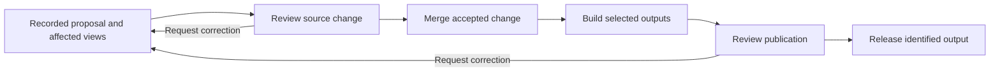

# Git, Review, and Collaboration


Review is how a team decides whether a change is ready to use. Version control helps by showing what changed and preserving the version that was inspected. It does not decide whether the information is correct or who has authority to approve it.

In a document-as-code workflow, a small change can be reviewed without asking someone to reread an entire handbook. But a small source edit may affect several outputs. Good review combines a focused diff with an explicit check of those consequences.

We will follow a proposed clarification to the onboarding requirement from chapter 5. You will identify affected information, inspect the evidence, and record a decision tied to a source version. The exercise can be completed locally; a GitHub pull request adds a shared place for discussion when you have access and a reviewer.

## Three Decisions, Not One

These actions answer different questions:

| Action | Question answered | What it does not establish |
| --- | --- | --- |
| Record a commit | Which version of the files is saved? | Whether anyone reviewed it |
| Accept a source change | Is this proposal ready to join the shared source? | Whether every assembled output is ready to publish |
| Approve a publication | Is this particular deliverable ready for its audience? | Approval of later source changes or future builds |



*Accepting a source change does not automatically approve every output built from it.*

This Mermaid diagram describes a review process, not an enforced workflow in this repository. Teams can combine review steps when appropriate, but should still state what their decision covers.

Chapter 1's handbook illustrates why the scope matters: assembling approved procedures together with a draft does not produce an approved handbook. The complete publication needs checks for selection, consistency, completeness, and presentation.

## Keep the Proposal Focused

A branch holds proposed work separately from the shared main version. Commits record stages of that work; a pull request brings the proposal and its discussion together. A diff shows changed lines, but reviewers may need surrounding text, linked records, and rendered outputs to understand their meaning.

Suppose the team proposes clarifying REQ-014 so the confirmation must identify the requested system as well as provide a reference number. This is a fictional new requirement for the exercise, not a claim about an existing service.

The change should explain its reason, identify an appropriate reviewer, and list affected information. Keep unrelated rewriting out of the same proposal. A reviewer should be able to connect each edit to the stated purpose.

An issue can hold the question and acceptance criteria before editing begins. Link the eventual proposal to it and retain the decision's rationale. Resolving a discussion or closing an issue does not by itself establish approval of every linked source item.

## Follow the Effects of the Change

For this proposal, the review should consider:

| Item | Review question | Likely treatment |
| --- | --- | --- |
| REQ-014 | Does the wording express the intended new expectation? | Edit and review the requirement |
| TEST-008 | Does the intended check cover the additional information? | Update the test plan, without claiming execution |
| TASK-003 | Does its implementation description still cover the work? | Inspect and update if needed |
| Generated requirements and AI context | Do they reflect the selected source and current status? | Regenerate and inspect |
| Relationship diagrams | Did the connections change, or only their meaning? | Check; arrows may remain unchanged |
| Chapter examples and explanations | Are they current views or fixed teaching snapshots? | Update current explanations or retain clearly labelled snapshots |
| Operational procedure | Is there evidence that the new behavior is available? | Do not promise it based only on the requirement |

The purpose is not to edit everything. It is to account for each relevant dependency. A relationship diagram can correctly remain unchanged when only the requirement body changes, while a test description needs an edit.

## Define What Approval Covers

An approval needs an identifiable subject and version. It might cover one procedure, a coordinated set of records, or a particular PDF release. Record who reviewed it, the decision, the evidence inspected, and any limitations.

Our `status: approved` field is a simplified example convention. The record processor does not verify reviewer identity, review authority, or a link between that field and a particular review decision. Changing approved content must not silently inherit the old decision. For this exercise, return the changed requirement to `proposed` until the simulated review is complete.

Use the [review-note template](../examples/review/templates/change-review.md) to capture the evidence. It is an authoring aid, not an approval service or a signed audit record. The template keeps these distinctions explicit:

- The exact source commit and item paths inspected.
- The person who reviewed them and whether the exercise was self-reviewed.
- Checks performed, results, and any unverified outputs.
- The decision and its scope, including what remains outside it.
- Any later source version that needs renewed review.

Attach the note to the proposal or save it after recording the candidate commit. A note can refer to the earlier candidate commit without containing its own final commit ID. If source content changes again, preserve the earlier decision as history and identify the new version for review.

## Use GitHub Review Deliberately

GitHub pull request reviews distinguish comments, approval, and requests for changes. Approval signals readiness to merge; the team's process must define whether that also constitutes a particular content decision. [GitHub's review documentation](https://docs.github.com/en/pull-requests/reference/pull-request-reviews) describes these options.

Repository settings can require reviews and checks before merging, and can require renewed approval after later changes. Availability depends on the repository and plan. Check the actual settings rather than assuming that a pull request enforces a review policy. [GitHub's branch protection documentation](https://docs.github.com/en/repositories/configuring-branches-and-merges-in-your-repository/managing-protected-branches/about-protected-branches) explains the controls.

This tutorial's growth workflow runs on pushes to `main` or manual dispatch. It is not a required pre-merge content review. Its successful run demonstrates that configured checks completed, not that every sentence or visual was approved. This chapter does not configure branch protection or require a paid plan to complete the local exercise.

When edits conflict, read both intentions and their surrounding context. Do not choose one version solely to make a merge succeed. Recheck the combined result, including generated views and the scope of earlier approvals.

## Let an Agent Prepare Evidence

An agent can inspect a diff, find related files, regenerate views, and propose corrections. Give it a review task with boundaries:

```text
Review the proposed REQ-014 clarification and its related records.
Compare the candidate source with the stated base revision.
Check whether TEST-008 covers the new expectation.
List affected generated views, diagrams, and explanatory text.
Distinguish current views from fixed teaching snapshots.
Report updated, checked-but-unchanged, and unverified items.
Do not change approval statuses, merge, or publish anything.
Do not treat an unexecuted test plan as a passing test.
```

Supply the actual base and candidate commit IDs and relevant project instructions. Inspect the agent's evidence, not just its conclusion. An AI review is assistance to the responsible reviewer, not a substitute for the team's approval authority.

## Review the Publication Too

Before release, identify the source revision, selected items, build settings, and exact output being reviewed. A filename such as `handbook.pdf` is not enough to distinguish later builds; retain an artifact identifier or hash with the review evidence.

Inspect whether drafts were included intentionally, whether cross-references and terminology agree, and whether diagrams and tables remain readable. Acceptance of one requirement does not approve a complete handbook, database, or repository snapshot.

If a defect is found after release, decide whether to correct, withdraw, or supersede that publication and record the decision. Preserve enough information to explain which output was affected. [Chapter 10](10-publishing.md) will develop the publishing side of this process.

## Try It: Review a Coordinated Change

Use a separate exercise branch or disposable copy, not an operational requirement set. Follow [GitHub's setup guide](https://docs.github.com/en/get-started/git-basics/set-up-git) if needed; this exercise focuses on review, not installation.

1. Record a clean starting revision. If your current work includes unrelated edits, preserve them and prepare a separate exercise workspace rather than including them accidentally.
2. Propose the fictional REQ-014 clarification described above and set its status to `proposed`. Update TEST-008's intended check and inspect TASK-003. Leave execution and implementation claims unchanged unless you have evidence.
3. Run the checks below. Inspect the requirement view, AI selection, and diagram. With REQ-014 proposed, the approved-only AI package should omit it; it may still contain other approved requirements from earlier exercises.
4. Inspect the source diff and commit only the candidate exercise changes. Record the full candidate commit ID using `git rev-parse HEAD`.
5. Copy the review-note template into your review materials and fill in actual evidence. Ask another person to review the candidate when possible. If working alone, label it self-review practice, not independent approval.
6. If feedback requires a source change, make a new candidate commit, rerun affected checks, and record the new review scope. Do not describe the first review as covering that later version automatically.
7. Use a pull request when appropriate in your exercise repository. Merge only when the agreed review conditions are met. Local completion does not require a merge, publication, or an `approved` metadata value.

With the existing Python environment active, run:

```bash
python -m unittest discover -s tests
python scripts/process_records.py
python scripts/build_record_diagram.py
```

**Expected result:** a candidate change and an honest review record identifying its version, dependencies, decision, and limits. Regenerated diagram arrows may be unchanged because the record relationships did not change. Renderer checks remain unverified unless actually performed.

**If evidence does not match:** check that outputs were regenerated from the candidate inputs and that no later edits have been mistaken for the reviewed version. A failed build can leave older outputs behind. Fix the source or the evidence before recording acceptance.

**Keep:** the intentional exercise commits and review note, separately from ignored generated files. Leave the branch unmerged if review is unfinished. Keep all fictional decisions clearly distinguished from real approval records.

For your information item from chapter 1, name the review authority, approval scope, and one related output that needs checking. Next, [Dashboards and Work Tracking in GitHub](09-dashboards.md) explores how to make that outstanding work visible.
