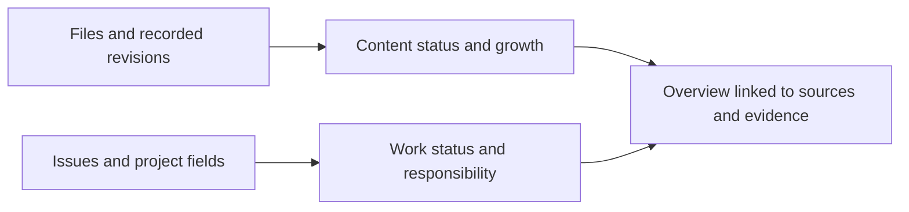

# Dashboards and Work Tracking in GitHub


In chapter 1, a small dashboard helped us identify instructions that needed review and the team responsible for them. Chapter 3 showed how the tutorial grows over time. Chapter 9 connected proposed changes to review decisions. We can now bring these ideas together: what information do we have, what needs attention, and what work is moving it forward?

A dashboard is a selected overview that helps someone understand a situation and decide what to do. It might be a table on a repository's starting page, a chart, or a work board. It does not need to be a separate application.

For a document-as-code team, this overview can support more consistent information, clearer responsibilities, and better planning. The important starting point is not the chart type. It is the question the team needs to answer.

This chapter develops a small dashboard from existing records and explains how to connect it to work tracking in GitHub. You can complete the first exercise locally. A second exercise uses a GitHub Project in a workspace you control.

## Start with a Decision

Imagine preparing this tutorial for a workshop. More words do not necessarily mean that it is ready. You need to know which chapters need review, whether the exercises work, and who will address any problems before the session.

Different questions call for different views:

| Question | Useful information | Possible next action |
| --- | --- | --- |
| Which chapters need attention? | Chapter status, review task, and responsible person | Arrange a review |
| Where is work waiting? | Tasks awaiting review, blockers, and owners | Resolve a dependency or assign a reviewer |
| What has changed since the previous workshop? | Changes between identified revisions | Inspect the affected exercises |
| Can we deliver the PDF book? | Capability criterion and a checked output | Test the build or review the publication |

Start with one question and a small amount of trustworthy information. Add another measure when it supports a decision, not simply because it is available.

## Two Kinds of Progress

The tutorial itself and the work around it have different records. A chapter file tells us what readers will see. An issue can describe an improvement someone intends to make. A pull request shows the proposed change and its review.



*Content records and work tracking answer different questions in a shared overview.*

The diagram describes how we can combine these perspectives. It does not mean that information already moves automatically between them in this project.

A chapter can remain a draft while a task to correct one example is complete. A requirement can be approved while its implementation is still in progress. Likewise, a closed task to investigate PDF tools does not mean that we have a working PDF publishing capability.

Our [feature register](../data/features.json) describes capabilities and their completion criteria. Keep those criteria separate from task completion. The chapter 3 measurements read the recorded capability states; they do not independently verify that each capability works.

## Choose Where the Information Lives

We do not need to put every kind of information in a Markdown file. Use files for the content and records that benefit from versioned review. Use a work-tracking tool for assignments, discussions, and day-to-day coordination when that suits the team.

Choose one place to maintain each fact:

| Information | Suggested home | How other views use it |
| --- | --- | --- |
| Chapter text and editorial status | Chapter file | Read the file and its metadata |
| Requested improvement and discussion | GitHub issue | Link to the issue |
| Who is doing the work and its current stage | Issue assignment and Project fields | Display those values in work views |
| Capability definition and acceptance criterion | Feature register | Link tasks and evidence to that criterion |
| Review evidence for a change | Pull request and review record | Link to the reviewed version |

These are choices for a workflow, not mandatory rules. Chapter 6's file-based tasks remain a useful alternative. Avoid maintaining the same task status independently in a file, an issue, and a spreadsheet. When more than one representation is needed, decide which one is authoritative and how the others are refreshed.

GitHub Issues and Projects are service data, not files included in an ordinary Git clone. A content-history report therefore does not also preserve your work board. For a combined historical report, retain dated work-data snapshots or other suitable history alongside the source revisions you measure.

## A Dashboard Readers Can Find

The repository README is a useful starting point. It can link to chapters, work items, and reports, and display a saved chart. A small dashboard section might contain a review queue, a growth report, and links to the evidence behind a delivery milestone.

This project already has several building blocks:

- Chapter 1's [status chart](../assets/onboarding-showcase/review-status.png) and accompanying table illustrate a review queue using fictional procedures.
- Chapter 3's [historical comparison](03-project-growth.md) shows measured changes between identified revisions.
- Chapter 6's [record processor](../scripts/process_records.py) creates a local `build/records/dashboard.md` from structured records.
- The [feature register](../data/features.json) holds the capability criteria we want to satisfy.

These are not yet one automatically refreshed dashboard. The teaching chart is a fixed example, the record dashboard is generated locally, and the growth workflow produces downloadable reports. A link to a report and an embedded image also have different update paths: generating a new chart does not replace an older image saved in the README.

For each view, tell readers what it includes and which version or observation it represents. Provide a route back to the underlying records. Someone should be able to move from "one task in progress" to the task and understand what is left to do.

## Missing Excel? Tables and Spreadsheets

Moving information into a repository does not remove the need for tables. You may still want to compare spending, scan a plan, or highlight values that need attention. A text file can hold the data while a reading tool provides a familiar table view.

[CSSV, Comma-Separated Styled Values](https://github.com/rhpaiva/cssv), explores one way to do this. It puts CSS styling above CSV data in a plain-text file. A dedicated renderer turns that file into a styled HTML table. GitHub can show its source, but does not render CSSV itself.

<!-- example:start cssv-department-budget -->

### Example: Where Are We Over Budget?

A manager is reviewing a fictional department's annual budget. All amounts are in Swedish kronor (SEK). Variance means actual spending minus planned spending: a positive value means overspending, not money remaining.

<!-- interactive: budget-table -->

| Category | Planned SEK | Actual SEK | Variance SEK |
| --- | ---: | ---: | ---: |
| Equipment | 60,000 | 72,000 | 12,000 |
| Training | 40,000 | 32,000 | -8,000 |
| Travel | 30,000 | 39,000 | 9,000 |
| Software | 50,000 | 48,000 | -2,000 |
| Team events | 20,000 | 20,000 | 0 |

The [Astro version of this section](https://and-gu.github.io/document-as-code-lab/chapters/10-dashboards/#missing-excel-tables-and-spreadsheets) replaces this saved table with a styled, interactive view when JavaScript is available. It reads the actual [department-budget.cssv file](../examples/dashboards/department-budget.cssv), not a separate set of website values. The table above remains readable in GitHub and when JavaScript is unavailable.

Choose **Over budget** to isolate Equipment and Travel. Together they exceed their allocations by 21,000 SEK. Across all five categories, lower spending elsewhere reduces the net overspend to 11,000 SEK. The view's totals always describe the rows currently shown.

### What Comes from CSSV?

The file supplies the values, number formatting, and table styling. This rule highlights positive variance values:

```css
[data-col="Variance SEK"].positive {
  color: #982b17;
  font-weight: 700;
}
```

The renderer identifies numeric cells and exposes their column names and signs to CSS. A second rule shades rows with positive variance. The numbers retain their meaning without color. The [CSSV specification](https://github.com/rhpaiva/cssv/blob/main/SPEC.md) describes these styling hooks.

In the example file, the CSS sits between two `---` lines, followed by:

```csv
Category,Planned SEK,Actual SEK,Variance SEK
Equipment,60000,72000,12000
Training,40000,32000,-8000
Travel,30000,39000,9000
Software,50000,48000,-2000
Team events,20000,20000,0
```

These delimiters resemble the front matter introduced in chapter 4, but this block contains CSS, not YAML metadata. Its meaning comes from the program reading it.

Our Astro component adds sorting, filtering, and totals. These are website features, not spreadsheet formulas supplied by CSSV. Variance values are stored explicitly in this teaching file; CSSV does not recalculate them. If you change a planned or actual amount, update its variance too.

Try **Largest overspend first**, then switch between **All categories** and **Over budget**. Expand **Inspect CSSV source** to see how the values and styling produce the view. For a local experiment, change Equipment's actual spending to `58000` and variance to `-2000` in the CSSV file, then rebuild the site. Alternatively, use the editor on the [CSSV website](https://cssv.dev/) to experiment with the file's styling.

**Expected result:** Equipment no longer has an overspend highlight and disappears from the filtered view. Our component updates its totals. The saved Markdown table does not refresh automatically: update it alongside any intentional change to the teaching data.

**If you see only the static table:** check that JavaScript is enabled and the website build includes the CSSV component. Opening the downloaded file in a text editor shows source, not the styled result.

<!-- example:end cssv-department-budget -->

### When to Keep Excel

This is a published table, not a replacement for a spreadsheet application. Excel remains useful for exploratory calculations, complex models, charts, and interactive cell editing. You can export data for a repository-based publication while continuing to use Excel where it serves the work best.

Use plain CSV when other applications need the values without presentation. Use website CSS when tables should share the site's design. CSSV is an experimental option when the data should travel with its own styling. Its complete file is not ordinary CSV: extract the data portion before importing it into tools that expect CSV.

This site bundles the official CSSV renderer at a pinned version and loads only the reviewed example file. It does not accept uploaded styles or fetch a renderer from an external CDN. Before adopting CSSV more broadly, check browser support, accessibility, and how styles from other sources are handled.

## Track the Work with GitHub Projects

GitHub Projects provides table, board, and roadmap views of work items, including issues and pull requests. These are different presentations of the same project data, not separate task lists. A table helps compare fields; a board helps follow stages; a roadmap helps discuss work over time. See [GitHub's introduction to Projects](https://docs.github.com/en/issues/planning-and-tracking-with-projects/learning-about-projects/about-projects).

For the workshop example, we could use these stages: **To do**, **In progress**, **Review**, and **Done**. We choose their meaning. Here, Done means that the particular task's acceptance criteria have been met and its evidence has been linked.

An issue titled "Check the chapter 3 exercise before the workshop" should identify the chapter, the expected result, and how to record the check. Assign the work to a person who can act on it. The person responsible for writing a chapter is not necessarily the person checking its exercise.

A milestone can group issues for a shared delivery goal, such as a workshop edition. Keep chapter status, task stage, and milestone completion distinct so readers understand what progress means. [GitHub's milestone guidance](https://docs.github.com/en/issues/using-labels-and-milestones-to-track-work/about-milestones) explains this grouping.

Projects also offers Insights charts based on project items, including current and historical views. A current chart can show how work is distributed; a historical chart can show changes over time. Insights excludes archived and deleted items, so it should not be mistaken for a complete permanent history. These charts measure project items, not words or chapter content. See [GitHub's Insights documentation](https://docs.github.com/en/issues/planning-and-tracking-with-projects/viewing-insights-from-your-project/about-insights-for-projects).

## Keep the Overview Trustworthy

A useful dashboard makes its limits understandable without overwhelming the reader. State the scope, the measurement date or source version, and what the measures mean. Keep a previous successful report available when an update fails, but label it as older information rather than silently presenting it as current.

Use measures that match the question. A count of assigned tasks is not an estimate of someone's workload: tasks differ in size and difficulty. Word count describes volume, not clarity. A higher number of closed issues does not necessarily mean greater value delivered. Use these measures to discuss the work, not rank individuals.

For visual clarity, label categories and values directly, use consistent scales, and do not rely on color alone. Include a table or text summary with a chart. When showing trends, distinguish zero from missing data and explain changes in the counting rules. Chapter 3's measurement notes show why those definitions matter.

An interactive website could add filters by chapter, owner, or period using the same underlying data. That is a later extension, not a prerequisite for a useful overview. It will also need accessible controls, clear data freshness, and appropriate access restrictions. Aggregating private project data into a public chart can expose information even when the source links remain private.

## Maintain the Dashboard as Part of the Work

Agree who maintains the source records, who maintains the reporting process, and who acts on the results. A useful weekly routine is to inspect outstanding work, correct stale records, and identify the next action. The dashboard supports that conversation; it does not replace it.

GitHub Projects has built-in automation for selected item events. Inspect the enabled rules and test their effects before relying on them. A rule that moves an item when an issue closes should match your team's meaning of Done. [GitHub's automation guidance](https://docs.github.com/en/issues/planning-and-tracking-with-projects/automating-your-project/using-the-built-in-automations) describes the controls.

Custom automation can connect content checks to reporting. For example, an agent could update a chapter, regenerate affected reports, and prepare a summary of the changes. Give it the relevant source files, measurement rules, and permission boundaries. Ask for evidence of successful checks rather than an unsupported progress summary.

```text
Inspect the chapter changes and the linked work items.
Identify which dashboard inputs and outputs are affected.
Regenerate the local views and report the source version used.
List stale links, missing owners, and unverified completion claims.
Do not close issues or mark capabilities complete without approval.
```

The rules, scripts, and agent instructions are part of the team's maintained tools. As the work changes, the team can improve them too. Chapter 13 will develop this automation further.

## Try It: Connect a Measure to an Action

Use the Python environment from chapter 3 and the structured records introduced in chapter 5 and processed in chapter 6. Work in a disposable exercise copy if you plan to edit records. You do not need a GitHub Project for this first part.

1. Run `python scripts/process_records.py` from the repository root.
2. Open `build/records/dashboard.md`. Read its selection and version information before interpreting the counts.
3. Find TASK-003 in `examples/structured-content/records/TASK-003.md`. In the supplied example it is in progress, belongs to the service team, and implements REQ-014.
4. Write a short dashboard note linking to the task and requirement. State the next action: obtain implementation and verification evidence before treating the requirement as delivered.
5. In your exercise copy, change the task's owner to another fictional team and run the processor again. Compare the owner counts and the input digest at the top of the report. The task-status count should remain unchanged.

**Expected result:** a regenerated dashboard and a note that connects an aggregate count to a specific record, responsible team, and next action. With the supplied four records, the status table contains two requirement categories, one in-progress task, and one planned test. Earlier exercise changes may produce different counts.

**If the result differs:** check the input records and the output folder. The processor validates the records before generating views; after a failed run, an older output may still be present. Read the error and correct the source before interpreting the report.

**Keep:** your dashboard note and a record of the change you tested. Keep the fictional exercise separate from operational work. Generated files under `build/` remain local and ignored by Git.

### Extend It with a Work Board

Use a repository and a user or organization Project where you have permission to create and edit work items. Follow [GitHub's Projects quickstart](https://docs.github.com/en/issues/planning-and-tracking-with-projects/learning-about-projects/quickstart-for-projects) for account-specific creation steps. This chapter does not create a hosted board on your behalf.

1. Create an issue to review one chapter's exercise. Include its file link, a proposed reviewer, and concrete acceptance criteria.
2. Add it to your Project. Configure the stages described above and create a board grouped by status plus a table showing assignments.
3. Add a second issue for a specific improvement discovered during the review. Link the eventual pull request or recorded change to that issue.
4. In your exercise repository's README, add a dashboard section linking to the board, the chapter, and the review evidence. Label manually maintained summaries as such.
5. Change one item's stage and inspect both views. Confirm that they show the same item and that the README links reach the intended evidence. Check any enabled automation before closing an issue.

**Expected result:** two linked work items, two views of the same work, and a dashboard entry connecting chapter development to review evidence.

**If you cannot create or edit the Project:** check your permissions with the workspace owner. You can still complete the local exercise and sketch the proposed board as a Markdown table; label it as a sketch rather than a connected work board.

**Keep:** the board and evidence links for continued use, or clearly label the items as training exercises before leaving them in a shared workspace.

For your own information example, choose one question, its maintained source, and the person who should act on the answer. Next, [Publishing to Websites, Books, and Presentations](11-publishing.md) considers how to deliver maintained information to different audiences.
