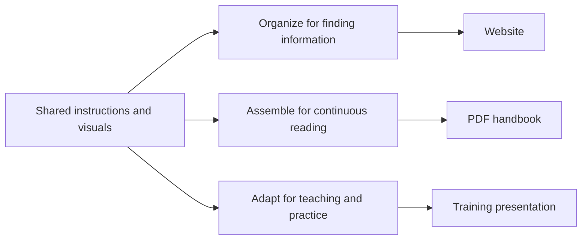

# Publishing to Websites, Books, and Presentations


In chapter 1, three instruction files became a handbook, a training excerpt, and a dashboard. We have since explored how to structure that information, review changes, and track the work. The next question is how to deliver it to people who need different reading experiences.

A new colleague may want a page they can find quickly on their phone. A trainer needs a sequence of explanations and exercises. A manager may prefer a PDF that can be read offline and referred to during a meeting. These readers can use the same underlying information without receiving the same document.

Publishing is the process of selecting, preparing, checking, and delivering information for an audience. Converting Markdown into another file format is one part of that process. The larger task is deciding what readers need and making the result work for them.

This chapter uses our onboarding example to plan three publications. We also examine the tutorial's published website and HTML introduction deck. The core exercise works with the files already in the project; an export extension introduces tools to try when you are ready to generate additional formats.

## One Source, Several Reading Experiences

Suppose we want to explain how new colleagues request access, collect equipment, and find their team contacts. We already maintain those instructions separately. We now choose how to use them:

| Publication | Reader's need | Editorial choice |
| --- | --- | --- |
| Website | Find a specific instruction when needed | Separate pages with clear navigation and links |
| PDF handbook | Read the onboarding process as a coherent whole | Ordered sections, a contents page when useful, and edition details |
| Training presentation | Understand and practise the access process | Selected explanations, an example, and a short exercise |



*Reuse the maintained information while shaping each publication for its readers.*

The middle step matters. A presentation is not a handbook divided into slides, and a website needs more than a long page of exported text. We keep the facts together while allowing each output to have its own introduction, order, navigation, and visual treatment.

## Start with a Publication Brief

Before choosing a publishing tool, describe the intended result. A brief can be short: who will use it, what they should be able to do, which sources it uses, and how you will check it.

For the onboarding presentation, the brief might say:

> Prepare a short session for new colleagues on requesting system access. Use the access procedure, explain what information to include, and ask participants to practise writing a request. Leave equipment and contacts for another session. Retain a link to the source so the trainer can check for updates.

The [publication-brief template](../examples/publishing/publication-brief.md) captures these choices for a website, PDF, or presentation. It also records the source version and the person responsible for checking the output. These are our chosen working conventions, not fields mandated by a publishing tool.

Selection needs an explicit rule. Our example handbook includes all three procedures, including draft contacts, because it is a review copy. A publication intended for operational use might require reviewed content only. If an essential section is not ready, decide whether to delay publication or change the publication's stated scope. Silently removing it could leave readers with an incomplete guide.

## Build a Website Around Reader Tasks

A website is useful when people need to find individual topics, follow related information, and return to the current instructions. Organize navigation around their tasks rather than exposing the repository's folder structure unchanged.

For the onboarding example, the starting page could link to "Request access," "Collect equipment," and "Find team contacts." Each page should make its purpose clear and provide a way back. As the site grows, search, a contents view, and related-topic links can help people find the right detail.

Check a real reader journey: can a new colleague reach the access instructions, understand what to submit, and locate the next relevant topic? Try both a narrow screen and a desktop. Check keyboard navigation, meaningful link text, headings, and image descriptions.

Chapter 1's linked handbook already gives us a basic reading experience in GitHub. A separate website offers more control over navigation and presentation, but also introduces a build and hosting process to maintain. Generating a website and making it available to readers are separate steps. Decide where it will be hosted and who should have access before publishing project information.

### Our Website Uses Astro

We use [Astro](https://astro.build/), a framework for building content-driven websites, to give this tutorial a separate reading experience. The Astro project lives in `site/`, while the chapter sources remain in `docs/`. This is a publishing choice, not a requirement of document-as-code; another tool could present the same maintained information.

Our site uses an Astro content collection to read the original Markdown files and their chapter metadata. Layouts and page templates provide the contents view, chapter navigation, and visual styling. The build turns these inputs into web pages and supporting assets. Our site also renders Mermaid diagrams and links to supporting examples. See the [Astro documentation](https://docs.astro.build/) and its [content collections guide](https://docs.astro.build/en/guides/content-collections/) for the underlying concepts.

The responsibilities are separate:

| Part | Responsibility in this project |
| --- | --- |
| Markdown in `docs/` | Holds the maintained chapter content |
| Astro in `site/` | Builds the website and defines its presentation |
| GitHub Actions | Runs repeatable checks and the configured publishing process |
| GitHub Pages | Hosts the generated website for readers |

This separation lets us improve navigation or page layout without maintaining another copy of the chapters. An accepted text change can reach the website through a new build. Our HTML presentations now use that same build and deployment process, with their own selected messages and layouts. PDF book and PowerPoint export pipelines are not yet configured.

You can inspect the current reading site locally using the [site instructions](../site/README.md). From `site/`, `npm run dev` starts the local site and `npm run build` creates production files in `site/dist/`. Those generated files are not the editable master and are not committed to the repository.

For hosted publication, the intended sequence is: propose a change in a branch, open a pull request, pass the Astro build check, review the change, and merge it into `main`. A deployment workflow then builds the accepted sources and sends the output to GitHub Pages. Required reviews and checks depend on repository branch rules; a workflow alone does not enforce approval.

The repository is public, and [the tutorial website is published on GitHub Pages](https://and-gu.github.io/document-as-code-lab/). The committed deployment workflow builds the accepted sources on pushes to `main` and publishes the generated output. Successful deployments have been checked in the browser, including chapter navigation, an image, a Mermaid diagram, and the expandable chapter information panel. Enabling Pages and building files are necessary steps; checking the hosted result confirms that readers can use the publication.

Because this is a project website, its address includes `/document-as-code-lab/`. Navigation, images, and script URLs must work under that path, not just at the root of localhost. Check the published site as well as the local build, including a chapter link, an image, and a Mermaid diagram. A successful build confirms that files were generated; it does not confirm that hosting and browser rendering work.

## Assemble a PDF for Continuous Reading

A PDF provides a stable edition that can be downloaded, shared, or printed. Its structure should help readers understand the material without relying on the surrounding website.

Arrange sections in a deliberate reading order. Add a title, edition information, and enough context to explain the selection. A longer book also needs consistent heading levels, page numbers, a contents page, and useful cross-references. A two-page excerpt may need much less.

Page layout creates problems that are easy to miss in source text. A table can run off the page, a heading can become separated from its paragraph, or a diagram can shrink until its labels are unreadable. Inspect the generated pages, not only the build log. Check that text is selectable and that headings, reading order, and alternative descriptions survive the chosen export process where supported.

For our review handbook, keep the draft label visible inside the PDF. A filename is easily changed or lost when someone forwards the document. Record which source versions produced the edition so that later questions can be answered against the same information.

## Design Presentations for the Session

A presentation supports a particular conversation. Decide whether it is an introduction, a workshop, or a technical deep dive before selecting the content.

The access procedure can support a short training sequence:

1. Explain what the colleague needs to include in a request.
2. Show a fictional example containing the system name and team.
3. Ask participants to draft a request and identify which reference they should retain for follow-up.

The underlying instructions stay the same, but the teaching sequence adds explanation and practice. Put supporting detail in speaker notes or a handout rather than shrinking all the text onto a slide. Distinguish examples you create for teaching from facts stated in the source.

AI can help propose the sequence, draft notes, or suggest a visual. Give it the selected source, audience, session purpose, and boundaries, as in chapter 6. Review whether it has invented a service address, response time, or process step that the source does not support.

PowerPoint can remain part of the workflow. Generated slides may provide a starting point for visual refinement, discussion, or delivery. Decide which changes belong only to that presentation and which should return to the maintained content.

### Our HTML Presentations Use Astro and Reveal.js

Our first presentation puts these principles into practice. Open the [published introduction deck](https://and-gu.github.io/document-as-code-lab/presentations/document-as-code/) or choose **Presentations** in the website's chapter menu. Its eight slides draw on chapters 1, 2, 8, and 10, moving from information reuse through collaboration and review to publishing.

The [presentation definition](../presentations/document-as-code-intro.yaml) is a YAML file containing the selected messages, slide order, and chapter references. It does not copy entire chapters. The chapters remain the maintained knowledge; the YAML defines a particular teaching sequence.

We separate three responsibilities:

| Part | Responsibility |
| --- | --- |
| YAML in `presentations/` | Selects the story, messages, and source references |
| Astro slide components and CSS in `site/` | Render the content and define its visual presentation |
| [Reveal.js](https://revealjs.com/) | Provides slide navigation, keyboard controls, fullscreen, overview, transitions, and progress |

Four reusable slide types support titles, short explanations, comparisons, and workflow diagrams. This lets us improve the layout without rewriting each slide. Reveal.js enhances the pages Astro creates; it is not a separate application or hosting service.

To create a similar deck, add a YAML definition using those slide types and link each slide to its source chapters. The [presentation authoring notes](../presentations/README.md) describe the fields and verification steps. The existing Astro build discovers the definition and creates a presentation route. Changes merged into `main` are rebuilt and published through the same GitHub Pages workflow as the documentation.

Source links make the relationship visible, but they do not automatically rewrite a slide when a chapter changes. Review the affected messages and update the YAML when needed. Likewise, rebuilding a deck does not approve its content.

The HTML introduction deck is implemented and published. Speaker notes and presenter mode are not enabled in our integration; the PDF book, workshop deck, and PowerPoint export remain future work.

## Reuse Visuals, Adapt Their Presentation

Chapter 7 distinguished editable visual sources from their rendered images. Publishing adds another decision: which representation works in each output?

An interactive chart needs a static alternative in a printed book. A detailed diagram may fit a full book page but need simplification for a presentation. A website may let readers enlarge an image; a slide shown across a meeting room cannot rely on that interaction.

Keep the meaning and source data consistent while adapting size, labels, and detail. Preserve captions, units, source versions, and relevant qualifications. Do not assume that a Mermaid block displayed by GitHub will become a diagram in every exporter. Check the chosen renderer and use a suitable image export when required.

For charts, repeat the checks from chapter 9: readable labels, adequate contrast, and an explanation that does not depend on color alone. Review representative images in every target format before scaling up to the full tutorial.

## Choose Tools with a Small Trial

Start by testing a small but representative selection: headings, a table, a link, and one visual. Add an unusually long title or paragraph to expose layout limits. Compare the effort to produce, check, and maintain the results.

Pandoc is one option for converting Markdown into formats such as HTML, Word, and PowerPoint. PDF generation requires an appropriate rendering engine. Reference documents can influence Word and PowerPoint styling. See the [Pandoc user guide](https://pandoc.org/MANUAL.html).

Quarto is another candidate when the project needs coordinated websites, books, and presentations. Its [documentation](https://quarto.org/docs/guide/) describes these output types and their configuration. Choosing it would mean adding and maintaining the relevant project settings; its capabilities are not already configured in this repository.

Astro publishes our reading website and, with Reveal.js, our first HTML presentation. Both use the existing GitHub Pages deployment. The PDF book, workshop deck, and file-export pipelines remain to be developed. The onboarding builder still produces Markdown and a chart rather than those formats. Use a small trial to choose additional tools according to the audience, visual requirements, accessibility needs, and maintenance capacity.

## Keep Changes Connected to Their Source

Readers will often send feedback in Word, PowerPoint, email, or a meeting. That is compatible with document-as-code, provided there is a clear route back to the maintained information.

If a trainer corrects a factual instruction in a slide, review the correction in the original procedure and rebuild the affected outputs. If the trainer changes a slide's layout for one event, retain that in the presentation's design source or reference template. If the change is a local teaching example, decide whether other trainers would benefit from maintaining it as reusable material.

Repeated manual changes to generated files will be lost when those files are rebuilt unless the changes are incorporated into the process. Record presentation-specific additions alongside their source references, and avoid letting an exported document become an untracked competing master.

For each release, retain the selected inputs, their order, the source revision, tool versions, relevant settings, and the exact outputs reviewed. Local uncommitted edits need to be accounted for too; a commit identifier alone does not describe them. Chapter 8's review record provides a place to connect evidence to a decision.

## Try It: Prepare Three Publications

Use a disposable copy of the project for source edits so the fixed examples in chapter 1 remain unchanged. Begin with the [onboarding source files](../examples/onboarding-showcase/README.md), [handbook review copy](../assets/onboarding-showcase/handbook.md), and [training excerpt](../assets/onboarding-showcase/training-excerpt.md).

1. Make three working copies of the publication brief: one for a website, one for a PDF handbook, and one for an access-training presentation.
2. Identify the audience, purpose, and ordered sources for each. Label all three as fictional teaching material. Explain whether contacts is included and how its draft status affects the publication.
3. Sketch the website navigation and the PDF reading order. Write a three-slide teaching outline based on the access procedure. Keep these plans alongside the briefs.
4. In the disposable project copy, add a clearly fictional clarification to the access instructions. Record the exact edit. With the chapter 3 Python environment active, run `python scripts/build_onboarding_showcase.py` from that copy's root.
5. Inspect the regenerated handbook and training excerpt. Both should contain the clarification; the status chart should retain its counts because no status changed. Update the presentation outline if the teaching sequence needs to explain the clarification.
6. Record which outputs changed, which remained unchanged, and what still requires an actual format-specific export and visual check.

**Expected result:** three publication briefs, an output-specific structure for each, and a demonstrated source change reaching the two existing text outputs. This core exercise prepares the publishing decisions; it does not yet produce a website, PDF, or PowerPoint file.

**If an output seems stale:** confirm that you ran the builder in the disposable copy and opened files from that same copy. Check the selected source filenames and compare the generated text with your recorded edit.

**Keep:** the briefs, teaching outline, source-change note, and review observations. Do not replace the tutorial's fixed examples with your fictional variation.

### Extend It: Export and Inspect

When you are ready to try a converter, follow the [official Pandoc installation guide](https://pandoc.org/installing.html). The following is an optional trial, not a verified pipeline supplied by this project.

In your disposable project copy, create `build/publishing/`. Save the three-slide outline as `build/publishing/slides.md`, using a level-one heading for each slide. From the project root, try:

```bash
pandoc assets/onboarding-showcase/handbook.md --standalone --metadata title="Onboarding review copy" -o build/publishing/handbook.html
pandoc assets/onboarding-showcase/handbook.md -o build/publishing/handbook.pdf
pandoc build/publishing/slides.md --slide-level=1 -o build/publishing/training.pptx
```

The PDF command requires a PDF engine configured for Pandoc; see its [PDF guidance](https://pandoc.org/MANUAL.html#creating-a-pdf). These commands produce local files, not a hosted website or a released publication. The HTML trial is a single reading page rather than the multi-page website in your brief.

Open each successful output and compare it with the brief. Check page breaks in the PDF, text fit in the slides, and headings and links in the HTML. Confirm that the source clarification is present wherever it belongs. Record converter versions and checks, including any failed or untested format. A successful conversion is the starting point for this review.

The next chapter, [Beyond GitHub: OneDrive, Copilot, and Other Applications](11-beyond-github.md), considers how to carry these practices into environments where readers and authors use different tools.
